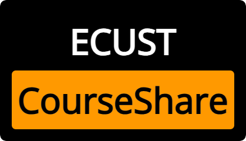
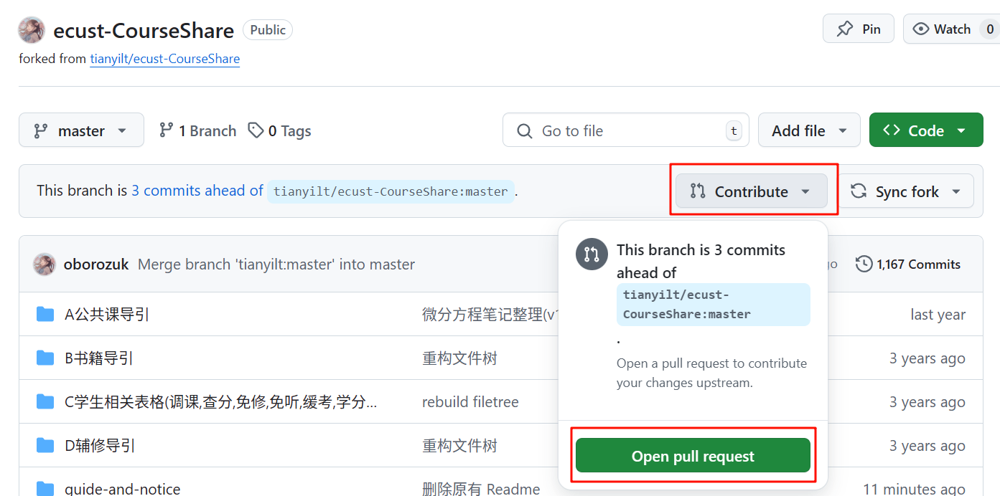

<div align="center">
  
  <h1>华东理工大学课程攻略共享计划</h1>
  
  [项目仓库](https://github.com/tianyilt/ecust-CourseShare)
  /
  [项目网站](https://ecust-courseshare.github.io/)
  /
  [CNB镜像](https://cnb.cool/ecustcic/ecust-CourseShare)
  /
  [Gitcode镜像](https://gitcode.com/ecust/ecust-CourseShare)
  
  
  
  
</div>

> [!NOTE]
>
> 本项目以[浙江大学课程攻略共享计划](https://github.com/QSCTech/zju-icicles)为模板，致力于构建共建共治共享的华理课程攻略共享库，在这里你可以找到各种课程的资料。
>
> 如果对您有帮助，别忘了 star 哦！

## 前言

引用[浙江大学课程攻略共享计划](https://github.com/QSCTech/zju-icicles)的前言：

> 来到一所大学，从第一次接触许多课，直到一门一门完成，这个过程中我们时常收集起许多资料和情报。
>
> 有些是需要在网上搜索的电子书，每次见到一门新课程，Google 一下教材名称，有的可以立即找到，有的却是要花费许多眼力；有些是历年试卷或者 A4 纸，前人精心收集制作，抱着能对他人有用的想法公开，却需要在各个群以至于从学长学姐手中代代相传；有些是上完一门课才恍然领悟的技巧，原来这门课重点如此，当初本可以更轻松地完成得更好……
>
> 我也曾很努力地收集各种课程资料，但到最后，某些重要信息的得到却往往依然是纯属偶然。这种状态时常令我感到后怕与不安。我也曾在课程结束后终于有了些许方法与总结，但这些想法挂在群相册，局限于一个年级，最终只能把花费时间与精力才换来的经验耗散在了漫漫的遗忘之中。
>
> 我为这一年一年，这么多人孤军奋战的重复劳动感到不平。
>
> 我希望能够将这些隐晦的、不确定的、口口相传的资料和经验，变为公开的、易于获取的和大家能够**共同完善、积累**的共享资料。
>
> 我希望只要是前人走过的弯路，后人就不必再走。这是我的信念，也是我建立这个项目的原因。

课程攻略共享计划走过了三个阶段。

第一阶段是在 QQ 群里，完成了，但是年级之间交流很少，加之文件存储麻烦，资料在传递中消散。第二阶段转向网盘，由于多人共同编辑不方便、无法控制版本、长期更新很依赖于单个管理员，网盘难以承载长久更新的重量。如今的第三阶段，受到 GitHub 上众多相关项目的启发，将目光投向 GitHub。这里能用目录清楚地组织文件，Readme 标注每个目录的说明，还具备方便协作的 Issue 和 Pull Request 功能。

## 内容及使用方法
>
> [!NOTE]
>
> 推荐使用电脑端浏览

- 历年试卷
- 复习资料
- 教师课件
- 平时作业答案
- 电子版教材（提供下载外链以节省项目空间）
- 开卷考试 A4 纸（TODO）
- 选课攻略（TODO）
- 学院的全称 ~~（相信我，真的有小可爱不知道自己学院叫什么的）~~
- 其他一些零散的内容
  
**郑重警告，抄作业是没有前途的!!!**

### 我想下载文件

- 若要下载单文件，点击文件链接，再点击 Download 即可
- 若要下载单个文件夹，复制该文件夹的网址，粘贴入 [DownGit](https://downgit.github.io/#/home) 中，选择 Download 即可
- 安装 [GitZip 插件](https://microsoftedge.microsoft.com/addons/detail/gitzip-for-github/nlgkiabjnbdndgblhcaobimbpifcdkjj)选择多个文件下载
- Alist 镜像：
  - [公网](https://alist.xn--rhqr3ykwbm05aegjqxb.com/)（[wu2305](https://github.com/wu2305) 提供，更新于 2023.09.19）
  - [公网](http://alist.ecustvr.top/)（由 VR 俱乐部提供）
  - [校内](http://s.ecustvr.top/)（由 VR 俱乐部提供）
- 腾讯云 CNB 镜像：[https://cnb.cool/ecustcic/ecust-CourseShare](https://cnb.cool/ecustcic/ecust-CourseShare)
- Gitcode 镜像（由于平台审核机制，需要[邀请](https://gitcode.com/invite/link/c8dc013aafe6494a9cfd)查看）：[https://gitcode.com/ecust/ecust-CourseShare](https://gitcode.com/ecust/ecust-CourseShare)
- Git 命令行克隆到本地：`git clone https://github.com/tianyilt/ecust-CourseShare.git --depth=1`
- 百度网盘：[更新于 2020.05.14](https://pan.baidu.com/s/1toHeEz0oMvN1H5lXhZrCHw?pwd=f2fm)

### 我想上传文件（请先阅读贡献指南）

Fork 这个项目，在您的仓库里的对应位置上传文件，提交后创建 Pull Request 等待合并



### 我想长期合作

看到这里的人，你应该有一定的 Git 基础或者想学习 Git，你可以在[这个网站](https://www.liaoxuefeng.com/wiki/896043488029600)学习 Git 的知识。

当你了解 Git 之后，我相信你应该知道如何长期参与到我们的项目中来。我们欢迎任何人加入到这个项目中！

## 贡献指南

***非常欢迎贡献！***

Issue、PR、纠错、资料、选课/考试攻略，完全欢迎！大家的关注、维护和贡献，才是让这个攻略共享计划存在的动力~

贡献需要注意如下几点：

- 本仓库未启用 `git-lfs`，请不要上传单个超过 100M 的文件，否则提交无效
- 注明文件的时间（学期或考试时间）
- 请填写提交说明（commit message）
- 参考文件结构进行贡献
- 对于教师的评价请一律使用姓名拼音首字母缩写

### 课程分组

华理有众多专业共享同一门课程，也有不同学院开设的同名课程。故进行了文件树的重构，依照开课学院进行分组，在其他学院的 Readme 中加入超链接来进行跳转。

- 如果多个学院共享同一门课程，如化工学院、化分学院等都有化工原理课程，请全部归于单一开课学院，也就是 [/化工学院/化工原理](/化工学院/化工原理) 中。
- 如果不同学院开设的同名课程，如由数学学院和信息学院分别开设的计算机网络，请分别归于开课学院，如 [/数学学院/计算机网络](/数学学院/计算机网络) 和 [/信息科学与工程学院/计算机网络](/信息科学与工程学院/计算机网络) 中。建议在 Readme 中加入相互的跳转。
- 对于同名的不同学分课程，我们建议在文件夹名中备注学分。
- 公共课程设有专门的文件夹用来导航。

课程开课学院完全按照教务处公示。

### 文件结构

```text
.
├── README.assets
├── README.md
├── 公共选修
│   └── 公共选修课程
└── 学院
    └── 课程
        ├── README.assets
        ├── README.md
        ├── 考试
        │   └── 年份-期中/期末-试卷.pdf
        ├── 作业
        ├── 课件与教材
        │   ├── 教材
        │   └── 课件
        └── 复习
            ├── 思维导图
            └── 复习文档
```

## TODO List

- [ ] 向没有 Git 基础的广大同学介绍简便使用方式
- [ ] 为项目制作网站首页，参考[中科大的项目](https://ustc-resource.github.io/USTC-Course/)
- [ ] 邀请更多志同道合者
- [ ] **形成项目传承长效机制，每一位来到学校的同学都能享受历年传承的攻略并可以贡献自己的智慧。**
- [ ] **项目瘦身!!!!太大了!!!!**

## 参考

- [清华大学计算机系课程攻略](https://github.com/PKUanonym/REKCARC-TSC-UHT)
- [浙江大学课程攻略共享计划](https://github.com/QSCTech/zju-icicles )
- [中国科技大学课程攻略共享计划](https://ustc-resource.github.io/USTC-Course/)
- [上海交通大学求生手册](https://github.com/SurviveSJTU/SurviveSJTUManual)

## 传送门

以下是非本仓库但是其他极客同学贡献的一些关于课程的仓库：

- 🌟[华东理工大学飞跃手册](https://ecust-leap.github.io/)
- [大物实验自动化脚本](https://github.com/ff6757442/experiment_kit)
- [马原答题程序](https://github.com/YifeiYang210/2020ecustMAYUAN)
- ~~计131资源共享站~~

## 致谢名单

感谢每一位关注该项目、为该项目贡献过的同学！

- 16 级：以 PanJR XieYJ LuLW ChenGR TaoZH 为代表的奆佬学长学姐帮助
- 17 级：互相帮助合作 a.e.
- 20 级：由 [wu2305](https://github.com/wu2305) 和 [Liz](https://github.com/Liz-Nozomi) 等同学重构
- 22 级：dyc 同学、wzy 同学

## 许可

[](https://creativecommons.org/licenses/by-nc-sa/4.0/)

[CC BY-NC-SA 4.0](https://creativecommons.org/licenses/by-nc-sa/4.0/deed.zh-hans)

> [!IMPORTANT]
>
> 资料仅供参考，请自己判断其适用性。
>
> 我们非常重视版权保护，如有侵权内容，请在 issues 下指出，我们将会很快删除，非常感谢。
