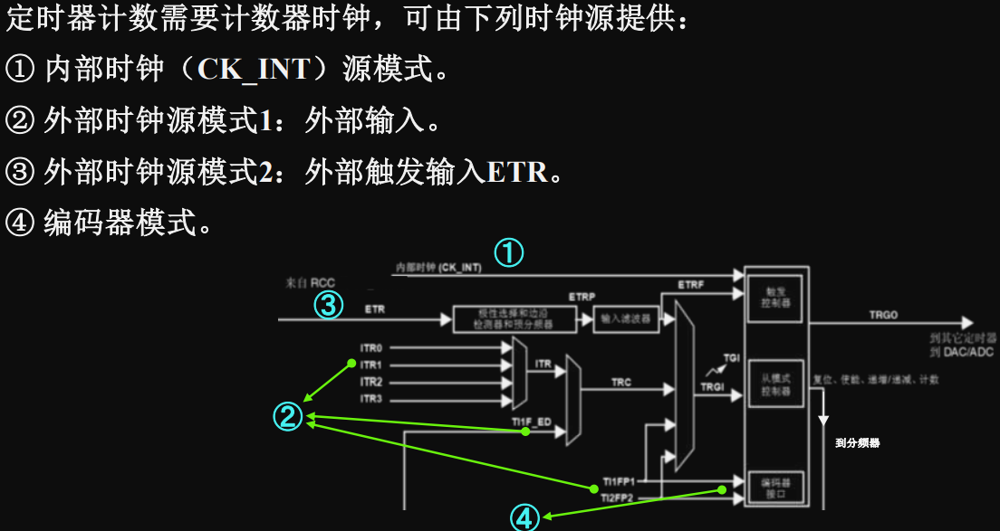
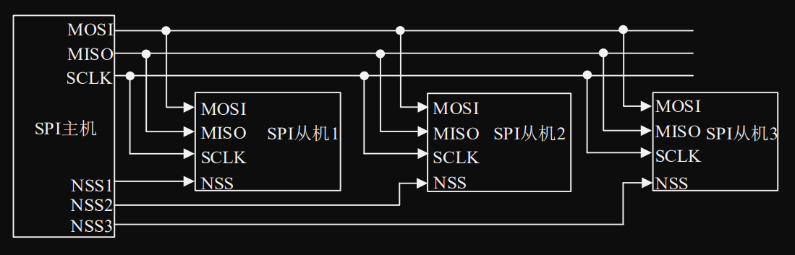

# 嵌入式系统原理与应用（2 学分）+ 综合实践（1 学分）

## 关于实验报告

实验内容基本是读源码然后修改，挺简单的。

pdf 使用 typst 生成，可以在[此处](https://github.com/lxl66566/my-college-files/tree/main/信息科学与工程学院/嵌入式系统)找到源码。本人不对合法性与正确性作出任何保证。

## 2023 考题回忆版

1. 填空 18 分（2 \* 9），基础题目
   - 有几种 SPI 模式？
2. 名词解释 12 分（4 \* 3）
   - NVIC
   - 占空比
   - PLL
   - MOSI
3. 综合 70 分
   - 中断优先级 3 分
   - 给出时钟源图，写 4 个时钟源名称 8 分。（PPT 原题） 
   - 看图，全部挖空，写 SPI 接口名称，6 分 
   - 寄存器地址映射
     - 计算 4 题，8 分
     - 给出公式，问为什么 bit_number **× 4**，2 分
   - 说明什么是大端格式，2 分
   - 读 GPIO 代码
     - 使用了哪些 GPIO 接口？6 分
     - 除了输入，GPIO 还有哪些工作模式？4 分
   - GPIO 原理图，问图上的三个寄存器分别是什么，6 分
   - 读定时器代码，8 分
     - 输出模式？
     - 什么是 arr，psr
     - 计数模式？
   - 按键原理图，问电平，5 分
   - PWM 计算，6 分（PPT 原题：40KHz 占空比=25%PWM 波，内部时钟源=180MHz）
   - 其他忘了

## 考点

因为有原题，考点不是很重要，不过也可以点击展开查看

重点复习代码：GPIO，定时器中断。给代码考作用（ppt 代码 + 实验代码）。

1. 基本概念，嵌入式系统举例，开发环境举例，如何打断点调试。
2. 大端小端必考，位带映射必考
3. 微控制器常识
   - 开发工具：FPLINK
   - 时钟系统，RTC，timer
   - 芯片大致架构
   - 复位有哪几种，来源有哪些
4. GPIO
   - 解释：通用输入输出
   - **内部构造图**，简单描述过程
   - GPIO 有哪些寄存器
   - **GPIO 的 8 个工作模式**
   - **代码**
5. NVIC
   - 介绍
   - **优先级**
   - 代码
6. 外部中断/事件控制器（EXTI）
   - 非重点
7. 定时器（重点）
   - 用途
   - 结构（重点）
   - 有哪些时钟源
   - 时基单元
   - 计数模式
   - PWM 谁控制周期，谁控制占空比
   - 输出模式
   - 定时的计算
8. IIC
   - 开始/结束信号
   - 主机发送/接收数据流程
9. SPI
   - 四个信号
   - 总线连接

## 开发环境安装

<!-- prettier-ignore -->
1. [下载资料](https://cs.e.ecust.edu.cn/download/5a403808a967b666b1e9ce9ac88429b5)并解压。
   - 约 2GB，课前提前下载。
2. 前往 _软件资料 - 软件 - MDK5_，双击 `MDK521A.exe` 安装。注意安装路径不能有中文。
3. **双击** 同文件夹下的 `Keil.STM32F4xx_DFP.2.9.0.pack` 安装。
4. 返回 _软件_，选择 _ST LINK 驱动及教程 - ST-LINK 驱动 - dpinst\_amd64.exe_，双击安装。
5. 打开桌面上的 `Keil ...` 软件，选择左上角 `File - License Management`，复制右边的 CID。
6. 下载[破解软件](https://cs.e.ecust.edu.cn/download/3b4d80b99923984b0d52f1788b5359bc)，解压运行（可能报毒，需要关闭 Windows Defender）。
7. 粘贴刚才复制的 CID，右边 Target 选择 ARM，点击 Generate，复制生成的代码。
8. 在 `Keil` 的 `License Management` 中，`New License ID code` 处粘贴代码，选择 _Add LIC_。
9. 回到 `1.` 中的资料，进入 _程序源码_，解压`1，标准例程-寄存器版本`，在 _实验 1 跑马灯实验 - USER_ 中打开 `TEST.uvprojx`。
10. 连接开发板，按 `F7` 编译，再按 `F8` download。
11. 此时应能看到开发板的 LED 闪烁。若无反应，可以按一下板子的 RESET 再观察。

### 工具使用

- 串口调试工具：_外部中断实验_ 中需要调试串口。
  1. 烧录程序后，把 USB 线从 ST-LINK 上拔出，接到板子的 USB_232 上。
  2. 打开 _软件资料\1，软件\串口调试助手\XCOM（正点原子推荐）_
  3. 波特率选择 115200，_串口选择_ 中选中出现的串口，点击 _打开串口_ 即可看到消息。
- 引入外部库：_综合实验_ 中可能需要引入外部库。
  1. 将库所在的文件夹复制到项目中的相同结构下。（例如将 `24CXX` 放到 `HARDWARE`下）
  2. 在 Keil 中，右击放入的目录（`HARDWARE`），选择 _Add Existing Files to Group..._，选中库内的 `*.c` 文件。
  3. 点开工具栏 `Options for Target`，选择 `C/C++`，在 `Include Paths` 中仿照例子添加库的路径。

### 报告要求

每次实验做两个项目，写成一份报告，每两周交一次（两份）报告。（11，12 耗时更长一点）

修改后的代码需要注明“修改后”！修改前的代码可以放上去也可以不放。

理论上每份报告只需要一个心得体会，我从逻辑上考虑，将其分为两个，放到两个项目里。
