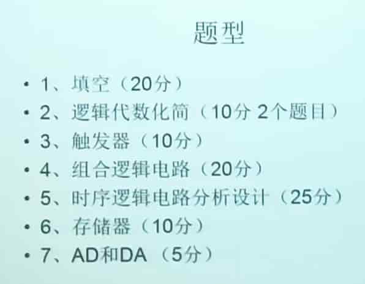

# 数字系统设计（3.5学分）与实践（2学分）
* 信工专业，木昌洪的课。讲得一言难尽，建议翘课自学。平时分挺高，几个舍友都 90+ 了。
* 理论与实践是两门学科，分数分开算的。
* 前往[课件](./resources.md)
* [笔记](https://absx.pages.dev/farraginous/learning/dsp.html)
* ~~甚至可以在[这里](https://github.com/lxl66566/my-college-files/tree/main/信息科学与工程学院/数字系统设计/作业)找到手写作业~~
## 实践
> 免责声明：实验报告不保证正确，不保证代码可以正常运行。作业不保证正确。

这里的报告大概是平均前 10 个 A-，后面 B 的水平（问就是看过批改结果）。还有*解决方法和心得*挺蠢的，建议用 gpt 重新生成一下。
## 2023考试
> 欢迎补充/修正

范围：

verilog 有 26 分，需要笔写代码，需要掌握基本语法，`assign`，`case`等语句，状态机的写法。

填空（20分20空）。考点：余三码，bcd 码，格雷码，原反补码，进制转换，奇偶校验，还有各种各样贯穿全课的概念。稍稍回忆一点：
* CMOS 对比 TTL 的最显著优势是？
* 逻辑电路分为：`时序`与`组合`

大题：
* （10分）两题逻辑表达式化简。（化为最简与或表达式）
* 与非门的基本 RS 触发器，设计，方程，verilog 设计。（分别使用`assign`和`case`）
* 看全加器的波形图，分析，真值表，verilog 设计。（分别使用与或表达式方程设计和直接描述设计）
* （15分）设计一个序列检测器（检测`10010`），画状态转移图，用 verilog 和 `热独码` 状态编码描述。
* （10分）使用 2G\*32 位 RAM 扩展到 8G\*64 位。问片内地址线条数，片外寻址线条数。画图，写地址表。（低位地址，高位地址，16进制）
* （5分）双积分型 A/D 转换的流程图，数字公式，优势。
* 还有一道大题忘了。。