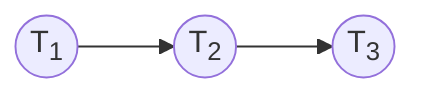
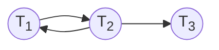

# Chapter10
## 10.1
ACID特性是指：
- 原子性：事务的所有操作要么全部被执行，要么都不被执行
- 一致性：一个单独执行的事务应保证其执行结果的一致性
- 隔离性(并发正确性、可串行化)：并发执行的各个事务不能相互干扰
- 持久性：一个事务成功提交后，对数据库的改变必须是永久的

对于每个特性，DBMS的保护途径：
- 原子性：撤销未完成事务对数据库的影响
- 一致性：数据库完整性约束(如触发器)的自动检查功能
- 隔离性：并发控制模块
- 持久性：恢复管理模块

## 10.9
### (1)

### (2) S1冲突可串行化(没有环)，等价于T1T2T3

### (3)

$S_2$不是冲突可串行化的

## 10.13
(1) 分析阶段：  
|   | UNDO-SET| REDO-SET|
|---|---------|---------|
|<Checkpoint {T1,T2}>|{T1,T2}|{ }|
|<T3,START>|T1,T2,T3}|{ }|
|<T3,COMMIT>|{T1,T2}|{$t_3$}|
|<T1,COMMIT>|{T2}|{T1</sub,T3</sub$}|  

(2) 撤销阶段：  
<T2: A = 20  
<T2: C = 20
撤销后结果：$A = 20, C = 20$

(3) 重做阶段：  
<T1</sub,D,10,25>: D = 25  
<T3</sub,A,10,20>: A = 20  
<T3</sub,D,0,10>: D = 10

故恢复后结果：$A = 20, B = 10, C = 20, D = 10$
