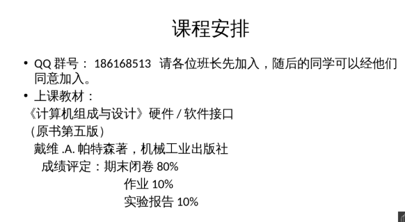

数学系大三苦逼选修信院,顺便嫖点资料

课程概况:



作业答案:推荐直接参考[Slader上的答案](https://www.slader.com/textbook/9780124077263-computer-organization-and-design-mips-edition-the-hardwaresoftware-interface-5th-edition/)

所有答案都可能有误,希望大家多多找出问题相互讨论

---

关于 C 转换成 MIPS，网上有现成工具供参考

https://godbolt.org/

左边语言选 C

右边的编译器选择带 MIPS 字样的

比如 MIPS gcc 5.4

```c
void main() {
  int l = 1;
  int a = 0;
  b[a+l]=4;
}
```

> 汇编的代码高亮关键词是 assembly

```assembly
main:
        addiu   $sp,$sp,-40
        sw      $fp,36($sp)
        move    $fp,$sp
        li      $2,1                        # 0x1
        sw      $2,8($fp)
        sw      $0,12($fp)
        lw      $3,12($fp)
        lw      $2,8($fp)
        nop
        addu    $2,$3,$2
        sll     $2,$2,2
        addiu   $3,$fp,8
        addu    $2,$3,$2
        li      $3,4                        # 0x4
        sw      $3,8($2)
        nop
        move    $sp,$fp
        lw      $fp,36($sp)
        addiu   $sp,$sp,40
        j       $31
        nop
```
