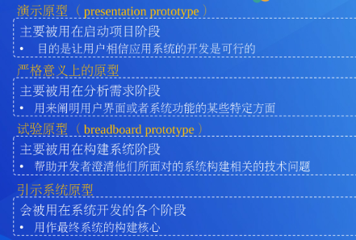
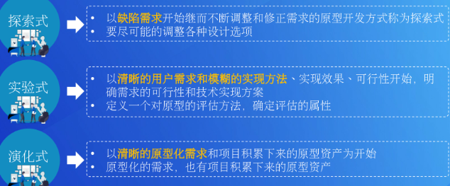
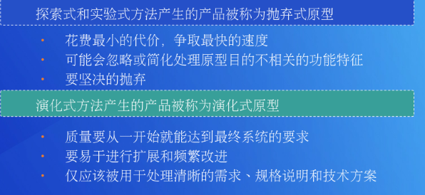
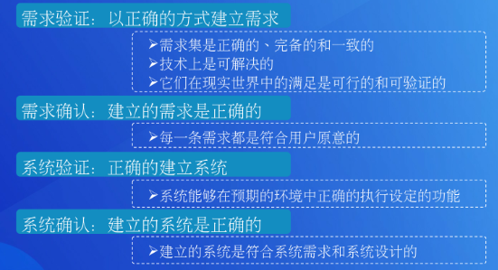
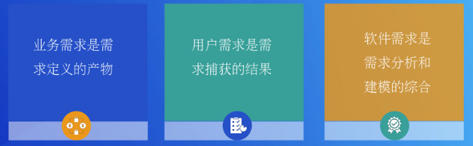
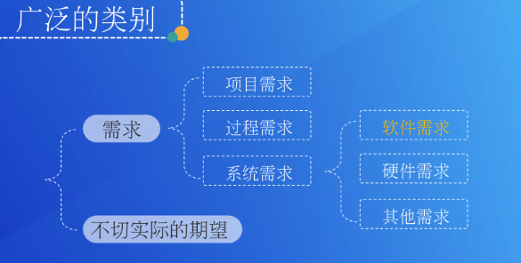
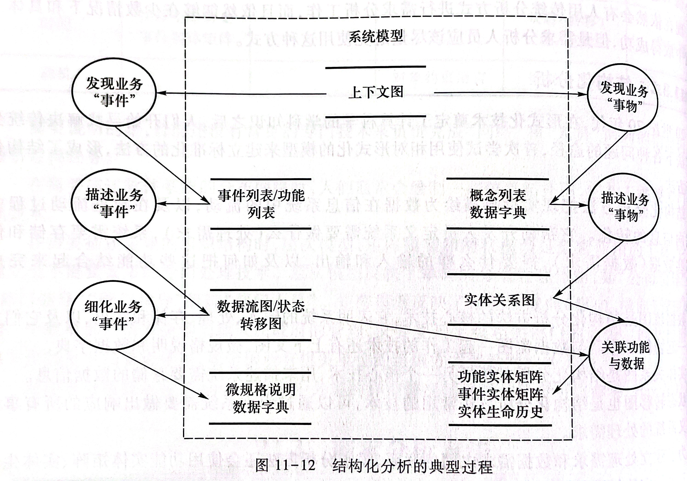
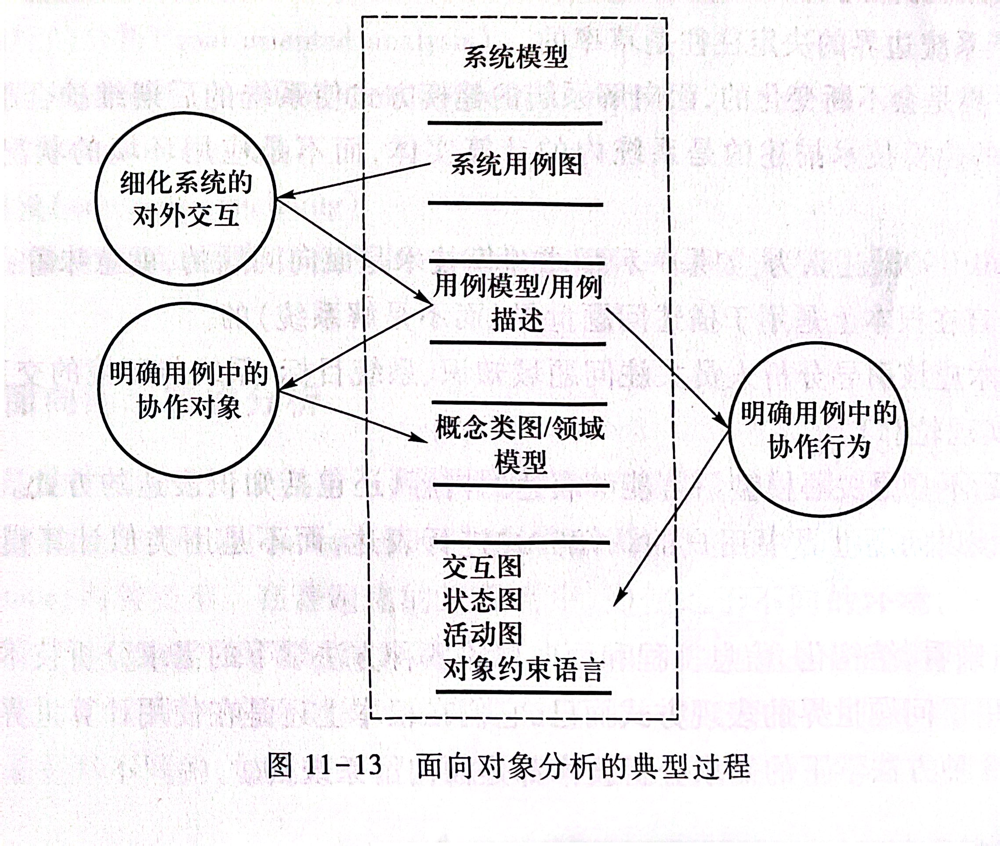
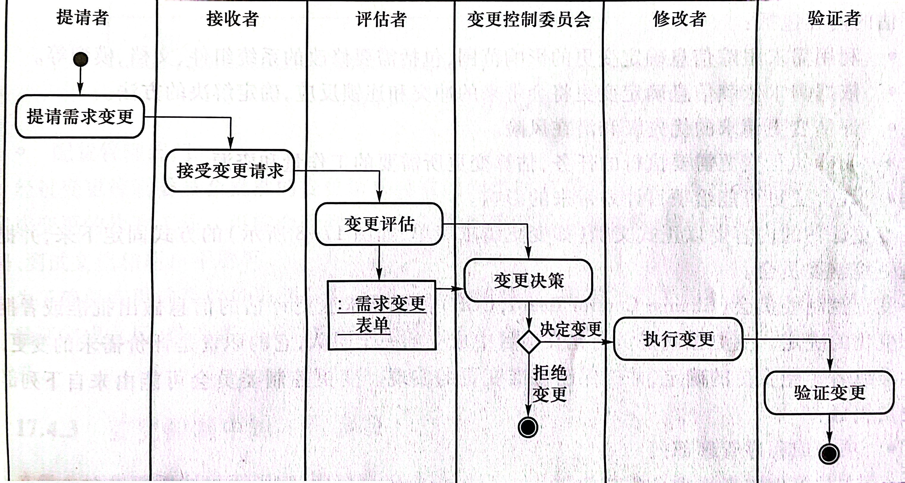

# 需求分析复习

## 基本概念

###### **•需求：**

​	①用户为了解决问题或达到某些目标所需要的条件或能力;

​	②系统或系统部件为了满足合同、标准、规范或其他正式文档所规定的要求而需要具备的条件或能力;

​	③对①或②中的一个条件或一种能力的一种文档化表述。

​	IEEE的定义中同时包括了用户的观点(第一种条件和能力)和开发者的观点(第二种条件和能力),它强调了“需求”的两个不可分割的方面:需求是以用户为中心的，是与问题相联系的；需求要被清晰、明确地写在文档上。

###### **•需求工程：**

​	简单来说，需求工程是所有需求处理活动的总和，它收集信息、分析问题、整合观点、记录需求并验证其正确性，最终反映软件被应用后与其环境互动形成的期望效应。

​	需求工程是软件工程的一个分支，它关注软件系统所应实现的现实世界目标、软件系统的功能和软件系统应当遵子的约束，同时也关注以上因素和准确的软件行为规格说明之间的联系,关注以上因素与其随时间或跨产品族而演化之后的相关因素之间的联系。

###### •**需求规格说明**:

​	获取的需求需要被编写成文档。业务需求被写人项目前景和范围文档,用户需求被写人用户需求文档(或用例文档)，系统级需求被写人需求规格说明。

​	编写文档的主要目的是在系统涉众之间交流需求信息，因此编写的文档应该具有定的质量。这些质量特性有些来自于文档内所有独立需求的质量之和,有些来自于编写者的写作技巧，最重要的质量要求是简洁、精确、一致和易于理解。

​	需求工程师在这个阶段的主要工作包括：1.定制文档模板2.编写文档

###### • **质量属性**:

​	为了度量一个系统的质量，人们通常会选用系统的某些质量要素进行量化处理，建立质量特征，这些特征成为质量属性。

###### •**非功能需求**:

​	除功能需求之外的其他4种类别需求又被统称为非功能需求 。在非功能需求中质量属性对系统成败的影响极大，因此在某些情况下，非功能需求又被用来特指质量属性。

  	性能需求 (performance reguiremend)：系统整体或其组成部分应该拥有的性能特征，如CPU 使用率和内存使用率等。
  	
  	质量属性(quality attribute)：系统完成工作的质量，即系统需要在一个“好的程度”上实现功能需求，如可靠性程度和可维护性程度等。
  	
  	对外接口 (external interface）：系统和环境中其他系统之间需要建立的接口,包括使件接口、软件接口和数据库接口等。
  	
  	约束(constraint）：进行系统构造时需要遵守的约束，如编程语言和使件设施等。

###### •**功能需求**:

​	  功能需求( functional requirement) ：和系统主要工作相关的需求，即在不考虑物理约束的情况下，用户希望系统所能够执行的活动，这些活动可以帮助用户完成任务。功能需求主要表现为系统和环境之间的行为交互。

###### •**业务需求**：

​	业务置求(business requirement)，针对整个业务的期望

###### •**用户需求**：

​	用户需求(user requirement) ,针对具体任务的期望

###### •**系统需求**:

​	系统级需求( system requirement)，针对用户与系统一次交互的期望

###### •**项目前景**:

​	描述了产品的作用以及最终的功能，将所有涉众都统一到一个方向。

•**项目范围**:

​	划定了需求的界限。指出了当前的项目是要解决产品长远规划中的哪一部分。

###### •**需求获取活动的过程**	P80

1.确定待获取信息的内容；2.确定待获取信息的来源;

3.确定应采用的获取方法；4.执行获取；5.记录成果。

###### ==•**涉众分析**==

P145？

###### •**==涉众分析方法==**

###### •**原型系统**

​	原型是一个系统，它内化(capture)了一个更迟系统(later system)的本质特征。原型系统通常被构造为不完整的系统，以在将来进行改进、补充或者替代。

###### •**原型系统类型**

​	按照使用方式进行分类：

​	按照开发方式分类：

###### •**用例**

​	用例是[Jacobson1992]最先在Objectory方法中提出的，用于描述电话通信中的信息交换序列一对话过程。后来人们开始使用用例描述系统与外界交互的行为序列一软件功能的执行场景，并得到越来越多的关注与应用。统一建模语言UML也将用例和用例模型看作是整体中的一个重要组成部分，UML对用例/场景的定义成为人们事实上的使用标准。

​	UML将用例定义为“在系统(或者子系统或者类)和外部对象的交互中所执行的行为序列的描述，包括各种不同的序列和错误的序列，它们能够联合提供种有价值的服务”[Rumbaugh2004]。 [Cockburn 2001]认为用例描述了在不同条件下系统对某一用户的请求所做出的响应。根据用户请求和请求时的系统条件，系统将执行不同的行为序列，每一个行为序列被称为一个场景。二个用例是多个场景的集合。

​	换句话说，每个用例是对相关场景集合的叙述性的文本描述，这些场景是用户和系统之间的交互行为序列,互有重合、互为补充，共同实现用户的目的。更精确地说，一个用例承载了所有和用户某个目标相关的成功和失败场景的集合。用例是一个理想的容器，以外部视图和描述系统可观察行为的方式记录系统的功能需求。

###### •**场景**：

​	场景是对系统和环境行为的局部描述，或者说场景是对行为或者事件序列的描述，序列中的行为和事件是系统需要完成的一个任务的特殊示例。（也可以说，场景是用户为了达到某个目标而和软件系统发生的行为交互序列，是开 发者描述软件功能和需求的一种重要形式。）

###### •**用例模型**	P172

​	用例/场景模型用于组织用户需求的相关内容，用例/场景分析是建立用例/场景模型的过程，但用例/场景分析无法完成对用户需求相关内容正确性、完备性一致性的验证。

###### •**需求分析**

###### •**需求验证**&•**需求确认**

​	和验证活动贯穿于软件开发活动一样，验证活动同样也普遍存在于需求开发活动中。

​	所述的需求验证专指在需求规格说明完成之后，对需求规格说明文档进行的验证活动。

​	需求验证并不是一个可以一次结束的活动 ,它可能需要多次、反复地执行验证。执行验证的方法有:需求评审、原型与模拟、测试用例开发、用户手册编制、利用跟踪关系和自动化分析。

###### •**需求基准（线）**

​	作为需求开发的结果，最终的需求应该被明确和固定下来,传递给其他的项目工作人员。需求基线就是被明确和固定下来的需求集合，是项目团队需要在某一特定产品版本中实现的特征和需求集合。

​	基线(baseline)为：已经通过正式评审和批准的规格说明或产品，它可以作为进一步开发的基础，并且只有通过正式的变更控制过程才能修改它。

###### •**需求管理**

​	在需求开发结束之后，还需要有一种力量保证后续的系统开发活动依照需求的基线展开，从而保障系统的质量(质量就是对需求的依从性)。需求管理就是这样的管理活动,它在需求开发之后的产品生命周期当中保证需求作用的有效发挥。

###### •**需求追踪**

​	需求跟踪是一种有效的控制手段,它能够在涉众的需求变化中协调系统的演化，保持各项开发工作对需求的一致性。

​	需求跟踪是以软件需求规格说明文档为基线，在向前和向后两个方向上，描述需求以及跟踪需求变化的能力。它分为前向跟踪和后向跟踪两种。

## 基本过程和思想

###### •**需求工程过程**：	P12

​	需求工程->需求管理/需求开发->需求获取/需求分析/需求规格说明/需求验证

###### •**优秀需求的特性**：

​	完备性、正确性、可行性、必要性、无歧义可验证

###### •**需求的层次性**

​    业务需求反映企业/组织对软件系统的高层次目标需求；用户需求,针对具体任务的期望；系统级需求，针对用户与系统一次交互的期望。

​    业务需求是抽象层次最高的需求，是系统建立的战略出发点，表现为高层次的目标；用户需求来自系统的使用用户，描述系统为用户做什么；系统级需求描述系统的目标与效益，适合决策者。

###### •**==常见的需求问题及解决方法==**

###### •**需求的类型**	P35

​	严格意义上：功能需求、性能需求、质量属性、对外接口、约束

•**需求获取过程**

​	1.收集背景资料	2.获取问题与目标，定义项目前景与范围	3.涉众识别，选择信息来源	4.选择获取方法，执行获取，获取功能与非功能需求	5.记录获取结果

​	–**系统边界确定**		P134

​		1.问题分析与系统边界定义	2.目标分析与系统边界定义	3.业务过程分析与系统边界定义

​	–**需求获取过程的困难**	P75

​		1.用户和开发人员的背景不同，立场不同：知识理解的困难、默认知识现象

​		2.普通用户缺乏概括性、综合性的表述能力

​		3.用户存在认知困境

​		4.用户越俎代庖：用户提出的不是需求,而是解决方案、用户固执地坚持某些特征和功能

​		5.缺乏用户参与：用户太多选择困难、用户认识不足不愿参与、用户情绪抵制消极参与、没有明确的用户

​	–**硬数据采集、定量硬数据和定性硬数据**	P167

​		定量数据指经过仔细设计具有严格规范的格式化文档，常见有：1.数据收集表格	2.统计报表

​		定性硬数据(大多是使用自然语言的文本描述)：1.整个组织的的描述文档	2.业务指导文档	3.业务备忘

​	–**面谈过程（面谈类型，面谈准备和采样）**

​		1）**金字塔结构**面谈问题的归纳式组织被看做是金字塔形状。使用这种形式时，会见者以很具体的问题（通常是封闭式的问题）开始，然后逐渐提高问题的开放度，同时允许被会见者用越来越笼统的答案来回答问题。在主动的情况下，如果会见者认为被会见者需要对话题进行预热，可以采用金字塔结构，通过逐步的引导使被会见者进入讨论；在被动的情况下，如果会见者发现自己事先对事实的确认存在较大偏差或者被会见者看上去不情愿讨论某个话题，也可以采用金字塔结构。

​		2）**漏斗结构**在这种结构中，会见者使用演绎的方法，以一般的、开放式的问题开始，然后用封闭式的问题缩小可能的答复。这种面谈结构可看做是漏斗型。在主动的情况下，漏斗结构为开始一场面谈提供了一种容易而轻松的途径。答复者即使答错了开放式问题，也不会感到压力；在被动的情况下，当被会见者对话题有情绪，并且需要自由表达这些情绪的时候，需要采用漏斗型提问顺序。或者在会见者事先对事实了解不多时，也应该采用漏斗结构的问题组织方式。 使用漏斗结构的一个好处是：用这种方式组织面谈能得出很多的详细信息，以至于没有必要使用长序列的封闭式问题。 

​		3）**菱形结构**人们在面谈中常常会将上述两种结构结合起来使用，其中菱形结构就是一种最好的结合结果。这种结构以一种非常明确的方式开始，然后考察一般问题，最后得出一个非常明确的结论。会见者首先提出一些简单的、封闭式的问题，为面谈过程做好铺垫。在面谈的中间阶段，向被会见者提出明显没有“正确答案”的一般话题的看法。然后，会见者再次限制问题以获得明确的答复，这样就为会见者和被会见者提供了面谈的结束时机。菱形结构结合了其他两种结构的长处，但是也有缺点，即所花的时间比其他任何一个都长。

​		**准备工作：**1.阅读背景资料	2.确定面谈主题和目标	3.选择被会面者	4.通知被会面者做准备	5.确定问题和类型

​		**采样：**选择面谈对象的时候采用随机抽样，从各个阶层以及生产、会计、营销、系统、物流各选择2-3名客户参与面谈。高层管理均要参加面谈。因为在选择面谈的时候要力争均衡的用户需求，因此要设计各方面受系统影响的人。采样的规则：控制人数4-8人。高层管理的人最先面谈。然后是系统层。其余层的面谈对象根据实际情况可以先后安排面谈的时间，不一定要分先后顺序。

​	–**涉众分析及如何与用户建立良好关系**	P147

​		建立良好的合作关系：

​	（1）理解用户：对用户的基本特征描述（个人特征、工作特征、少数会涉及地理特征）

​	（2）评估用户：优先级评估、风险评估、共赢分析

​	（3）与用户协商，处理用户间对于项目期望冲突

​	（4）用户的个人特征和工作特征的描述可以帮助更好的确定功能需求。

​	–**原型（原型类型、原型开发步骤、优缺点及风险）**	P218
​		**比较原型开发方法的三种类型:**（1）探索式 探索式原型法是以缺陷需求开始继而不断调整和修正需求的原型开发方式。探索式的原型方法通常要尽可能地调整各种设计选项（例如需求内容、软件化内容以及软件支持方式等），并比较多种设计方案下的用户反馈以得到理想的用户需求。探索式的原型方法能够帮 助开发者更深入地了解用户的业务、问题和期望。
（2）实验式 实验式的原型方法初始时拥有清晰的用户需求，但是开发者对这些需求的实现方法、实现效果和可行性没有太大的把握。实验式的原型方法需要首先定义一个对原型的评估方法，确定评估的属性（例如可行性、适用性、效率、吞吐量等），据此评估各种技术方案下的原型，明确需求的可行性和有效的技术实现方案。
（3）演化式 在演化式的原型方法中，原型的开发并不是一个独立的活动，而是整个项目的持续开发过程中的一个部分。原型开发的初始点既有要求原型化的需求，也有项目积累下来的原型 资产。积累下的原型资产所没有实现的需求，往往是清晰的需求。在开发原型时，还要能够以一个整体的方式传递给下一个原型开发过程。这个被不断传递和不断增强的原型资产将成为最终的软件系统。通过在持续开发过程中使用原型方法，可以使软件开发过程更好地处理 用户需求的不断变动。

​		**在需求获取中使用原型方法的主要步骤包括：**
​    		①确定原型需求。搞清楚为什么要开发原型，拥有的起始点是什么，期望的结束标准是什么?
   		 ②原型开发。依据原型的需求特点和开发目的，选择原型开发方法和构建技术，建立初始原型。
​    		③原型评估。对上一阶段产生的原型进行评估，根据评估者的反馈判断原型是否满足 结束标准。评估者一般是用户和开发者。
   		 ④原型修正。如果已经建立的原型达到了目的，就结束原型方法过程。否则根据评估 者反馈的不足进行原型调整，调整完成后准备再次进行原型评估。

​		**开发步骤(P222)：**1.尽可能考虑各种不同的设计选项，构建多种方案供用户选择，将探索不确定功能需求的原型构建得易于修改；2.让探索可行性的原型收集充分的数据	3.控制开发成本

​		**优缺点及风险(P232)：**原型方法的最大优点是能够及早解决系统开发中的不确定性，从而减少软件项目失败的风险，但原型方法的复杂性使得它在减少风险的同时也引人了新的风险；原型方法最大的风险是成本失控；原型方法的第二个风险是给客户造成错误印象；	原型方法的第三个风险是用户可能会被原型所表现出来的非功能特性遮蔽了眼睛，从而忽略了他们更应该重视的功能特性；	原型方法的第四个风险是在澄清需求不确定性的同时也可能会掩盖一些用户假设，这些假设将会无从发现。

​	–**原型的必要性**

​    因为原型是在最终系统产生之前的一个局部真实表现，所以原型方法可以让人们在系统 的开发过程中，就能够对一些具体问题进行基于实物的有效沟通，从而帮助人们尽早解决软 件开发过程中存在的各种不确定性。不确定性是指人们已经拥有的知识是不充分的，不足以 预测将来的事件发展，或者不足以清晰、准确地描述某个事物。
实践证明，利用原型有如下好处：
①及时、有力地响应用户需求的变化。
②减少返工。
③帮助控制不完整需求所带来的风险。
④可以将一个大的难以处理的开发过程细分成一些更小更容易处理的步骤。
⑤减少开发成本，提高经济效益。
⑥增加开发者之间的交流，帮助确定技术解决方案的可行性。
⑦有效地识别风险和解决风险，帮助进行风险管理。
⑧提高用户在软件开发中的参与程度。

###### •**需求分析过程**

​	–**结构化分析过程**	P271

​	–**面向对象分析过程**	P273

###### •**需求规范说明过程**

​	–**数据建模过程**	P321

​		E-R图

​	–**过程建模过程**	P293

​		上下文图、数据流图、层次结构、数据字典

​	–**面向对象建模**	P338

​		UML、类图、交互图、顺序图、状态图

###### •**需求验证过程**

​	–**需求验证的方法**	P418

​		**1.需求评审：**又被称为同级评审，是指由作者之外的其他人来检查产品问题。在系统验证当中,评审是主要的**静态分析手段**，所以评审也是需求评审的一种主要方法。

​		**2.原型与模拟：**当有些需求涉及复杂的**动态行为**时，它可能就需要使用原型或模拟方法来加以验证。

​		**3.开发测试用例：**在需求开发完成之后，测试人员就作为软件需求规格说明文档的读者开始进行测试计划。测试计划的主要活动是依据需求设计测试用例，这些测试用例将在软件系统实现之后的功能测试当中得到执行。

​		**4.用户手册编制：**以软件需求规格说明文档为重要的工作依据；

​		**5.自动化分析**

​		**6.利用跟踪关系**

​	–**==如何综合使用需求验证方法==**

​	–**需求验证的作用（能发现哪些问题）**

​		在需求获取中：获得的用户需求是否正确?是否充分地支持业务需求?

​		在需求分析中：建立的分析模型是否正确反映了问题域特性和需求?细化的系统级需求是否充分和正确的支持用户需求?

​		需求规格说明：需求规格说明文档是否组织良好、书写正确?需求规格说明文档内的需求是否充分和正确地反映了涉众的意图?需求规格说明文档是否可以作为后续开发工作(设计、实现、测试等等)的基础?

​	–==**需求修正行为**==

​		1.需求澄清

​	第一种需要澄清的情况是已经获得了相应的需求信息,但是理解当中出现了偏差。这时需要需求工程师重新进行分析工作,按照正确的理解方式修正需求文档。

​	第二种需要澄清的情况是已经获得了相应的需求信息,但是它们没有被纳入需求分析或者文档化工作。这要求需求工程师重新分析和文档化这部分信息。

​	第三种需要澄清的情况是获得并正确理解了相应的需求信息，但是在文档化的过程当中使用了不怡当的表达方式。这要求文档编制人员重新以合适的方武修改对需求的表达。

​		2.发现缺失需求

​	需求验证当中可能会发现有些关键的需求没有获取，这时就需要重新执行需求获取工作,发比较严重的需求缺失情况是选择获取源时遗诵了某些关键涉众类型,这通常意味着大量的返工。

​		3.解决需求冲突

​	需求验证当中也常常会发现需求不一致和严正冲突的情况，这时需求开发人员要组织相关涉众，进行分析,引导并促成需水的协商解决。

​		4.修正不切实际的期望

​	不切实际的期望也是在需求验证中经常发现的问题类型，它有可能是技术上无法解决的单 一需求，也可能 是在项目的既定条件下无法解决的单一儒 水,还可 能是在项目的既定 条件下无法同时解决的需求集。

###### •**需求管理过程**

​	–**需求规格说明书的作用**	P392

​		①需求规格说明文档可以成为各方人员之间有关软件系统的协议基准。

​		②需求规格说明文档可以成为项目开发活动的一一个重要依据。

​		③在需求规格说明文档的编写过程中，可以尽早发现和减少可能的需求错误，从而减少项目的返工，降低项目的工作量。

​		④需求规格说明文档可以成为有效的智力资产。

​	–**需求变更的原因及管理**	P440

​		原因：问题发生改变、环境发生改变、需求基准线存在缺陷、用户变动、用户对软件的认识变化、相关产品出现。

​		管理：控制变更

​	–**需求管理的主要作用**	P432

​		交流涉众需要什么。

​		将需求应用、实施到解决方案。

​		驱动设计和实现工作。

​		控制变更。

​		将需求分配到子系统。

​		测试和验证最终产品。

​		控制迭代式开发中的变化。

​		辅助项目管理。

​		这些任务可以被归纳为需求管理的3个活动：维护需求基线、实现需求跟踪和控制变更。

​	–**需求基线**	P432

​		概念见上文

、

