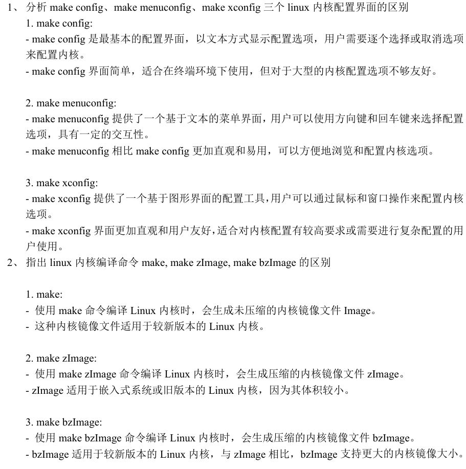

#  嵌入式系统原理与设计

[toc]

## 复习

> 本复习以老师的[复习pdf(2024)](2024.pdf)为依据 

### 嵌入式系统概述

**1. 嵌入式系统定义**

**嵌入式系统是指操作系统和功能软件集成于计算机硬件系统之中**。		


更为普遍的定义:

**嵌入式系统是以应用为中心，以计算机技术为基础，采用可剪裁软硬件，适用于对功能、可靠性、成本、体积、功耗等有严格要求的专用计算机系统。**


**2. 嵌入式系统组成**


硬件核心： 微处理器

外围设备：时钟模块、电源模块、输入输出设备、存储设备、通信模块


**3. 嵌入式系统与通用性计算机系统的区别**

+ 嵌入式系统通常是面向特定应用的
+ 嵌入式系统是将先进的计算机技术、半导体技术和电子技术与各个行业的具体应用相结合后的产物(技术密集、高度分散、不断创新)
+ 嵌入式的软硬件都必须高效率设计，量体裁衣、去除冗杂(专用性)
+ 本身不具备自主开发能力(需要开发工具以及环境)
+ 升级换代和具体产品同步进行(与具体应用有机结合)
+ 软件固化(软件一般固化在**存储器芯片**或**单片机本身**, 不是~~**磁盘**~~)


### ARM处理器和架构

**1.冯诺依曼结构与哈佛结构的区别**

- 冯诺依曼结构（普林斯顿结构）：在冯诺依曼结构中，数据和指令共享同一存储器空间，因此指令和数据使用相同的总线传输。这种结构的优点是简单且成本较低，但可能会导致数据与指令之间的竞争和瓶颈。指令地址与数据地址统一编码。

- 哈佛结构：在哈佛结构中，数据存储器和指令存储器是分开的，各自有独立的总线传输数据。这种结构可以提高性能，因为指令和数据可以同时访问，避免了竞争和瓶颈。然而，哈佛结构通常需要更多的硬件资源和成本。四总线制提高吞吐率(程序的地址总线、数据总线，数据的地址总线、数据总线)

**2.关键寄存器**

> ARM处理器的三个关键寄存器

1. `CPSR`: 当前程序状态寄存器，用于存储当前程序的状态信息，包括 条件码、中断屏蔽位、执行状态等。通过CPSR可以控制程序的执行和状态转换。
2. `SPSR`:保存程序状态寄存器，用于存储在异常处理过程中保存的程序 状态。当处理器发生异常时，当前程序状态会被保存到SPSR中，以便在异常处理完成后能够恢复到之前的状态
3. `PC`:程序计数器，用于存储当前正在执行的指令的地址。PC指向下一条要执行的指令的 地址，控制程序的执行流程。

**3. 指令集，微架构，芯片产品的关系**

指令集: **指令集架构**(ISA)的缩写，计算机系统中硬件和软件之间**交互**(指令)的**规范标准**，定义指令的格式、功能

> 指令集规范记录于手册(**Manual**)中

微架构: 就是将指令集手册定义的功能**实例化**，然后通过工程开发，变成**源代码**

芯片产品: 将**版图**提交给台积电/中芯国际等企业流片，然后由长电等企业完成封装，获得芯片

**ISA定义了软件与硬件之间的接口，微架构实现了ISA中定义的指令集，而芯片产品则是基于特定ISA和微架构设计的实际硬件产品 。**


**4. `RISC-V架构`相对于`X86/ARM`**的优势

+ 指令更精巧
+ 模块化，可根据需求自由组合，灵活搭配，支持自定义指令
+ 高性能
+ 开放免费

> 缺点: 生态不足，碎片化，专利问题


**5. 嵌入式处理器常见分类**

**EMPU**, **MCU**, **EDSP**, **SoC**

<details>
    <summary>点击查看更多细节(了解)</summary>
    EMPU： 嵌入式微处理器 (Embedded Microprocessor Unit)  </br>
	MCU: 嵌入式微控制器 (Microcontroller Unit) </br>
	EDSP: 嵌入式DSP处理器 (Embedded Digital Signal Processor) </br>
	SoC: 嵌入式片上系统 (System On Chip) </br>
	<p>
	EMPU常见的有: MIPS, ARM系列, PowerPC, SH处理器
	</p>
</details>

> 区别`ARMv7`和`ARM7` （以下是**个人总结**，ppt没有答案，*注意甄别*）
>
> `ARM7`系列是处理器版本型号，而`ARMv7`是ARM架构版本号，两者没有本质关联，或者说，ARM7用的也许不是ARMv7架构 
>
> *不知道这道题目的意义在哪*


**6. 基于`RISC架构`的`ARM处理器`的特点**

+ 体积小，低功耗，低成本，高性能
+ 支持Thumb(16 位)/ARM(32位)双指令集，能很好兼容8位/16位器件
+ 大量使用寄存器，指令执行速度快
+ 大多数数据操作都在寄存器中完成
+ 寻址方式灵活简单，执行效率高
+ 采用固定长度的指令格式

**7. ARM微处理器-Cortex系列**

三个系列： Cortex-A, Cortex-R 和 Cortex-M

+ `Cortex-A`: 面向高性能应用，13级的流水线，支持1-4个核
+ `Cortex-R`: 面向高实时性要求的应用，通常应用于专用集成电路(ASIC)，8级流水线
+ `Cortex-M`: 全球微控制器的标准，面向对能耗和价格有较高要求的用户，低延迟的3级流水线

**8. ARM指令集**

 * **指令集特征**

     * ARM指令集属于加载/存储型指令
     * 指令的操作数都储存在寄存器中，处理结果直接放回到目的寄存器中

<details>
<summary>
指令集的分类(复习ppt没有要求)
</summary>
<ol>
	<li>跳转指令(如 B, BL)</li>
	<li>数据处理指令(如 MOV, ADD)</li>
	<li>存储器访问指令(如 LDR, STR)</li>
	<li>协处理器指令(如 CDP, LDC, STC)</li>
	<li>杂项指令(如 BKPR【端点指令】)</li>
	<li>饱和算术指令(如 QADD)</li>
</ol>
</details>


 * **指令基本组成部分**

     `<opcode>{<cond>}{S} <Rd>,<Rn> {,<shift_op2>}`
     
     `< >`内的项目必选，`{ }`内的项目可选

|             | 解释                                                         |
| :---------: | ------------------------------------------------------------ |
|  `opcode`   | 操作码(指令助记符)                                           |
|   `cond`    | 条件码，描述指令执行的条件                                   |
|     `S`     | 若加上“S”，则在指令完毕后会自动更新CPSR中条件码标志位的值    |
|    `Rd`     | ARM指令的目标操作数 (总是一个**寄存器**)                     |
|    `Rn`     | 存放第1操作数的**寄存器**                                    |
| `shift_op2` | 第2操作数，灵活，可以是`寄存器`，`立即数`，而且能是使用经过位移运算的寄存器和立即数 |


* ARM指令和Thumb指令的区别
  * `ARM`指令集几乎每条指令（除了某些v5T指令）都可以是**条件**执行的，`Thumb`指令集除了B指令都是**无条件**执行的
  * 许多`Thumb`指令数据处理指令采用2地址格式（目的寄存器和源寄存器相同），而大多数`ARM`数据处理指令采用3地址格式
  * `ARM`指令在32位的存储下性能较高，而`Thumb`指令具有较高的指令密度，可以有效降低存储器功耗，在16位的存储器下具有较高的性能


* 寻址方式

     * 立即寻址

       ```
       ADD R1, R1, #0x1;  ‘#’加数字表示立即数
       ```

     * 寄存器寻址

       ```
       ADD R1, R1, R2
       
       MOV R1, R0; 也是寄存器寻址的一种，将R0寄存器的数据赋给R1
       ```
     
     * 寄存器偏移寻址
     
       ```
       ADD R1, R1, R2, ROR #0X2;  R2循环右移2位后与R1相加，结果放入R1
       
       MOV R1, R0, LSL R2;        RO逻辑左移R2位后放入R1
       ```
     
     * 寄存器间接寻址
     
       ```
       STR R1, [R2];		将R1的值存入以R2内容为地址的存储器中
       
       SWP R1，R1, [R2]
       ```
     
     * 基址变址寻址
     
       ```
       ; ppt 以及课本几乎没有提及，大概率不重点
       ; 就是寄存器间接寻址加上个偏移量
       
       ; 以下自己随便给个例子
       STR R1, [R2, #0x2]
       ```
     
     * 多寄存器寻址
     
       ```
       ; 在一条指令中完成多个寄存器数据的传送
       
       LDMIA RO, {R1, R2, R3, R4, R5}
       ```
     
     * 堆栈寻址
     
       ```
       ; 大概率不考，就是一个数据结构存放要寻址的寄存器，而指针始终指向栈顶
       
       STMFD SP!, {R1 - R7, LR}；	将R1-R7,LR存放到堆栈中，这条指令一般用来保护现场
       ```
     
     * 相对寻址
     
       ```
       ; 寄存器变址寻址的一个特例
       
       BL Label
       	...
       	Label:
       		...
       ```
     
     <details>
         <summary>小结</summary>
         以上是复习ppt给出要复习的内容，基本不涉及指令的内容，不知道是不是只是ppt没写出来而已，但想来这门课是嵌入式，不是计组，所以还真可能不考那么多的内容。
     </details>
     
     

### 嵌入式Linux操作系统

* 操作系统作用
  * 系统资源管理
  * 硬件虚拟化
  * 提供资源


* 常见嵌入式OS
  * 嵌入式Linux、Windows CE、Symbian、VxWorks(嵌入式系统领域中市场占有率最高)、QNX、Palm等
  * 鸿蒙 
  
  > 考试可能问鸿蒙的特点，考试忘了就胡扯吧。。。
  >
  > 卡片化的前端管理，物联网，。。。。
  >
  > + 统一OS，弹性部署
  > + 硬件互助，资源共享
  > + 一次开发，多端部署


1. **嵌入式Linux特点**

   * **Linux组成结构（4部分）**

     * **内核**

       * Linux内核组成结构（5部分）

         1. **进程调度程序（SCHED）**负责控制进程访CPU

            * 保证进程能够公平地访问 CPU，同时保证内核可以准时执行一些必需的硬件操作

         2. **内存管理程序（MM）**使多个进程可以安全地共享机器的主存系统，并支持虚拟内存

         3. **虚拟文件系统（VFS）**通过提供一个所有设备的公共文件接口，VFS 抽象了不同硬件设备的细节。此外，VFS 支持与其他操作系统兼容的不同的文件系统格式

         4. **网络接口（NET）**提供对许多建网标准和网络硬件的访问

         5. **进程间通信（IPC）**子系统为进程与进程之间的通信提供了一些机制

            

       * **Linux内核的命名机制：**
       
        `:num.num.num`  
        `:主版本号.此版本号.修订版本号`
       
     * **Shell**
     
     * **文件系统**
     
       嵌入式设备往往选用`ROM`、`Flash Memory`等作为主要存储设备
     
       `Flash Memory`是`Non-Volatile`（断电数据也能保存）内存的一种，具有`EEPRROM`（电擦除）的特点。
     
       主要有两种非易失闪存技术：`NAND`和`NOR`    
     
       `NAND`: 单元排列串行，以块和页为单位进行读写，顺序读写，随机读写慢  
       
       `NOR`:  单元排列并行，按字节进行读写，随机读写快，可以片内执行 
       
     * **应用程序**
     
       
     
   * **特点（了解）**
   
        * 广泛的硬件支持
        * 内核高效稳定
        * 开放源码，软件丰富
        * 优秀的开发工具
          * 以`gcc`做编译器，以`gdb`, `kgdb`, `xgdb`调试
        * 完善的网络通信和文件管理机制
   
2. **嵌入式Linux基础知识要点**

   #: root用户， $: 普通用户

   `command [-option] {parameters...}`

   `shell`常见命令、`gcc`编译命令、`Makefile`的编译 见[实验一](#实验一)

   这里列一些实验一没有的命令:

   `mv`: 移动文件

   `ln`: 创建链接(类似于`Windows`的快捷方式`.lnk`文件)

   ​	分为`符号链接`和`硬链接`，后者与原文件具有相同的`inode`(文件索引节点)

   ​	**符号链接像一个指针，指向另一个文件的位置，而硬链接则是与原始文件共享相同内容的另一个文件名。**

   ​	软链接: `ln a_b_c_d_305.file 305`， 硬链接: `ln -s a_b_c_d_305.file 305`

   `mount`: 挂载文件系统，将一个文件系统连接到另一个文件系统的一个点上的过程，这样用户和程序就可以访问挂载的文件系统中的文件了。将一个文件系统连接到另一个文件系统的一个点上的过程，这样用户和程序就可以访问挂载的文件系统中的文件了。详见实验四指导。

   `chown`: 改变文件或目录的所有者（owner）和所属组（group）

   ​	$e.g.$ `sudo chown john:users example.txt`

   `chmod`: 改变文件或目录的权限 【**面试试卷必出(别问我怎么知道)**】

   ​	`u`: 所有者，`g`: 所属组， `o`: 其他用户，`a`: 所有用户

   ​	`r`: 读(4)，`w`: 写(2)，`x`: 执行(1)

   ​	$e.g.$ `chmod go+rx example.txt`

   ​	`chmod 744 example.txt` 、`chmod u=rwx,g=r,o=r example.txt` 分别表示`u(4 + 2 + 1)`、`g(4)`、`o(4)`

   ​	三段式(`ls -l example.txt`):  `-rwxr--r--`，其中开头的`-`表示这是一个普通文件，`d`表示目录文件

3. Linux编程

   具体操作见[实验一](#实验一)

​	`vim/vi`的三种模式：普通模式、插入模式、命令行模式

​	`GCC`编译： 预处理、编译、汇编、链接

### 嵌入式软件编程

`Makefile`: 依赖关系 + 规则


1. 什么是`Make`、`Makefile`

   `make`是一种常用的编译工具，方便管理软件编译的内容、方式和时机，可以自动根据文件修改时间判断源文件哪些部分有更新，通过解释`Makefile`文件内的规则并执行响应的命令，重新编译链接这些更新过的文件。[**省流: 方便编译，缩短不必要的编译时间**]

   `Makefile`：一个用于自动化构建过程的文件，包含一系列规则，告诉`make`工具如何生成目标文件

   

2. `Makefile`的构成：

   ```makefile
   TARGET... : PREREQUISITES...  # 规则的目标: 规则的依赖
   
   COMMAND # 规则的命令
   ```

   

   可以在`Makefile`中定义变量，利用`$`访问

   此外，`@`表示当前目标文件，`<`规则的第一个依赖文件名，`^`规则的所有依赖文件列表

   > 其余的感觉也不会考。。。平常也用不到

   

   ```makefile
   # 编译文件 hello.c, 包含file1.h, file2.h，其中file1.h, file2.h声明的函数在file1.c, file2.c定义
   CC=gcc					# 指明编译器
   CFLAGS=					# 参数，为空，此行可以不写，虽然不知道老师为什么喜欢写，比如可以写 CFLAGS=-Wall -o3
   
   OBJS=hello.o file1.o file2.o
   
   all: hello				# 最终目标
   
   hello: $(OBJS)			# 依赖关系
   	$(CC) $(CFLAGS) $(OBJS) -o hello	# 这里的$(OBJS)就可以用$^代替， hello就可以用$@代替(目标)
   	
   hello.o: hello.c file1.h file2.h
   	$(CC) $(CFLAGS) -c hello.c -o hello.o # 这里的hello.o也课程用$@代替，目标: 依赖
   
   file1.o: file1.c file1.h
   	$(CC) -c file1.c -o $@
   	
   file2.o: file2.c file2.h
   	$(CC) -c file2.c -o $@
   	
   clean:
   	rm -f *.o	#这一步开心就好，想要怎么清理就怎么清理 rm -f $(OBJS) hello
   	
   
   ```

   

   除了显性规则，还有隐含规则和模式规则

   模式规则：`%.o: %.c`，详见实验（短时间内记不住的那种）

   隐含规则：类似这种`gcc hello.c -o hello` 一般`hello.o`会找到`hello.c`编译的目标

   

3. 可重入问题

   **可重入函数可以有多个任务并发使用，而不必担心数据出错。**

   + 将全局变量或静态变量改为局部变量
   + 采用信号量进行临界资源保护
   + 禁止中断
   
   
   
4. C语言和汇编语言编程

   > 我不信他考汇编语言。。。

   **1. 汇编程序调用C程序**

   ​	汇编语言使用`IMPORT`伪指令声明将要调用的C语言子程序

   ​	然后通过`BL`指令调用C函数

   **2.C程序调用汇编程序**

    + 嵌入式汇编

      汇编程序中使用`EXPOET`伪指令声明子程序将在其他文件中调用

      C程序中使用`extern`声明要调用的汇编子程序为外部函数

    + 内联汇编

      在C程序中使用`__asm__(输出:输入:修改)`语句实现

      优点:

      1. 可以实现一些高级语言不能实现或者不容易实现的功能
      2. 对于有时间紧迫要求的功能也可以通过C语言中内嵌汇编语句来实现

      $e.g.$

      ```c
      #include <stdio.h>
      
      int main(void) {
          int result, value;
          value = 1;
          printf("old value is %x\n", value);
          __asm("mov %0, %1, ror #1": "=r"(result): "r"(value));
          printf("new result is %x\n", result);
          
          return 1;
      }
      ```

      

### 开发环境和调试技术

1. **嵌入式软件开发的主要步骤**

   * 选择硬件开发平台
   * **建立嵌入式Linux开发环境** [*本章的内容*]
   * 系统软件开发
     * 建立引导装载程序**Bootloader**
     * **ARM-Linux**内核
     * 嵌入式文件系统
     * 嵌入式设备驱动
     * 嵌入式GUI
   * 嵌入式应用开发——Android / 鸿蒙应用开发

2. **嵌入式系统开发模式**

   * 硬件环境
     * 通信接口和设备
     
   * 软件环境

     **宿主机/目标机交叉开发模式**

      1. 原因

         嵌入式系统资源受限，直接在嵌入式系统硬件平台编写软件较为困难。

      2. 步骤

         + 在通用计算机上编写软件
         + 通过本地编译或者交叉编译生成目标平台可以运行的二进制代码格式
         + 下载到目标平台运行

            

         

3. **宿主机环境的建立**

   * 交叉编译环境
     
     * 包括交叉编译，交叉链接，交叉调试
     
     * 安装交叉编译工具机**`ToolChain`**（标准库、编译器、链接器、汇编器、调试器）
       * 什么是**交叉编译**
     
         在一种平台上编译出能在另一种平台（体系结构不同）上运行的程序
     
   * 建立宿主机-目标机之间的通信连接
     <div id="通信方式"></div>
     
     * `JTAG`
       
       * 芯片级接口，第一个运行软件需要通过`JTAG`口传递
       
         > 目标板的`JTAG`接口连接开发机的`并口/USB`
       
     * 实现串口通讯
       * 驱动实现最简单
       * 传输速度慢，距离短，不适合大数据量、长距离数据传输
       * 需要在宿主机、目标机两端均提供驱动
       * 常用于宿主机-目标机的字符流通讯
       
     * 网络通讯
       * 驱动实现相对复杂，一般采用精简的网络通讯协议，如`TFTP`进行通讯
       * 常用语宿主机-目标机的大数据量数据传输，可以作为串口通讯的补充
       * 需要在宿主机、目标机两端均提供驱动
       * 宿主机端实现服务器，目标机端提供客户端

4. **交叉编译**

   * 交叉编译就是在一个架构下编译另一个架构的目标文件
   * 采用何种交叉编译器产生何种格式的目标文件还要取决于目标机的操作系统

5. **TFTP协议**

   * **TFTP服务的全称是Trivial File Transfer Protocol**
     * TFTP可以看成一个简化了的FTP
   * **特点：**
     * TFTP承载在UDP上
     * 最普遍使用的是第二版TFTP使用UDP的67端口
     * **TFTP在安装时一定要设立一个单独的目录作为TFTP服务的根目录，以减少安全隐患**
     * 利用TFTP下载Linux映像

6. **Linux下的调试——`gdb`调试**

   * 运行程序，可以给程序加上所需的任何调试条件

   * 在给定的条件下让程序停止

   * 检查程序停止时的运行状态

   * 通过改变一些数据，可以更快地改正程序的错误

     

   * **GDB用法？**

     * 在编译时，必须要把调试信息加到可执行文件中
     * 使用编译器（`cc` / `gcc` / `g++`）的 -g 参数
     
     具体可以查看[实验五](#实验五)
     
     

7. **搭建嵌入式系统的远程调试环境**

   * **搭建原理**

     * `Stub`方案

       `Stub`：为解决调试器与被调试程序如何通信、被调试程序产生异常如何即时通知调试器、调试器如何控制和访问被调试程序等问题，需要在目标操作系统和宿主机调试器内分别添加一些功能模块，然后二者互通信息调试，这种**方案**称为`Stub(插桩)`

   * **远程调试原理**
   
     * 用`ROM Monitor`调试目标板程序
     * 用`kgdb`调试系统内核
     * 用`gdbserver`调试用户空间应用程序
     
     


### Boot Loader技术

* **PC机与嵌入式系统的启动过程及其差别？**
  * PC机：
    	+ 加电自检（`POST`)
    	+ `BIOS`/`UEFI`初始化
    	+ 加载引导程序
    	+ 加载操作系统
  
  * 嵌入式：
  
    *  硬件初始化
    *  加载引导程序
    *  内核启动
    *  加载根文件系统
    *  启动用户程序
  
  * 差别
  
    嵌入式系统没有`POST`，用没有`BIOS`，启动过程更加简单和定制化，可以是直接从固话的存储器中（如闪存）加载引导程序，更快速和更高效率；PC系统启动往往会做一系列检查
  
* **什么是Boot Loader?**
  
  在操作系统内核运行之前运行的一段小程序（**引导加载程序**）
  
  * 常见的Boot Loader
  
    `U-Boot`、`vivi`、`Redboot`
  
* **主要工作**
  
  * 初始化硬件设备和建立内存空间的映射图
  * 将系统的软硬件环境带到一个合适的状态
  * 为最终调用操作系统内核准备好正确的环境


1. **相关概念**
   * **Boot Loader的操作模式**
     * 启动加载模式
     * 下载模式
       * 如何使用串口终端
       
         > 如果问的是如何使用串口终端连接，这个问题似乎没有意义。。。。使用传输协议，往下看`xmodem`等
         >
         > 如果问的下载模式如何通过连接下载文件：
         >
         > 首先被Boot Loader保存到目标机的RAM中，然后再被Boot Loader写到目标机的Flash类固态设备中。
   * **Boot Loader与主机之间的通信设备及协议**
     * 最常见的是**串口**，协议`xmodem` /` ymodem` / `zmodem`
     * 以太网，协议**`TFTP`**
   * **从操作系统的角度看，Boot Loader的总目标就是正确的调用内核来执行**
   
2. **Boot Loader的典型结构框架**
   
   * 大多数Boot Loader都分为**阶段1**和**阶段2**两个部分
     * 阶段1的任务
       * 实现依赖于CPU体系结构的代码
     * 阶段2的任务
       * 实现一些复杂的任务（C语言）
   
     > 以下阶段内容了解即可
   
      阶段1
   
     + 硬件设备初始化
     + 为加载阶段2准备RAM空间
     + 拷贝阶段2到RAM中
     + 设置堆栈指针SP
     + 跳转到阶段2的C入口点
   
   
        阶段2
   
     + 初始化本阶段要使用到的硬件设备
     + 检测系统的内存映射
     + 加载内核映像和根文件系统系统映像
     + 设置内核的启动参数
     + 调用内核
   
     
   
3. **Boot Loader的使用**
   
   * **烧写Boot Loader**
     
     * 烧写方法
     
       `JTAG`、`串口`、网络等等，跟上方的宿主机和目标机的通信方式基本一致，基本都可以
     
       > ~~这里我不明白老师说的第一个程序只能通过`JTAG`是什么意思~~
     
   * **Boot Loader加载或烧写内核和文件系统**
     
     * Boot Loader的操作模式
     * Boot Loader编程：trampoline 
     
       > 当`main`函数执行完成后，执行`trampoline`，然后`trampoline`小程序作为`main`的外部包裹，所以`main`函数执行完成后，就继续执行`main`函数
     
   * **Boot Loader如何检测内存（RAM）可读写**
   
     > ~~这个问题课件没有，复习ppt也没有答案。~~
     >
     > 有一个办法，就是`读写测试`
     >
     > 往指定内存地址读写操作，首先写入一个特定的数据模式，然后立即读回并比较，判断两个数据是否一致。
     >
     > `范围测试`
   
     
   
     ​	
   
   * **Boot Loader**与内核的通信
   
     * 传递启动参数
     * 设置内核运行环境
     * 加载内核模块
     * 传递控制权


### ARM-Linux 内核

1. **内存管理**
   * **内存管理内容**
     * 包含地址映射、内存空间的分配，有时还包括地址访问的限制
     * 如果将I/O也放在内存地址空间中，则还要包含I/O地址的映射
     * 另外，像代码段、数据段、堆栈段空间的分配等等都属于内存管理
   * **影响内存管理的两个方面**
     * Linux操作系统的内存管理 [ARM-Linux：基于ARM处理器的Linux内核]
     * `MMU（内存管理单元）`(`ARM`体系)，体系对内存管理的特殊性

2. **MMU**

   * **作用**
     * 地址映射
     * 对地址访问进行保护和限制
   * **地址映射方式种类**
     * 段映射（`Section`: 1MB)[单层]
     * 页面映射 （`Page`， 大的64KB，小的4KB，微小的1KB）
   * MMU可以做在芯片中，也可以作为协处理器

3. **嵌入式Linux内核**

   * 虚拟内存

   * 内存映射模型

        

     >  记不住。。。
     >
     > `mm_struct`最高层次，`vm_area_struct`较高层次

4. **进程管理和调度**

   * **进程**：又称作任务，是一个动态的执行过程，是处于执行期的程序，是系统资源分配的最小单位。

   * Linux中，每个进程由一个`task_struct`的数据结构来表示

   * **Linux进程的创建**

     * 三个系统调用

       * `sys_fork`
       * `sys_vfork`
       * `sys_clone`

       三个系统调用的区别：

        

   * **Linux进程的执行**

     * fork创建一个新的进程会产生一个新的PID，exec启动一个新程序，替换原有的进程，所以这个新的被执行exec执行的程序的PID不会改变，和调用exec函数的进程一样
     * 通常在使用 fork() 后，子进程会调用 exec() 来执行新的程序 。

   * **进程的销毁——三个事件驱动**

     * 正常的进程结束

     * 信号终止

     * exit函数的调用

       本质都要借助内核函数`do_exit`的调用来结束进程

   * **进程调度依据**

     功能：

     	+ 清理当前运行中的进程
     	+ 选择下一个投入运行的进程
      + 设置新进程的运行环境
     	+ 执行进程上下文切换

     下面四个在`task_struct`结构中

     * Policy
       * 调度策略，用来区分实时进程和普通进程
       *  实时进程会优先于普通进程执行
     * Priority
       * 进程（包括实时和普通）的静态优先级
     * Counter
       * 进程剩余的时间片，起始值就是priority的值
       * 可以看作是进程的动态优先级
     * rt_priority
       * 实时进程特有的，用于实现进程间的选择

     Linux中，用函数`googness()`综合以上四项并结合其他因素，给每个处于可运行状态的进程赋予一个权值

5. **Linux模块机制**
   * 必要性

     * 弥补Linux可拓展性以及可维护性差的缺点

   * 模块的代码结构

     ```c
     //头文件
     #include <linux/module.h>
     #include <linux/init.h>
     #include <linux/kernel.h>
     
     //模块宏声明，不是每个选项都必须
     MODULE_LICENSE("GPL");
     MODULE_DESCRIPTION("TEST");
     MODULE_AUTHOR("JiGuang");
     
     //初始化函数
     static int __init mod_init_func(void) // __init不可省略, mod_init_func名字无所谓
     {
         printk(KERN_EMERG "Hello\n");
         return 0;
     }
     
     //退出函数
     static void __exit mod_exit_func(void)
     {
         printk(KERN_EMERG "See you \n");
     }
     
     //入口出口函数设置
     module_init(mod_init_func);
     module_exit(mod_exit_func);
     
     ```

     

6. **与Linux模块相关的命令**

   <div id="挂载方式"></div>

   * **`lsmod`** 把现在kernel中已经安装的modules列出来
   * **`insmod`** 把某个module安装到kernel中
   * **`rmmod`** 把某个没在用的module从kernel中卸载
   * **`depmod`** 制造module dependency file，以告诉将来的`insmod`要去哪儿找modules来安装

7. **中断管理**

   * **一个流程**

     > 我不信他让我们描述

       
   * **三个环节**
     * 中断响应
     * 中断处理
     * 中断返回
   * **GPIO**

     ​	是一个通用的可编程I/0接口，每一位都可在程序的控制下设置用于输入或者输出；用于**输入**时，可引发中断请求

8. **系统调用**

   * 实现方式
     
     通过经过封装的C库(`libc`)或者直接调用
     
     * `x86`：通过自陷指令`INT 0x80`实现
     * `ARM`：通过自陷指令`SWI`实现
     
     保存当前运行的信息
     根据系统调用号查找相应的函数去执行
     恢复原先保存的运行信息返回

9. **启动和初始化**

   * **过程**

     * 使用Boot Loader`将内核映像载入

     * 内核数据结构初始化

     * 外设初始化

       >  后两者属于初始化过程，特别特别特别特别特别多步骤，应该不考

   * **`/etc/inittab`**

     `init`程序通过读取该文件作为其行为指针，`inittab`是以行为为单位的描述性(**非执行性**)文本，每一个指令行都具有一下格式

     * `id:runlevel:action:process`

       `入口标识符:运行级别:动作代号:具体的执行程序`

10. **嵌入式Linux内核编译**

    ```mermaid
    flowchart TD
        A[Linux内核配置] --> B[Linux内核编译]
        B --> C[内容下载与烧写]
    ```

    * **Linux内核配置**区别：
      
      * **`make config`**
      * **`make menuconfig`**
      
      * **`make xconfig`**
    * **Linux内核编译**区别
      * `**make`**
      * **`make zImage`**
      * **`make bzImage`**

​		详见[实验三](#实验三)

<details>
    <summary>懒得去看实验请点此</summary>
    
</details>


### 文件系统

1. **嵌入式文件系统知识点**

   * **控制设备驱动的途径有哪些**

     * 通过设备驱动的接口
     * 通过文件管理器接口

     > 这个问题看起来很奇怪，事实上也是很奇怪。但是，Linux中，请时刻记住设备属于文件。所以这个问题出现在这里也能理解。
   * **Linux文件系统组织结构**

     ​	通过树结构（`单根倒置树结构`），如`/bin/sbin/etc/dev/proc/var/temp/usr/home`
   * **Linux文件系统与Windows文件系统区别**

     |          | Linux                | Windows                                |
     | -------- | -------------------- | -------------------------------------- |
     | 组织结构 | 文件树 /etc/home     | 以驱动器的盘符为基础 C:\\Windows\Users |
     | 分区     | 分区属于目录结构     | 目录结构属于分区                       |
     | 开源     | 开源                 | 商业                                   |
     | 设备     | 设备属于文件         | 将硬盘等视为设备                       |
     | 权限     | 每个文件`rwx`        | 管理员（面向对象）                     |
     | 进程     | 不会锁定对文件的独占 | 会锁定对文件的独占                     |

     至于文件系统格式并不是绝对的，因为操作系统可以使用多个文件系统。

     一般`Linux`是`EXT`系列，`Windows`是`NTFS`，后者区分大小写

2. **常用文件系统**

   * **通用文件系统**
     * ext2
       * **能否做嵌入式文件系统？**
       
         > 对于这道问题，ext2文件具有轻量级、高性能和稳定性等特点，适用于嵌入式设备中。
         >
         > 但是，这可能是相对的。。。下面有道题：
         >
         >     
         >
         > <details>
         >     <summary>答案</summary>
         >     D
         > </details>
         >
         > 
   * **常用嵌入式文件系统**
     * **NAND Flash** $\longrightarrow$ **YAFFS2**
     * **NOR Flash** $\longrightarrow$ **JFFS2**
     * **RAM** $\longrightarrow$ **RAMFS**
     * **Network** $\longrightarrow$ **NFS**

3. **根文件系统**

   * **什么是根文件系统：**

     系统挂载的第一个文件系统，本质上就是一种目录结构，需要包括Linux启动时所必需的目录和关键性文件。

     **`根文件系统`**： 
   * **如何建立根文件系统？**

     详见[实验四](#实验四)

     <details>
         <summary>粗浅的流程</summary>
         准备好工具后，创建根文件系统目录，编译<strong>busyBox</strong>，然后安装（make install）,添加一些链接库到lib目录，最后添加一些必要的文件，生成镜像。
     </details>
    
     

4. **`cramfs`嵌入式根文件系统构造**

   ```mermaid
   flowchart TD
       A[make menuconfig] --> B[make]
       B --> C[make install]
       C --> D[创建一些必要的文件，包括rc,rcS,motd等]
       D --> E[mkfs.cramfs]
       E --> F[烧到flash中]
   ```
   
   

### 设备驱动

**设备驱动程序**，这里简写成设备驱动。

* **基本概念**
  
  * 作用
  
    * 设备初始化和释放
    * 传输数据（内核与硬件之间，双向）
    * 读取应用程序传送给设备文件的数据，回送应用程序请求的数据
    * 检测和处理设备出现的错误
  
  * 设备的分类
  
    * 字符设备：无需缓冲直接读写
    * 块设备：通过`buffer`或`cache`进行读写，支持随机访问
    * 网络设备：通过`BSD`套接口访问
  
  * 设备文件
  
    Linux抽象了对硬件设备的访问，可作为普通文件一样访问，使用和操作文件相同的、标准的系统调用接口来完成打开、关闭、读写和I/O控制操作
  
    * 设备号
  
      每个设备文件都对应两个设备号
  
      + 主设备号，标识设备的种类，使用的驱动程序
      + 次设备号，标识使用同一设备驱动程序的不同硬件设备
  
      `sudo mknod /dev/lp0 c 6 0`：
  
      该命令用来创建设备节点，`/dev/lp0`为要创建的设备节点和名称，`c`表示创建，`6`、`0`分别是主、次设备号
  
      <details>
          <summary>设备节点和设备文件的区别（上课提过，复习PPT没有提及，可能不考）</summary>
          用来表示系统中的硬件设备或虚拟设备的特殊文件就叫做设备文件，一般放在/dev目录下 </br>
      	而设备节点是设备文件的一种<strong>表现形式</strong>。也就是说，可以用设备文件的路径来表示设备文件。 </br>
      	在我看来，这种关系就好比有一个文件a,现在这个文件丢给你，这就是一个实际的文件来表示你之前说的文件（设备节点），但也可以直接告诉你文件的路径来表示这个文件，而文件a(好比设备文件)是真实存在的，而丢给你的文件也是真实存在的。
      </details>
      
      
  
* **`sysfs`文件系统**

  设备拓扑结构的文件系统表示，为了方便调试，将设备结构树导出为一个文件系统，即`sysfs`文件系统，挂载在`/sys`目录下

  

1. **驱动程序的编写及加载**

   ```mermaid
   flowchart TD
       A[编写驱动程序] --> B[驱动程序编译]
       B --> C[下载到目标板]
       C --> D[挂载目标模块]
   ```
   
   

   * **编写驱动程序**
     * 程序结构
       * 驱动程序的注册与注销
       * 设备的打开与释放
       * 设备的读写操作
       * 设备的控制操作
       * 设备的中断和轮询处理
     
   * **下载到目标板**
     
     下载方式见[目标板与宿主机的通信方式](#通信方式)
     
   * **挂载目标模块**
   
     挂载模块方式见[第七章](#挂载方式)。
   
     驱动程序编写完本质也是一个模块，需要挂载。
   
2. **同步机制**

   * **内核同步**

     Linux内核的同步机制

     * 同步锁

       * 自旋锁

         **如果获取自旋锁时锁已经有保持者，那么获取锁这个操作将自旋，知道该自旋锁的保持者释放了锁**

       * 读写锁

         `读者/写者`形式的锁允许任意数目的读者同时进入临界区，但写者必须是排他的。

       * RCU锁

         改进的读写锁，相比下允许多个读者和多个写者在同一时刻访问被保护数据。

       * `Seqlock`

         实现原理类似`c++`的`shared_ptr`，利用计数器，能够实现快速地、无锁地存取一个共享资源。

     * 信号量

     * 原子操作

       **最小的执行单位**。指该操作在执行完毕前绝对不会被任何其他任务或时间打断。

     * 完成事件

       实现简单睡眠直到其他进程完成某些处理过程，不会引起资源竞争。

       **线程之间的通信和协调**，而同步锁用于**保护共享资源的访问**

   * **设备操作——同步 or 异步**

3. **DMA（Direct Memory Access）**

   **`直接内存存取`**
   
   * 解决快速数据访问
   * DMA控制器可以不需要处理器的干预，在设备和系统内存高速传输数据


#### 字符设备和驱动程序设计

**字符型设备驱动**

   * 数据结构
     * `struct file_operations`
     
       描述一个文件操作所需要的所有函数（以函数指针的形式给出）
     
     * `struct file`
     
       每次打开的文件，在内核中都用`file`结构体表示，其中有一个成员`f_op`，指向`file_operations`
     
       Linux所有的设备都是文件，在内核中使用`file`结构体来表示一个打开的文件。
     
     * `struct inode`
     
       内核文件系统索引节点对象，包含了内核在操作文件或目录时所需要的全部信息
     
       **内核中用`inode`表示文件**，同个文件可能会有多个打开文件，~~因此一个`inode`结构体可能对应多个`file`结构体~~[存疑]
     
       对于设备文件，`inode`的`dev_t i_rdev`表示实际的设备号，`struct cdev *i_cdev`指向`cdev`结构的指针，字符设备在内核中用`cdev`表示
     
   * 串行总线接口
     * `SPI`：高速、全双工、同步的串行总线，有两种模式：主模式、从模式
     
     * `I²C`：简单，高效
     
       `I²C`驱动架构有三个组成部分：
     
       + I²C核心
       + I²C总线驱动
       + I²C设备驱动


#### 块设备驱动和驱动程序设计

* **数据结构**
   * `gendisk`：表示是一个独立磁盘设备或者一个分区，记录磁盘等的设备号等等信息
   * `request_queue`：每一个块设备都有一个请求队列，组织和跟踪该设备的所有I/O请求，并提供插入接口给I/O调度器使用
   * `request`

* 主要工作
  * 初始化

    + 注册块设备及块设备驱动程序
    + 分配、初始化、绑定请求队列
    + 分配、初始化`gendisk`，为相应的成员赋值并添加`gendisk`
    + 其他初始化工作，比如申请缓冲区，设置硬件尺寸等等

  * 请求处理

    通过`请求函数`完成

    > 块设备不像字符设备操作，没有`read`和`write`，对块设备的读写是通过请求函数完成的。请求函数出块设备驱动的核心。


#### 网络设备和驱动程序设计

  * **数据结构**
     
     * `net_device`：记录设备基本信息
     * `sk_buffer`：处理网络数据包
     
   * **主要工作**
     
     * 初始化
     
       主要对`net_device`进行初始化，由`net_device`的`init`函数指针指向的函数完成，当加载网络驱动模块时该函数就会被调用。
     
     * 打开接口
     
       在数据包放送前，必须打开接口并初始化。
     
       由`net_device`的`open`函数指针指向的函数完成。


### 嵌入式系统应用

1. **嵌入式GUI**
   * **基本概念**
   
     嵌入式系统的图形用户界面。
   
   * **分类**
   
     * 与操作系统结合的GUI：如IOS
     * 外挂GUI：如`Android`、`Qt/E`、`MiniGUI`、`Microwindows`
     * 简单GUI：可重用性差
   
   * **体系结构——分层设计**
   
         
   
     
   
     
   
     * 三层
   
       * 抽象层：隐藏硬件的复杂性，为上层提供统一的接口
   
       * 核心层：包含了渲染引擎、事件处理、窗口管理器等核心功能
   
       * 应用程序接口层
   
         
   
2. **Android应用程序构成**
   * 一个Android应用程序构成
     * 活动（Activity）：Android应用程序最基本的组成单位，一个Activity对象通常就表示一个单独的屏幕。**用户唯一看得到的组件**
     
       * **`Activity`的生命周期**
     
         用户浏览、退出和返回到应用时，应用中的`Activity`实例会在其生命周期的不同状态间转换。
     
         六个核心回调：
     
         `onCreate()`、`onStart()`、`onResume()`、`onPause()`、`onStop()`、`onDestroy()`
     
     * 意图（Intent）：一个消息传递对象，使用它请求其他组件执行操作。
     
     * 服务（Service）：一个没有用户界面的应用组件，在后台执行长时间运行的操作
     
     * 内容提供器（Content Provider）：管理一组共享的应用数据，在文件系统、数据库或网络上
     
     
   
3. **鸿蒙应用开发**
   
   * 开发语言：`ArkTS`
   
   * Ability
     
     应用所具备能力的抽象，一个应用可以有多种能力
     
     * **FA**：UI界面
     * **PA**：`Ability`调用的各种服务

    

## 作业

### 作业三

1. 简述 Linux 操作系统内存管理的功能。（$P_{57}$​)

    1. 运行比内存还要大的程序。
    2. 先加载部分程序运行，缩短了程启动的时间。
    3. 可以使多个程序同时驻留在内存中提高CPU利用率。
    4. 可以运行重定位程序。（程序可以放于内存中的任何一处，且可以在执行程序中移动）
    5. 写机器无关的代码
    6. 减轻程序员分配和管理内存资源的负担
    7. 可以进行内存共享
    8. 提供内存保护

2. 解释 MMU （$P_{56} $ ~ $P_{57}$)
     ```MMU```: 内存管理单元，提供一组寄存器，并依靠这组寄存器来实现地址映射和访问保护，可以做在芯片中，也可以作为协处理器。 

3. C程序如何调用汇编程序。($P_{83}$)
     可以使用`嵌入式汇编` 或 `内联汇编` 调用。

4. 宿主机和目标机的连接方式有几种，各种连接方式的作用。  ($P_{86}$)
	1. `串口`：可以当做终端使用，利用串口给目标板发送命令，同时可接受目标板返回的信息并显示，可以传送文件，实现简单。
	2. `以太网`：使用简单，配置灵活，支持广泛，传输速率块，安全可靠。
	3. `USB`：快速、灵活、易于使用，支持热插拔。
	4. `JTAG`：用于芯片内部测试以及对系统进行仿真，调试。    

5. 简述如何进行嵌入式调试（三个层次）(`课本没有，结合PPT进行整理[问了个啥都不知道]`)

     ​	嵌入式应用一般采用交叉调试。

      1. 宿主机启用调试器
      2. 宿主机调试器与目标机调试服务器建立通信通道，向目标系统发送调试信息。
      3. 目标机被调试程序若触发异常，调用异常处理程序，转入调试端口通信。


      1. 上电初始化调试  
      2. 系统内核调试  
      3. 应用程序调试


 > 也可能问的这三个：远程调试、内核调试、网络调试。


## 实验

[实验平台](http://172.18.120.22:8080/#/login)  
[新实验平台](http://172.18.120.29:8080/#/login)

> 校外访问: https://172-18-120-29-8080-p.sslvpn.ecust.edu.cn:8118/#/login  
> 对于https端口，加入后缀即可访问 vpn

>  密码: `123456`  进入实验后选择任意一个实验，点击实验环境中的 `登录`

### 实验一

二.2 
<a href="ex1.pdf" target="_blank">pdf</a>  


新建项目目录project-1，完成如下功能：

1）在该项目中编写hello.c程序，该程序输出“Hello,world！”；

2）通过gcc命令编译该文件，运行该可执行程序。

----------------------------------------------------------------------

```bash
mkdir project-1
cd project-1

vim hello.c

```

`hello.c`文件内容：

```c
#include <stdio.h>

int main() {
    printf("Hello, world!\n");
    
    return 0;
}

```

退出编辑模式后，输入`:wq` 保存文件

使用命令编译运行文件：

```bash
gcc -c hello.c
gcc hello.o -o hello

./hello

```


二.3

新建项目目录project-2，完成如下功能：

1）在该项目中编写makefile-hello.c程序；

2）该程序输出“Hello,world for Makefile！”；

3）编写Makefile，通过Makefile编译makefile-hello.c，并运行可执行程序。

---------------------------------------------------------------------

使用命令返回到上一层，同样新建目录，并进入该目录

```bash
cd ..
mkdir project-2
cd project-2

vim makefile-hello.c

```

`makefile-hello.c`:

```c
#include <stdio.h>

int main() {
    printf("Hello, world for Makefile!\n")
        
    return 0;
}

```

新建`makefile`文件

```bash
vim makefile

```


`makefile`：

> 命令一定要缩放，不能空格 ಥ_ಥ

```makefile
CC=gcc
CFLAGS=

OBJS=hello.o
all: hello
hello: $(OBJS)
	$(CC) $(CFLAGS) $^ -o $@
hello.o: makefile-hello.c
	$(CC) $(CFLAGS) -c $< -o $@
	
clean:
	rm -rf hello*.o

```


保存退出

```bash
make

./hello

```


二.4

1）  新建项目目录project-3，完成如下功能：
        编写C语言文件file1.c、file2.c和相关的头文件；

2）file1.c输出：“This is the first file!”；

3）file2.c输出：“This is the second file!”；

4）编写Makefile，编译该工程，并运行可执行程序，依次输出：

This is the first file!

This is the second file!

-------------------------------------------------------

同样新建文件夹，创建以下文件

`file1.c`:

```c
#include <stdio.h>
#include "file1.h"

void showFile1(void) {
    printf("This is the first file!\n");
}

```

`file1.h`:

```c
void showFile1(void);

```

`file2.c`:

```c
#include <stdio.h>
#include "file2.h"

void showFile2(void) {
    printf("This is the second file!\n");
}

```

`file2.h`:

```c
void showFile2(void);

```

`main.c`:

```c
int main() {
    showFile1();
    showFile2();
}

```


`makefile`:

```makefile
CC=gcc
CFLAGS=

CFILES=$(wildcard *.c)
OBJS=$(CFILES:%.c=%.o)
all: main
main: $(OBJS)
	$(CC) $(CFLAGS) -o main $(OBJS)
.c.o:
	$(CC) -c $<
	
clean:
	rm -rf *.o

```

使用命令编译运行

```bash
make

./main

```


二.5

根据各人学号or姓名，为自己新建一个工作目录，并利用pwd命令查看自己的工作目录；将前述工程project-1到project-3打包成back.tar.g

```bash
mkdir 21013122
pwd 21013122

tar zcvg back.tar.g project-1 project-2 project-3

mv back.tar.g 21013122

```


### 实验二

[pdf文件](ex2.pdf)

<a href="ex2.pdf" target="_blank">新标签页打开pdf</a>

#### 题目说明

首先，*这个实验很多部分不同电脑不一样比如是添加用户时 `/etc/shadow`, `/etc/passwd`  这部分账号的id以及密码都是不确定的，不能 `直接照抄`*

其二，第四问 `file.c` 要求错误代码，这个错误代码要自己写，也不能一样

最后，第8问这个只能说上课讲过，但不知道咋写，实验指导也没有，所以这部分 `不能直接抄`

### 实验三

[pdf文件](ex3.pdf)
[doc文件](ex3.doc)

<a href="ex3.pdf" target="_blank">新标签页打开pdf</a>


### 实验五

[pdf文件](ex5.pdf)
[doc文件](ex5.doc)

<a href="ex5.pdf" target="_blank">新标签页打开pdf</a>
> 注意看文字，由于今天课上叫了我，于是在文档中有一些在吐槽，**不要抄**！！！！

### 实验四

[pdf文件](ex4.pdf)
[doc文件](ex4.doc)

<a href="ex4.pdf" target="_blank">新标签页打开pdf</a>  

> 这次实验没有代码的部分，我也没有**编译出一个文件系统**，所以都得**用自己的话**重新写一下步骤，包括思考题。
>
> 特别是**异同**那部分，是没话可说扯出来的，**这个绝对要改**。


### 实验六

**注意事项**：

1. ip每个虚拟机<font color="red">都不一样</font>，得自己查看  
2. 我之前换过虚拟机平台，所以出现的不能通过平台下载文件这个问题我不确定是否是我自己的问题，所以关于<font color="red">power shell</font>这部分的内容**最好别抄**.  
3. 简述主要步骤是我自己总结的，简述代码的作用是AI生成的，<font color="red">记得用AI重新生成一遍</font>  
4. 最后的思考题答案是本来就有了的，老师给的，不是我写的，所以**不用**替换。


<details>
    <summary>
        请注意注意事项的内容，特别是ip，绝对不一样，一样的会露馅，另外，这个实验的doc排版很阴间，最好自己修改一下，不要太一样.
    </summary>  
    <a href="ex6.pdf" target="_blank">新标签页打开pdf</a>    
    <a href="ex6.doc" target="_blank">打开word</a>    
</details>


### 实验七

众所周知，选做就是不做。

本实验绝大多数都是问的AI。除了前面两道有做实验之外。


[文档](ex7.doc)

<a href="ex7.pdf" target="_blank">pdf</a>  

