# 聚合物基复合材料

## 目录

<!-- TOC -->

- [聚合物基复合材料](#%E8%81%9A%E5%90%88%E7%89%A9%E5%9F%BA%E5%A4%8D%E5%90%88%E6%9D%90%E6%96%99)
    - [目录](#%E7%9B%AE%E5%BD%95)
    - [考点](#%E8%80%83%E7%82%B9)
    - [绪论](#%E7%BB%AA%E8%AE%BA)
        - [复合材料的发展](#%E5%A4%8D%E5%90%88%E6%9D%90%E6%96%99%E7%9A%84%E5%8F%91%E5%B1%95)
            - [降低成本](#%E9%99%8D%E4%BD%8E%E6%88%90%E6%9C%AC)
            - [高性能](#%E9%AB%98%E6%80%A7%E8%83%BD)
            - [功能复合材料](#%E5%8A%9F%E8%83%BD%E5%A4%8D%E5%90%88%E6%9D%90%E6%96%99)
            - [智能复合材料](#%E6%99%BA%E8%83%BD%E5%A4%8D%E5%90%88%E6%9D%90%E6%96%99)
            - [仿生复合材料](#%E4%BB%BF%E7%94%9F%E5%A4%8D%E5%90%88%E6%9D%90%E6%96%99)
            - [环保复合材料](#%E7%8E%AF%E4%BF%9D%E5%A4%8D%E5%90%88%E6%9D%90%E6%96%99)
        - [复合材料的定义和分类](#%E5%A4%8D%E5%90%88%E6%9D%90%E6%96%99%E7%9A%84%E5%AE%9A%E4%B9%89%E5%92%8C%E5%88%86%E7%B1%BB)
            - [定义](#%E5%AE%9A%E4%B9%89)
            - [分类](#%E5%88%86%E7%B1%BB)
                - [按增强材料类型](#%E6%8C%89%E5%A2%9E%E5%BC%BA%E6%9D%90%E6%96%99%E7%B1%BB%E5%9E%8B)
                - [按基体类型](#%E6%8C%89%E5%9F%BA%E4%BD%93%E7%B1%BB%E5%9E%8B)
                - [按用途不同](#%E6%8C%89%E7%94%A8%E9%80%94%E4%B8%8D%E5%90%8C)
            - [性能](#%E6%80%A7%E8%83%BD)
            - [命名](#%E5%91%BD%E5%90%8D)
        - [复合材料的特性](#%E5%A4%8D%E5%90%88%E6%9D%90%E6%96%99%E7%9A%84%E7%89%B9%E6%80%A7)
        - [补充](#%E8%A1%A5%E5%85%85)
            - [协同作用](#%E5%8D%8F%E5%90%8C%E4%BD%9C%E7%94%A8)
            - [比强度](#%E6%AF%94%E5%BC%BA%E5%BA%A6)
            - [比模量](#%E6%AF%94%E6%A8%A1%E9%87%8F)
            - [界面相的特征](#%E7%95%8C%E9%9D%A2%E7%9B%B8%E7%9A%84%E7%89%B9%E5%BE%81)
    - [复合材料基体](#%E5%A4%8D%E5%90%88%E6%9D%90%E6%96%99%E5%9F%BA%E4%BD%93)
        - [不饱和聚酯树脂](#%E4%B8%8D%E9%A5%B1%E5%92%8C%E8%81%9A%E9%85%AF%E6%A0%91%E8%84%82)
            - [饱和聚酯树脂和不饱和聚酯树脂的区别](#%E9%A5%B1%E5%92%8C%E8%81%9A%E9%85%AF%E6%A0%91%E8%84%82%E5%92%8C%E4%B8%8D%E9%A5%B1%E5%92%8C%E8%81%9A%E9%85%AF%E6%A0%91%E8%84%82%E7%9A%84%E5%8C%BA%E5%88%AB)
            - [应用](#%E5%BA%94%E7%94%A8)
            - [概述](#%E6%A6%82%E8%BF%B0)
            - [合成](#%E5%90%88%E6%88%90)
                - [原理](#%E5%8E%9F%E7%90%86)
                - [原材料](#%E5%8E%9F%E6%9D%90%E6%96%99)
                    - [原料对性能的影响](#%E5%8E%9F%E6%96%99%E5%AF%B9%E6%80%A7%E8%83%BD%E7%9A%84%E5%BD%B1%E5%93%8D)
                    - [饱和酸和不饱和酸对性能的影响](#%E9%A5%B1%E5%92%8C%E9%85%B8%E5%92%8C%E4%B8%8D%E9%A5%B1%E5%92%8C%E9%85%B8%E5%AF%B9%E6%80%A7%E8%83%BD%E7%9A%84%E5%BD%B1%E5%93%8D)
                    - [醇的不同对性能的影响](#%E9%86%87%E7%9A%84%E4%B8%8D%E5%90%8C%E5%AF%B9%E6%80%A7%E8%83%BD%E7%9A%84%E5%BD%B1%E5%93%8D)
                    - [交联单体对性能的影响](#%E4%BA%A4%E8%81%94%E5%8D%95%E4%BD%93%E5%AF%B9%E6%80%A7%E8%83%BD%E7%9A%84%E5%BD%B1%E5%93%8D)
                - [过程](#%E8%BF%87%E7%A8%8B)
                    - [详细过程](#%E8%AF%A6%E7%BB%86%E8%BF%87%E7%A8%8B)
                    - [实际操作合成过程](#%E5%AE%9E%E9%99%85%E6%93%8D%E4%BD%9C%E5%90%88%E6%88%90%E8%BF%87%E7%A8%8B)
                    - [实际操作中实验仪器的注意事项](#%E5%AE%9E%E9%99%85%E6%93%8D%E4%BD%9C%E4%B8%AD%E5%AE%9E%E9%AA%8C%E4%BB%AA%E5%99%A8%E7%9A%84%E6%B3%A8%E6%84%8F%E4%BA%8B%E9%A1%B9)
                    - [一步法合成和两步法合成](#%E4%B8%80%E6%AD%A5%E6%B3%95%E5%90%88%E6%88%90%E5%92%8C%E4%B8%A4%E6%AD%A5%E6%B3%95%E5%90%88%E6%88%90)
            - [固化](#%E5%9B%BA%E5%8C%96)
                - [固化原理](#%E5%9B%BA%E5%8C%96%E5%8E%9F%E7%90%86)
                    - [初级自由基的形成](#%E5%88%9D%E7%BA%A7%E8%87%AA%E7%94%B1%E5%9F%BA%E7%9A%84%E5%BD%A2%E6%88%90)
                    - [单体自由基的形成](#%E5%8D%95%E4%BD%93%E8%87%AA%E7%94%B1%E5%9F%BA%E7%9A%84%E5%BD%A2%E6%88%90)
                    - [链增长反应](#%E9%93%BE%E5%A2%9E%E9%95%BF%E5%8F%8D%E5%BA%94)
                    - [链终止反应](#%E9%93%BE%E7%BB%88%E6%AD%A2%E5%8F%8D%E5%BA%94)
            - [不饱和聚酯分子交联点键苯乙烯的重复单元数](#%E4%B8%8D%E9%A5%B1%E5%92%8C%E8%81%9A%E9%85%AF%E5%88%86%E5%AD%90%E4%BA%A4%E8%81%94%E7%82%B9%E9%94%AE%E8%8B%AF%E4%B9%99%E7%83%AF%E7%9A%84%E9%87%8D%E5%A4%8D%E5%8D%95%E5%85%83%E6%95%B0)
            - [不饱和聚酯分子中双键的反应百分数交联点数目](#%E4%B8%8D%E9%A5%B1%E5%92%8C%E8%81%9A%E9%85%AF%E5%88%86%E5%AD%90%E4%B8%AD%E5%8F%8C%E9%94%AE%E7%9A%84%E5%8F%8D%E5%BA%94%E7%99%BE%E5%88%86%E6%95%B0%E4%BA%A4%E8%81%94%E7%82%B9%E6%95%B0%E7%9B%AE)
            - [其他类型的不饱和树脂聚酯](#%E5%85%B6%E4%BB%96%E7%B1%BB%E5%9E%8B%E7%9A%84%E4%B8%8D%E9%A5%B1%E5%92%8C%E6%A0%91%E8%84%82%E8%81%9A%E9%85%AF)
                - [乙烯基酯树脂VER](#%E4%B9%99%E7%83%AF%E5%9F%BA%E9%85%AF%E6%A0%91%E8%84%82ver)
                - [烯丙基酯树脂](#%E7%83%AF%E4%B8%99%E5%9F%BA%E9%85%AF%E6%A0%91%E8%84%82)
                - [阻燃型不饱和聚酯树脂](#%E9%98%BB%E7%87%83%E5%9E%8B%E4%B8%8D%E9%A5%B1%E5%92%8C%E8%81%9A%E9%85%AF%E6%A0%91%E8%84%82)
            - [不饱和聚酯的性能](#%E4%B8%8D%E9%A5%B1%E5%92%8C%E8%81%9A%E9%85%AF%E7%9A%84%E6%80%A7%E8%83%BD)
                - [物理性质](#%E7%89%A9%E7%90%86%E6%80%A7%E8%B4%A8)
                - [化学性质](#%E5%8C%96%E5%AD%A6%E6%80%A7%E8%B4%A8)
                - [影响固化树脂性能的因素](#%E5%BD%B1%E5%93%8D%E5%9B%BA%E5%8C%96%E6%A0%91%E8%84%82%E6%80%A7%E8%83%BD%E7%9A%84%E5%9B%A0%E7%B4%A0)
                    - [影响顺式双键异构化的因素](#%E5%BD%B1%E5%93%8D%E9%A1%BA%E5%BC%8F%E5%8F%8C%E9%94%AE%E5%BC%82%E6%9E%84%E5%8C%96%E7%9A%84%E5%9B%A0%E7%B4%A0)
                    - [顺式双键的异构化反应机理理](#%E9%A1%BA%E5%BC%8F%E5%8F%8C%E9%94%AE%E7%9A%84%E5%BC%82%E6%9E%84%E5%8C%96%E5%8F%8D%E5%BA%94%E6%9C%BA%E7%90%86%E7%90%86)
        - [环氧树脂](#%E7%8E%AF%E6%B0%A7%E6%A0%91%E8%84%82)
            - [定义](#%E5%AE%9A%E4%B9%89)
            - [特点](#%E7%89%B9%E7%82%B9)
            - [分类](#%E5%88%86%E7%B1%BB)
            - [型号](#%E5%9E%8B%E5%8F%B7)
            - [技术指标](#%E6%8A%80%E6%9C%AF%E6%8C%87%E6%A0%87)
                - [环氧值](#%E7%8E%AF%E6%B0%A7%E5%80%BC)
                - [无机氯含量](#%E6%97%A0%E6%9C%BA%E6%B0%AF%E5%90%AB%E9%87%8F)
                - [总氯含量](#%E6%80%BB%E6%B0%AF%E5%90%AB%E9%87%8F)
                - [挥发物](#%E6%8C%A5%E5%8F%91%E7%89%A9)
                - [相对分子质量](#%E7%9B%B8%E5%AF%B9%E5%88%86%E5%AD%90%E8%B4%A8%E9%87%8F)
            - [环氧树脂的逐步聚合反应固化](#%E7%8E%AF%E6%B0%A7%E6%A0%91%E8%84%82%E7%9A%84%E9%80%90%E6%AD%A5%E8%81%9A%E5%90%88%E5%8F%8D%E5%BA%94%E5%9B%BA%E5%8C%96)
                - [固化剂](#%E5%9B%BA%E5%8C%96%E5%89%82)
                - [多元硫醇](#%E5%A4%9A%E5%85%83%E7%A1%AB%E9%86%87)
                    - [特点](#%E7%89%B9%E7%82%B9)
                - [多元酚](#%E5%A4%9A%E5%85%83%E9%85%9A)
            - [环氧树脂的稀释剂](#%E7%8E%AF%E6%B0%A7%E6%A0%91%E8%84%82%E7%9A%84%E7%A8%80%E9%87%8A%E5%89%82)
                - [作用](#%E4%BD%9C%E7%94%A8)
                - [种类](#%E7%A7%8D%E7%B1%BB)
                    - [非活性稀释剂](#%E9%9D%9E%E6%B4%BB%E6%80%A7%E7%A8%80%E9%87%8A%E5%89%82)
                    - [活性稀释剂](#%E6%B4%BB%E6%80%A7%E7%A8%80%E9%87%8A%E5%89%82)
            - [环氧树脂的增韧剂](#%E7%8E%AF%E6%B0%A7%E6%A0%91%E8%84%82%E7%9A%84%E5%A2%9E%E9%9F%A7%E5%89%82)
                - [作用](#%E4%BD%9C%E7%94%A8)
                - [缺点](#%E7%BC%BA%E7%82%B9)
                - [分类](#%E5%88%86%E7%B1%BB)
                    - [非活性增韧剂](#%E9%9D%9E%E6%B4%BB%E6%80%A7%E5%A2%9E%E9%9F%A7%E5%89%82)
                    - [活性增韧剂](#%E6%B4%BB%E6%80%A7%E5%A2%9E%E9%9F%A7%E5%89%82)
            - [缩水甘油醚类环氧树脂](#%E7%BC%A9%E6%B0%B4%E7%94%98%E6%B2%B9%E9%86%9A%E7%B1%BB%E7%8E%AF%E6%B0%A7%E6%A0%91%E8%84%82)
                - [二酚基丙烷型环氧树脂](#%E4%BA%8C%E9%85%9A%E5%9F%BA%E4%B8%99%E7%83%B7%E5%9E%8B%E7%8E%AF%E6%B0%A7%E6%A0%91%E8%84%82)
                    - [原料](#%E5%8E%9F%E6%96%99)
                    - [合成原理](#%E5%90%88%E6%88%90%E5%8E%9F%E7%90%86)
                    - [合成影响因素](#%E5%90%88%E6%88%90%E5%BD%B1%E5%93%8D%E5%9B%A0%E7%B4%A0)
                    - [合成方法](#%E5%90%88%E6%88%90%E6%96%B9%E6%B3%95)
                - [酚醛多环氧树脂](#%E9%85%9A%E9%86%9B%E5%A4%9A%E7%8E%AF%E6%B0%A7%E6%A0%91%E8%84%82)
                    - [合成](#%E5%90%88%E6%88%90)
                    - [合成的化学反应式](#%E5%90%88%E6%88%90%E7%9A%84%E5%8C%96%E5%AD%A6%E5%8F%8D%E5%BA%94%E5%BC%8F)
                - [其他酚类缩水甘油醚类环氧树脂](#%E5%85%B6%E4%BB%96%E9%85%9A%E7%B1%BB%E7%BC%A9%E6%B0%B4%E7%94%98%E6%B2%B9%E9%86%9A%E7%B1%BB%E7%8E%AF%E6%B0%A7%E6%A0%91%E8%84%82)
                    - [间苯二酚型环氧树脂](#%E9%97%B4%E8%8B%AF%E4%BA%8C%E9%85%9A%E5%9E%8B%E7%8E%AF%E6%B0%A7%E6%A0%91%E8%84%82)
                    - [间苯二酚-甲醛型环氧树脂](#%E9%97%B4%E8%8B%AF%E4%BA%8C%E9%85%9A-%E7%94%B2%E9%86%9B%E5%9E%8B%E7%8E%AF%E6%B0%A7%E6%A0%91%E8%84%82)
                    - [四酚基乙烷型环氧树脂](#%E5%9B%9B%E9%85%9A%E5%9F%BA%E4%B9%99%E7%83%B7%E5%9E%8B%E7%8E%AF%E6%B0%A7%E6%A0%91%E8%84%82)
                    - [三羟苯基甲烷型](#%E4%B8%89%E7%BE%9F%E8%8B%AF%E5%9F%BA%E7%94%B2%E7%83%B7%E5%9E%8B)
                    - [四溴酚基丙烷型环氧树脂](#%E5%9B%9B%E6%BA%B4%E9%85%9A%E5%9F%BA%E4%B8%99%E7%83%B7%E5%9E%8B%E7%8E%AF%E6%B0%A7%E6%A0%91%E8%84%82)
                - [脂肪族多元醇缩水甘油醚型环氧树脂](#%E8%84%82%E8%82%AA%E6%97%8F%E5%A4%9A%E5%85%83%E9%86%87%E7%BC%A9%E6%B0%B4%E7%94%98%E6%B2%B9%E9%86%9A%E5%9E%8B%E7%8E%AF%E6%B0%A7%E6%A0%91%E8%84%82)
                    - [丙三醇环氧树脂](#%E4%B8%99%E4%B8%89%E9%86%87%E7%8E%AF%E6%B0%A7%E6%A0%91%E8%84%82)
                    - [季戊四醇环氧树脂](#%E5%AD%A3%E6%88%8A%E5%9B%9B%E9%86%87%E7%8E%AF%E6%B0%A7%E6%A0%91%E8%84%82)
        - [酚醛树脂](#%E9%85%9A%E9%86%9B%E6%A0%91%E8%84%82)
            - [概述](#%E6%A6%82%E8%BF%B0)
                - [性能](#%E6%80%A7%E8%83%BD)
                - [用途](#%E7%94%A8%E9%80%94)
                - [存在的问题](#%E5%AD%98%E5%9C%A8%E7%9A%84%E9%97%AE%E9%A2%98)
                - [分类](#%E5%88%86%E7%B1%BB)
            - [合成原理](#%E5%90%88%E6%88%90%E5%8E%9F%E7%90%86)
                - [原料结构特点](#%E5%8E%9F%E6%96%99%E7%BB%93%E6%9E%84%E7%89%B9%E7%82%B9)
                - [反应特点](#%E5%8F%8D%E5%BA%94%E7%89%B9%E7%82%B9)
                - [热固性酚醛树脂的合成](#%E7%83%AD%E5%9B%BA%E6%80%A7%E9%85%9A%E9%86%9B%E6%A0%91%E8%84%82%E7%9A%84%E5%90%88%E6%88%90)
                    - [NaOH催化下反应步骤](#naoh%E5%82%AC%E5%8C%96%E4%B8%8B%E5%8F%8D%E5%BA%94%E6%AD%A5%E9%AA%A4)
                    - [强碱催化下的反应机理](#%E5%BC%BA%E7%A2%B1%E5%82%AC%E5%8C%96%E4%B8%8B%E7%9A%84%E5%8F%8D%E5%BA%94%E6%9C%BA%E7%90%86)
                    - [氨催化的热固性酚醛树脂](#%E6%B0%A8%E5%82%AC%E5%8C%96%E7%9A%84%E7%83%AD%E5%9B%BA%E6%80%A7%E9%85%9A%E9%86%9B%E6%A0%91%E8%84%82)
                - [热塑性酚醛树脂的合成](#%E7%83%AD%E5%A1%91%E6%80%A7%E9%85%9A%E9%86%9B%E6%A0%91%E8%84%82%E7%9A%84%E5%90%88%E6%88%90)
                    - [合成条件](#%E5%90%88%E6%88%90%E6%9D%A1%E4%BB%B6)
                    - [强酸催化下的反应机理](#%E5%BC%BA%E9%85%B8%E5%82%AC%E5%8C%96%E4%B8%8B%E7%9A%84%E5%8F%8D%E5%BA%94%E6%9C%BA%E7%90%86)
                    - [中等pH值条件下的反应](#%E4%B8%AD%E7%AD%89ph%E5%80%BC%E6%9D%A1%E4%BB%B6%E4%B8%8B%E7%9A%84%E5%8F%8D%E5%BA%94)
                - [影响因素](#%E5%BD%B1%E5%93%8D%E5%9B%A0%E7%B4%A0)
                    - [单体官能度的影响](#%E5%8D%95%E4%BD%93%E5%AE%98%E8%83%BD%E5%BA%A6%E7%9A%84%E5%BD%B1%E5%93%8D)
                    - [酚环上取代基的影响](#%E9%85%9A%E7%8E%AF%E4%B8%8A%E5%8F%96%E4%BB%A3%E5%9F%BA%E7%9A%84%E5%BD%B1%E5%93%8D)
                    - [单体摩尔比的影响](#%E5%8D%95%E4%BD%93%E6%91%A9%E5%B0%94%E6%AF%94%E7%9A%84%E5%BD%B1%E5%93%8D)
                    - [催化剂的影响](#%E5%82%AC%E5%8C%96%E5%89%82%E7%9A%84%E5%BD%B1%E5%93%8D)
                    - [反应介质pH值的影响](#%E5%8F%8D%E5%BA%94%E4%BB%8B%E8%B4%A8ph%E5%80%BC%E7%9A%84%E5%BD%B1%E5%93%8D)
                    - [其他因素的影响](#%E5%85%B6%E4%BB%96%E5%9B%A0%E7%B4%A0%E7%9A%84%E5%BD%B1%E5%93%8D)
                    - [制备工业上主要的酚醛树脂的条件一览](#%E5%88%B6%E5%A4%87%E5%B7%A5%E4%B8%9A%E4%B8%8A%E4%B8%BB%E8%A6%81%E7%9A%84%E9%85%9A%E9%86%9B%E6%A0%91%E8%84%82%E7%9A%84%E6%9D%A1%E4%BB%B6%E4%B8%80%E8%A7%88)
            - [合成方法](#%E5%90%88%E6%88%90%E6%96%B9%E6%B3%95)
                - [热固性酚醛树脂的合成](#%E7%83%AD%E5%9B%BA%E6%80%A7%E9%85%9A%E9%86%9B%E6%A0%91%E8%84%82%E7%9A%84%E5%90%88%E6%88%90)
                    - [反应条件](#%E5%8F%8D%E5%BA%94%E6%9D%A1%E4%BB%B6)
                    - [氨催化的合成工艺](#%E6%B0%A8%E5%82%AC%E5%8C%96%E7%9A%84%E5%90%88%E6%88%90%E5%B7%A5%E8%89%BA)
                - [热塑性酚醛树脂的合成](#%E7%83%AD%E5%A1%91%E6%80%A7%E9%85%9A%E9%86%9B%E6%A0%91%E8%84%82%E7%9A%84%E5%90%88%E6%88%90)
                    - [反应条件](#%E5%8F%8D%E5%BA%94%E6%9D%A1%E4%BB%B6)
                    - [合成工艺](#%E5%90%88%E6%88%90%E5%B7%A5%E8%89%BA)
            - [固化](#%E5%9B%BA%E5%8C%96)
                - [总速度](#%E6%80%BB%E9%80%9F%E5%BA%A6)
                - [特点](#%E7%89%B9%E7%82%B9)
                - [热固性酚醛树脂的固化](#%E7%83%AD%E5%9B%BA%E6%80%A7%E9%85%9A%E9%86%9B%E6%A0%91%E8%84%82%E7%9A%84%E5%9B%BA%E5%8C%96)
                - [热塑性酚醛树脂的固化](#%E7%83%AD%E5%A1%91%E6%80%A7%E9%85%9A%E9%86%9B%E6%A0%91%E8%84%82%E7%9A%84%E5%9B%BA%E5%8C%96)
                    - [使用六次甲基四胺固化](#%E4%BD%BF%E7%94%A8%E5%85%AD%E6%AC%A1%E7%94%B2%E5%9F%BA%E5%9B%9B%E8%83%BA%E5%9B%BA%E5%8C%96)
                    - [影响热塑性酚醛树脂固化速率的因素](#%E5%BD%B1%E5%93%8D%E7%83%AD%E5%A1%91%E6%80%A7%E9%85%9A%E9%86%9B%E6%A0%91%E8%84%82%E5%9B%BA%E5%8C%96%E9%80%9F%E7%8E%87%E7%9A%84%E5%9B%A0%E7%B4%A0)
            - [特性和应用](#%E7%89%B9%E6%80%A7%E5%92%8C%E5%BA%94%E7%94%A8)
                - [特性](#%E7%89%B9%E6%80%A7)
                - [三大热固性树脂性能比较](#%E4%B8%89%E5%A4%A7%E7%83%AD%E5%9B%BA%E6%80%A7%E6%A0%91%E8%84%82%E6%80%A7%E8%83%BD%E6%AF%94%E8%BE%83)
                    - [优点](#%E4%BC%98%E7%82%B9)
                    - [缺点](#%E7%BC%BA%E7%82%B9)
                - [应用](#%E5%BA%94%E7%94%A8)
    - [增强材料](#%E5%A2%9E%E5%BC%BA%E6%9D%90%E6%96%99)
        - [作用](#%E4%BD%9C%E7%94%A8)
        - [分类](#%E5%88%86%E7%B1%BB)
        - [应具有的基本特征](#%E5%BA%94%E5%85%B7%E6%9C%89%E7%9A%84%E5%9F%BA%E6%9C%AC%E7%89%B9%E5%BE%81)
        - [玻璃纤维](#%E7%8E%BB%E7%92%83%E7%BA%A4%E7%BB%B4)
            - [分类](#%E5%88%86%E7%B1%BB)
                - [按照化学组成分碱金属氧化物含量](#%E6%8C%89%E7%85%A7%E5%8C%96%E5%AD%A6%E7%BB%84%E6%88%90%E5%88%86%E7%A2%B1%E9%87%91%E5%B1%9E%E6%B0%A7%E5%8C%96%E7%89%A9%E5%90%AB%E9%87%8F)
                - [按照外观形状](#%E6%8C%89%E7%85%A7%E5%A4%96%E8%A7%82%E5%BD%A2%E7%8A%B6)
                - [按照纤维特性](#%E6%8C%89%E7%85%A7%E7%BA%A4%E7%BB%B4%E7%89%B9%E6%80%A7)
            - [结构及组成](#%E7%BB%93%E6%9E%84%E5%8F%8A%E7%BB%84%E6%88%90)
                - [结构](#%E7%BB%93%E6%9E%84)
                    - [微晶结构假说](#%E5%BE%AE%E6%99%B6%E7%BB%93%E6%9E%84%E5%81%87%E8%AF%B4)
                    - [网格结构假说](#%E7%BD%91%E6%A0%BC%E7%BB%93%E6%9E%84%E5%81%87%E8%AF%B4)
                - [组成](#%E7%BB%84%E6%88%90)
                    - [化学组成](#%E5%8C%96%E5%AD%A6%E7%BB%84%E6%88%90)
            - [物理和化学性能](#%E7%89%A9%E7%90%86%E5%92%8C%E5%8C%96%E5%AD%A6%E6%80%A7%E8%83%BD)
                - [物理性能](#%E7%89%A9%E7%90%86%E6%80%A7%E8%83%BD)
                    - [外观和密度](#%E5%A4%96%E8%A7%82%E5%92%8C%E5%AF%86%E5%BA%A6)
                    - [力学性能](#%E5%8A%9B%E5%AD%A6%E6%80%A7%E8%83%BD)
                    - [影响玻璃纤维强度的因素](#%E5%BD%B1%E5%93%8D%E7%8E%BB%E7%92%83%E7%BA%A4%E7%BB%B4%E5%BC%BA%E5%BA%A6%E7%9A%84%E5%9B%A0%E7%B4%A0)
                    - [弹性](#%E5%BC%B9%E6%80%A7)
                    - [耐磨性和耐折性能](#%E8%80%90%E7%A3%A8%E6%80%A7%E5%92%8C%E8%80%90%E6%8A%98%E6%80%A7%E8%83%BD)
                    - [热/电性能](#%E7%83%AD%E7%94%B5%E6%80%A7%E8%83%BD)
                - [化学性能](#%E5%8C%96%E5%AD%A6%E6%80%A7%E8%83%BD)
                    - [玻璃纤维直径对化学性能的影响](#%E7%8E%BB%E7%92%83%E7%BA%A4%E7%BB%B4%E7%9B%B4%E5%BE%84%E5%AF%B9%E5%8C%96%E5%AD%A6%E6%80%A7%E8%83%BD%E7%9A%84%E5%BD%B1%E5%93%8D)
                    - [玻璃纤维化学组分对化学性能的影响](#%E7%8E%BB%E7%92%83%E7%BA%A4%E7%BB%B4%E5%8C%96%E5%AD%A6%E7%BB%84%E5%88%86%E5%AF%B9%E5%8C%96%E5%AD%A6%E6%80%A7%E8%83%BD%E7%9A%84%E5%BD%B1%E5%93%8D)
                    - [水对玻璃纤维的作用](#%E6%B0%B4%E5%AF%B9%E7%8E%BB%E7%92%83%E7%BA%A4%E7%BB%B4%E7%9A%84%E4%BD%9C%E7%94%A8)
            - [玻璃纤维及其制品的生产工艺](#%E7%8E%BB%E7%92%83%E7%BA%A4%E7%BB%B4%E5%8F%8A%E5%85%B6%E5%88%B6%E5%93%81%E7%9A%84%E7%94%9F%E4%BA%A7%E5%B7%A5%E8%89%BA)
                - [坩埚法](#%E5%9D%A9%E5%9F%9A%E6%B3%95)
                - [池窑法](#%E6%B1%A0%E7%AA%91%E6%B3%95)
                    - [浸润剂](#%E6%B5%B8%E6%B6%A6%E5%89%82)
                - [生产示意图](#%E7%94%9F%E4%BA%A7%E7%A4%BA%E6%84%8F%E5%9B%BE)
            - [玻璃纤维制品的性能](#%E7%8E%BB%E7%92%83%E7%BA%A4%E7%BB%B4%E5%88%B6%E5%93%81%E7%9A%84%E6%80%A7%E8%83%BD)
                - [玻璃纤维无捻粗纱](#%E7%8E%BB%E7%92%83%E7%BA%A4%E7%BB%B4%E6%97%A0%E6%8D%BB%E7%B2%97%E7%BA%B1)
                    - [喷射用无捻粗纱](#%E5%96%B7%E5%B0%84%E7%94%A8%E6%97%A0%E6%8D%BB%E7%B2%97%E7%BA%B1)
                    - [SMC片状模塑成型用无捻粗纱](#smc%E7%89%87%E7%8A%B6%E6%A8%A1%E5%A1%91%E6%88%90%E5%9E%8B%E7%94%A8%E6%97%A0%E6%8D%BB%E7%B2%97%E7%BA%B1)
                    - [缠绕用无捻粗纱](#%E7%BC%A0%E7%BB%95%E7%94%A8%E6%97%A0%E6%8D%BB%E7%B2%97%E7%BA%B1)
                    - [织造用无捻粗纱](#%E7%BB%87%E9%80%A0%E7%94%A8%E6%97%A0%E6%8D%BB%E7%B2%97%E7%BA%B1)
                - [无捻粗纱方格布](#%E6%97%A0%E6%8D%BB%E7%B2%97%E7%BA%B1%E6%96%B9%E6%A0%BC%E5%B8%83)
                - [短切原丝毡](#%E7%9F%AD%E5%88%87%E5%8E%9F%E4%B8%9D%E6%AF%A1)
                - [连续原丝毡](#%E8%BF%9E%E7%BB%AD%E5%8E%9F%E4%B8%9D%E6%AF%A1)
                - [表面毡](#%E8%A1%A8%E9%9D%A2%E6%AF%A1)
                - [缝合毡](#%E7%BC%9D%E5%90%88%E6%AF%A1)
                - [加捻玻璃布](#%E5%8A%A0%E6%8D%BB%E7%8E%BB%E7%92%83%E5%B8%83)
                - [单向布](#%E5%8D%95%E5%90%91%E5%B8%83)
                - [三维织物](#%E4%B8%89%E7%BB%B4%E7%BB%87%E7%89%A9)
                    - [特点](#%E7%89%B9%E7%82%B9)
                    - [性能](#%E6%80%A7%E8%83%BD)
        - [芳纶纤维](#%E8%8A%B3%E7%BA%B6%E7%BA%A4%E7%BB%B4)
            - [概述](#%E6%A6%82%E8%BF%B0)
            - [制备](#%E5%88%B6%E5%A4%87)
            - [结构和性能](#%E7%BB%93%E6%9E%84%E5%92%8C%E6%80%A7%E8%83%BD)
                - [优点](#%E4%BC%98%E7%82%B9)
                - [缺点](#%E7%BC%BA%E7%82%B9)
            - [应用](#%E5%BA%94%E7%94%A8)
                - [增强材料](#%E5%A2%9E%E5%BC%BA%E6%9D%90%E6%96%99)
                    - [航空航天领域](#%E8%88%AA%E7%A9%BA%E8%88%AA%E5%A4%A9%E9%A2%86%E5%9F%9F)
                    - [船艇方面](#%E8%88%B9%E8%89%87%E6%96%B9%E9%9D%A2)
                    - [汽车](#%E6%B1%BD%E8%BD%A6)
                    - [建筑材料方面](#%E5%BB%BA%E7%AD%91%E6%9D%90%E6%96%99%E6%96%B9%E9%9D%A2)
                - [防弹制品](#%E9%98%B2%E5%BC%B9%E5%88%B6%E5%93%81)
                    - [防弹装甲板](#%E9%98%B2%E5%BC%B9%E8%A3%85%E7%94%B2%E6%9D%BF)
                    - [防弹背心](#%E9%98%B2%E5%BC%B9%E8%83%8C%E5%BF%83)
                - [其他](#%E5%85%B6%E4%BB%96)
                    - [缆绳](#%E7%BC%86%E7%BB%B3)
                    - [传送带](#%E4%BC%A0%E9%80%81%E5%B8%A6)
                    - [特种防护服装](#%E7%89%B9%E7%A7%8D%E9%98%B2%E6%8A%A4%E6%9C%8D%E8%A3%85)
                    - [体育用品](#%E4%BD%93%E8%82%B2%E7%94%A8%E5%93%81)
        - [碳纤维](#%E7%A2%B3%E7%BA%A4%E7%BB%B4)
            - [概述](#%E6%A6%82%E8%BF%B0)
                - [结构](#%E7%BB%93%E6%9E%84)
                - [特点](#%E7%89%B9%E7%82%B9)
                - [分类](#%E5%88%86%E7%B1%BB)
                    - [按照性能分类](#%E6%8C%89%E7%85%A7%E6%80%A7%E8%83%BD%E5%88%86%E7%B1%BB)
                    - [按照原丝类型](#%E6%8C%89%E7%85%A7%E5%8E%9F%E4%B8%9D%E7%B1%BB%E5%9E%8B)
                    - [按照制造条件和方法](#%E6%8C%89%E7%85%A7%E5%88%B6%E9%80%A0%E6%9D%A1%E4%BB%B6%E5%92%8C%E6%96%B9%E6%B3%95)
            - [制造方法](#%E5%88%B6%E9%80%A0%E6%96%B9%E6%B3%95)
                - [热解法](#%E7%83%AD%E8%A7%A3%E6%B3%95)
                    - [聚丙烯腈基碳纤维的制备](#%E8%81%9A%E4%B8%99%E7%83%AF%E8%85%88%E5%9F%BA%E7%A2%B3%E7%BA%A4%E7%BB%B4%E7%9A%84%E5%88%B6%E5%A4%87)
                - [气相法](#%E6%B0%94%E7%9B%B8%E6%B3%95)
                    - [基板法](#%E5%9F%BA%E6%9D%BF%E6%B3%95)
                    - [气相流动法](#%E6%B0%94%E7%9B%B8%E6%B5%81%E5%8A%A8%E6%B3%95)
            - [性能](#%E6%80%A7%E8%83%BD)
                - [物理性能](#%E7%89%A9%E7%90%86%E6%80%A7%E8%83%BD)
                - [化学性能](#%E5%8C%96%E5%AD%A6%E6%80%A7%E8%83%BD)
            - [表面处理](#%E8%A1%A8%E9%9D%A2%E5%A4%84%E7%90%86)
                - [为何要表面处理?](#%E4%B8%BA%E4%BD%95%E8%A6%81%E8%A1%A8%E9%9D%A2%E5%A4%84%E7%90%86)
                - [方法](#%E6%96%B9%E6%B3%95)
            - [应用](#%E5%BA%94%E7%94%A8)
                - [交通运输方面](#%E4%BA%A4%E9%80%9A%E8%BF%90%E8%BE%93%E6%96%B9%E9%9D%A2)
                - [其他工业应用](#%E5%85%B6%E4%BB%96%E5%B7%A5%E4%B8%9A%E5%BA%94%E7%94%A8)
    - [热固性复合材料成型工艺](#%E7%83%AD%E5%9B%BA%E6%80%A7%E5%A4%8D%E5%90%88%E6%9D%90%E6%96%99%E6%88%90%E5%9E%8B%E5%B7%A5%E8%89%BA)
        - [手糊成型工艺](#%E6%89%8B%E7%B3%8A%E6%88%90%E5%9E%8B%E5%B7%A5%E8%89%BA)
            - [概述](#%E6%A6%82%E8%BF%B0)
                - [定义](#%E5%AE%9A%E4%B9%89)
                - [特点](#%E7%89%B9%E7%82%B9)
                    - [优点](#%E4%BC%98%E7%82%B9)
                    - [缺点](#%E7%BC%BA%E7%82%B9)
                - [分类](#%E5%88%86%E7%B1%BB)
            - [原料](#%E5%8E%9F%E6%96%99)
                - [玻璃纤维及其织物](#%E7%8E%BB%E7%92%83%E7%BA%A4%E7%BB%B4%E5%8F%8A%E5%85%B6%E7%BB%87%E7%89%A9)
                    - [无捻粗纱布](#%E6%97%A0%E6%8D%BB%E7%B2%97%E7%BA%B1%E5%B8%83)
                    - [短切原丝毡](#%E7%9F%AD%E5%88%87%E5%8E%9F%E4%B8%9D%E6%AF%A1)
                    - [加捻布](#%E5%8A%A0%E6%8D%BB%E5%B8%83)
                    - [玻璃布带](#%E7%8E%BB%E7%92%83%E5%B8%83%E5%B8%A6)
                - [热固性树脂](#%E7%83%AD%E5%9B%BA%E6%80%A7%E6%A0%91%E8%84%82)
                    - [性能要求](#%E6%80%A7%E8%83%BD%E8%A6%81%E6%B1%82)
                    - [不饱和聚酯树脂](#%E4%B8%8D%E9%A5%B1%E5%92%8C%E8%81%9A%E9%85%AF%E6%A0%91%E8%84%82)
                    - [酚醛树脂](#%E9%85%9A%E9%86%9B%E6%A0%91%E8%84%82)
                    - [环氧树脂](#%E7%8E%AF%E6%B0%A7%E6%A0%91%E8%84%82)
                - [辅助材料](#%E8%BE%85%E5%8A%A9%E6%9D%90%E6%96%99)
                    - [脱模剂](#%E8%84%B1%E6%A8%A1%E5%89%82)
                    - [填料](#%E5%A1%AB%E6%96%99)
                    - [颜料糊](#%E9%A2%9C%E6%96%99%E7%B3%8A)
                    - [触变剂](#%E8%A7%A6%E5%8F%98%E5%89%82)
            - [手糊成型工艺](#%E6%89%8B%E7%B3%8A%E6%88%90%E5%9E%8B%E5%B7%A5%E8%89%BA)
                - [流程](#%E6%B5%81%E7%A8%8B)
                - [原材料的制备](#%E5%8E%9F%E6%9D%90%E6%96%99%E7%9A%84%E5%88%B6%E5%A4%87)
                    - [增强材料的准备](#%E5%A2%9E%E5%BC%BA%E6%9D%90%E6%96%99%E7%9A%84%E5%87%86%E5%A4%87)
                    - [树脂胶液的配制](#%E6%A0%91%E8%84%82%E8%83%B6%E6%B6%B2%E7%9A%84%E9%85%8D%E5%88%B6)
                - [制品糊制和固化](#%E5%88%B6%E5%93%81%E7%B3%8A%E5%88%B6%E5%92%8C%E5%9B%BA%E5%8C%96)
                - [模具的结构形式](#%E6%A8%A1%E5%85%B7%E7%9A%84%E7%BB%93%E6%9E%84%E5%BD%A2%E5%BC%8F)
                - [模具材料的选择](#%E6%A8%A1%E5%85%B7%E6%9D%90%E6%96%99%E7%9A%84%E9%80%89%E6%8B%A9)
                    - [常用的模具材料](#%E5%B8%B8%E7%94%A8%E7%9A%84%E6%A8%A1%E5%85%B7%E6%9D%90%E6%96%99)
        - [模压成型](#%E6%A8%A1%E5%8E%8B%E6%88%90%E5%9E%8B)
            - [概述](#%E6%A6%82%E8%BF%B0)
                - [定义](#%E5%AE%9A%E4%B9%89)
                - [特点](#%E7%89%B9%E7%82%B9)
                    - [优点](#%E4%BC%98%E7%82%B9)
                    - [缺点](#%E7%BC%BA%E7%82%B9)
                    - [分类](#%E5%88%86%E7%B1%BB)
            - [组成/配方/工艺/质量控制](#%E7%BB%84%E6%88%90%E9%85%8D%E6%96%B9%E5%B7%A5%E8%89%BA%E8%B4%A8%E9%87%8F%E6%8E%A7%E5%88%B6)
                - [组成](#%E7%BB%84%E6%88%90)
                    - [对树脂的基本要求](#%E5%AF%B9%E6%A0%91%E8%84%82%E7%9A%84%E5%9F%BA%E6%9C%AC%E8%A6%81%E6%B1%82)
                    - [辅助材料的作用](#%E8%BE%85%E5%8A%A9%E6%9D%90%E6%96%99%E7%9A%84%E4%BD%9C%E7%94%A8)
                - [工艺](#%E5%B7%A5%E8%89%BA)
                    - [预混法](#%E9%A2%84%E6%B7%B7%E6%B3%95)
                    - [预浸法](#%E9%A2%84%E6%B5%B8%E6%B3%95)
                    - [特点比较](#%E7%89%B9%E7%82%B9%E6%AF%94%E8%BE%83)
                - [设备的原理和组成](#%E8%AE%BE%E5%A4%87%E7%9A%84%E5%8E%9F%E7%90%86%E5%92%8C%E7%BB%84%E6%88%90)
                - [质量控制](#%E8%B4%A8%E9%87%8F%E6%8E%A7%E5%88%B6)
                    - [影响模压料质量的主要因素](#%E5%BD%B1%E5%93%8D%E6%A8%A1%E5%8E%8B%E6%96%99%E8%B4%A8%E9%87%8F%E7%9A%84%E4%B8%BB%E8%A6%81%E5%9B%A0%E7%B4%A0)
                    - [模压料的存放](#%E6%A8%A1%E5%8E%8B%E6%96%99%E7%9A%84%E5%AD%98%E6%94%BE)
                    - [模压料的存放期](#%E6%A8%A1%E5%8E%8B%E6%96%99%E7%9A%84%E5%AD%98%E6%94%BE%E6%9C%9F)
                - [模压料的工艺性](#%E6%A8%A1%E5%8E%8B%E6%96%99%E7%9A%84%E5%B7%A5%E8%89%BA%E6%80%A7)
                    - [流动性](#%E6%B5%81%E5%8A%A8%E6%80%A7)
                    - [收缩率](#%E6%94%B6%E7%BC%A9%E7%8E%87)
                    - [压缩比](#%E5%8E%8B%E7%BC%A9%E6%AF%94)
            - [团状膜塑料/片状膜塑料](#%E5%9B%A2%E7%8A%B6%E8%86%9C%E5%A1%91%E6%96%99%E7%89%87%E7%8A%B6%E8%86%9C%E5%A1%91%E6%96%99)
                - [团状模塑料BMC](#%E5%9B%A2%E7%8A%B6%E6%A8%A1%E5%A1%91%E6%96%99bmc)
                    - [特点](#%E7%89%B9%E7%82%B9)
                - [片状模塑料SMC](#%E7%89%87%E7%8A%B6%E6%A8%A1%E5%A1%91%E6%96%99smc)
                    - [特点](#%E7%89%B9%E7%82%B9)
            - [增稠剂](#%E5%A2%9E%E7%A8%A0%E5%89%82)
                - [组成类型](#%E7%BB%84%E6%88%90%E7%B1%BB%E5%9E%8B)
        - [缠绕成型](#%E7%BC%A0%E7%BB%95%E6%88%90%E5%9E%8B)
            - [概述](#%E6%A6%82%E8%BF%B0)
                - [定义](#%E5%AE%9A%E4%B9%89)
                - [特点](#%E7%89%B9%E7%82%B9)
                    - [优点](#%E4%BC%98%E7%82%B9)
                    - [缺点](#%E7%BC%BA%E7%82%B9)
                    - [分类](#%E5%88%86%E7%B1%BB)
            - [缠绕成型工艺的应用](#%E7%BC%A0%E7%BB%95%E6%88%90%E5%9E%8B%E5%B7%A5%E8%89%BA%E7%9A%84%E5%BA%94%E7%94%A8)
                - [压力容器](#%E5%8E%8B%E5%8A%9B%E5%AE%B9%E5%99%A8)
                - [管道](#%E7%AE%A1%E9%81%93)
                - [贮罐/槽车](#%E8%B4%AE%E7%BD%90%E6%A7%BD%E8%BD%A6)
                - [军工制品](#%E5%86%9B%E5%B7%A5%E5%88%B6%E5%93%81)
            - [缠绕规律的分类](#%E7%BC%A0%E7%BB%95%E8%A7%84%E5%BE%8B%E7%9A%84%E5%88%86%E7%B1%BB)
                - [环向缠绕](#%E7%8E%AF%E5%90%91%E7%BC%A0%E7%BB%95)
                - [纵向缠绕](#%E7%BA%B5%E5%90%91%E7%BC%A0%E7%BB%95)
                - [螺旋缠绕](#%E8%9E%BA%E6%97%8B%E7%BC%A0%E7%BB%95)
                    - [特点](#%E7%89%B9%E7%82%B9)
            - [用切点分析法分析缠绕规律](#%E7%94%A8%E5%88%87%E7%82%B9%E5%88%86%E6%9E%90%E6%B3%95%E5%88%86%E6%9E%90%E7%BC%A0%E7%BB%95%E8%A7%84%E5%BE%8B)
        - [垃挤成型](#%E5%9E%83%E6%8C%A4%E6%88%90%E5%9E%8B)
            - [概述](#%E6%A6%82%E8%BF%B0)
                - [定义](#%E5%AE%9A%E4%B9%89)
                - [特点](#%E7%89%B9%E7%82%B9)
                    - [优点](#%E4%BC%98%E7%82%B9)
                    - [缺点](#%E7%BC%BA%E7%82%B9)
                - [工艺流程](#%E5%B7%A5%E8%89%BA%E6%B5%81%E7%A8%8B)
                - [原材料](#%E5%8E%9F%E6%9D%90%E6%96%99)
            - [垃挤成型的工艺参数](#%E5%9E%83%E6%8C%A4%E6%88%90%E5%9E%8B%E7%9A%84%E5%B7%A5%E8%89%BA%E5%8F%82%E6%95%B0)
                - [拉挤成型工艺的影响因素](#%E6%8B%89%E6%8C%A4%E6%88%90%E5%9E%8B%E5%B7%A5%E8%89%BA%E7%9A%84%E5%BD%B1%E5%93%8D%E5%9B%A0%E7%B4%A0)
                - [温度参数](#%E6%B8%A9%E5%BA%A6%E5%8F%82%E6%95%B0)
                - [预热固化影响](#%E9%A2%84%E7%83%AD%E5%9B%BA%E5%8C%96%E5%BD%B1%E5%93%8D)
                - [拉挤速度](#%E6%8B%89%E6%8C%A4%E9%80%9F%E5%BA%A6)
                - [牵引力](#%E7%89%B5%E5%BC%95%E5%8A%9B)

<!-- /TOC -->

## 考点

- 绪论: 协同作用\基本物相组成\比强度, 比模量\复合材料的特征\界面相的特征
- 材料复合原理: 复合效应本质和分类\微观力学模型\复合效果
- 不饱和聚酯树脂: 缩聚反应原理\反应式双键转换\凝胶点预测\聚合机理
- 环氧树脂: 合成原理\分子构造和性质\环氧值, 环氧当量\固化剂的作用和分类
- 酚醛树脂: 体型聚合物\酚类的活性点\反应中性点\固化机理
- 玻璃纤维: 构成和组成\网格假说结构\玻璃纤维组成和性能
- 碳纤维: 碳纤维原理和特点\预氧化反应\碳化作用
- 芳纶纤维: 结晶结构模型\化学结构特征\生产结构流程
- 成型工艺和设备: 手糊合成工艺\模压成型工艺\缠绕成型工艺\垃挤成型工艺\RTM成型工艺\热压模成型工艺\自动铺放技术

## 绪论

### 复合材料的发展

#### 降低成本

他是主要障碍, 复合材料的性能优于传统材料降低成本后其应用场景非常广阔

#### 高性能

随着人类向太空发展, 航空航天工业对高性能复合材料的要求越来越大, 提出更高的性能要求, 因此研发成本巨大

#### 功能复合材料

他是重要发展方向

导电/超导/微薄/摩擦/吸声/阻尼/烧蚀. 应用领域对功能复合材料不断有新的性能要求, 是其他材料难以达到的, 如透波材料/烧蚀材料等

#### 智能复合材料

感知/识别/处理, 技术上通过传感器/驱动器/控制器实现复合材料的感知/识别/处理能力/传感器感受复合材料结构的变化信息

#### 仿生复合材料

仿生复合材料是参考生命系统的结构规律而设计制造的材料

#### 环保复合材料

环境保护, 可以回收利用, 节约资源和减少污染

### 复合材料的定义和分类

#### 定义 
复合材料: 是指将两种或者两种以上的不同材料, 根据适当的方法复合而成的一种新的材料, 它的性能比单一的材料优越

基体+增强材料=复合材料

- 增强材料: 复合材料的主要承力部分
- 基体: 将增强材料粘合成一个整体, 起到均衡应力和传递应力的作用

#### 分类

##### 按增强材料类型

- 玻璃纤维复合材料
- 碳纤维复合材料

##### 按基体类型

- 树脂基复合材料
- 金属基复合材料
- 无机非金属基复合材料
- 陶瓷基复合材料

##### 按用途不同

- 结构复合材料
- 功能复合材料

#### 性能

复合材料的性能主要取决于: 

- 基体的性能
- 增强材料的性能
- 基体和增强材料之间的界面性能

#### 命名

我们以树脂为基体材料的复合材料为树脂基复合材料或者聚合物基复合材料. 聚合物基复合材料的命名: 填充材料在前, 基体材料在后. 如: 碳纤维和环氧树脂构成的复合材料, 可以写成: "碳纤维\环氧树脂构成的复合材料"或者"碳纤维增强环氧树脂基复合材料"

### 复合材料的特性

- 轻质高强
- 可设计性
- 工艺性能优异
- 耐腐蚀性能好
- 热性能好
- 弹性模量
- 长期耐热性
- 老化现象

### 补充

#### 协同作用

复合材料将两种或者两种以上不同的材料复合成一种新的材料, 从而产生一种复合效应, 使复合材料的性能大大优于单一材料的性能.

#### 比强度

比强度是指强度和密度的比值

#### 比模量

比模量是指材料的模量和密度之比

#### 界面相的特征

暂时未找到相关资料

## 复合材料基体

### 不饱和聚酯树脂

#### 饱和聚酯树脂和不饱和聚酯树脂的区别

饱和聚酯树脂: 分子结构中不含有非芳香族的不饱和双键
不饱和聚酯树脂: 含有酯键和非芳香族不饱和双键的线性低聚物(三维网状结构的体型聚合物)

#### 应用

二战以后用于生产"珍珠"纽扣\大理石树脂\人造玛瑙\地板与路面的铺覆材料

能够适合多种成型工艺, 如手糊成型\喷射成型\RTM成型\模压成型\缠绕成型\垃挤成型等

#### 概述

不饱和聚酯树脂是**不饱和聚酯**在**乙烯类交联单体**中的溶液.

- 不饱和聚酯: 由**不饱和二元羧酸**或者**酸酐**\\**饱和二元羧酸**或者**酸酐**与**二元醇**缩聚而成
- 乙烯基类单体: 通常为苯乙烯, 在上述缩聚反应结束后加入, 配成粘稠的液体树脂

#### 合成

##### 原理

- 合成过程完全尊村线性缩聚反应的历程
- 反应是逐步进行的, 每一步都是可逆平衡反应
  - 缩聚反应的特点: 反应初期单体消失很快, 单体几乎100%转化, 生成二聚体\三聚体等低聚物, 随着反应时间的延长, 生成物分子量在逐步增大, 大分子链的形成就几乎消耗整个聚合反应所需的时间
  - 逐步可逆平衡反应: 聚酯化和低分子酯化反应相似, 都是可逆平衡反应, 正反应是酯化反应, 副逆反应是水解. 合成缩聚物的单体往往是缩聚物的降解剂, 例如醇或者酸能够使聚酯类醇解或者酸解 
- 在反应过程中伴有小分子物质的放出
- 最终得到的是线性结构的缩聚产物

##### 原材料

邻苯二甲酸酐\顺丁烯二酸酐\丙二醇

###### 原料对性能的影响

二元酸(酐): 为了调节聚酯的双键密度, 在合成不饱和树脂时采用不饱和二元酸和饱和二元酸的混合酸组分, 所以原材料的种类\比例对不饱和聚酯树脂的性能影响巨大

- 不饱和二元酸
  - 常用的不饱和二元酸是顺丁烯二酸酐和反丁烯二酸
  - 反式双键较顺式双键活泼, 有利于提高固化反应的程度
- 饱和二元酸
  - 用来调节双键密度
  - 增加树脂的韧性和柔顺性
  - 改善在乙烯基单体中的相容性
- 饱和酸与不饱和酸的比例
- 芳族二元酸对材料特殊性能的贡献
  - 查阅文献

###### 饱和酸和不饱和酸对性能的影响

- 邻苯二甲酸(酐): 破坏不饱和聚酯树脂低聚物主链的对称性, 降低不饱和聚酯树脂低聚物的结晶倾向, 改善树脂的柔韧性. 苯环芳香环的引入提高了不饱和聚酯树脂低聚物与苯乙烯的相容性.
- 键苯二甲酸: 两个羧基在苯环的间位上, 空间位阻效应较低, 易酯化, 比邻位苯酐极性小, 羧基间斥力较小, 稳定性好, 固化物耐化学腐蚀性\耐热性\力学性能和坚韧性有所提高. 但是对于同酸值的不饱和聚酯树脂低聚物而言, 树脂低聚物的黏度较邻苯型树脂低聚物大, 需要更大量的苯乙烯才可以获得低粘度的不饱和聚酯树脂
- 对苯二甲酸: 低聚物结构对称\易结晶\树脂在放置一段时间后会变得不透明, 但树脂拉伸强度提高, 耐化学试剂性和耐油性较好, 电器绝缘性优异, 可用于绝缘性能良好的树脂基复合材料制品
- 葵二酸: 脂肪族二元酸, 有8个-CH2-, 改变它与不饱和二元酸的投料比例可以调节低聚物的交联点密度, 使交联密度式中, 柔顺性\韧性好. 牺牲了不饱和聚酯树脂固化物的强度和耐热性
- 卤代芳族二元酸: 赋予树脂一定的阻燃性能, 但是阻燃效果不同. 四溴邻苯二甲酸阻燃自熄效果优异, 燃烧会放出有毒气体, 谨慎选择

饱和酸和不饱和酸的比例对性能的影响很大, 加入饱和酸能够改善柔顺性, 调节不饱和双键的密度, 控制固化物的交联密度. 加入不饱和酸, 能够提供继续反应的官能团, 双键越多, 柔韧性越小, 凝胶的时间越短, 交联的密度越大, 耐热性越高, 耐冲击性越低, 加入量要适当

###### 醇的不同对性能的影响

- 一元醇: 控制不饱和聚酯树脂低聚物的主链长度和端基结构
- 二元醇: 控制不饱和聚酯树脂低聚物的主链结构和不饱和双键的数量
- 多元醇: 赋予不饱和聚酯树脂低聚物主链上更多的羟基和支链结构, 导致合成过程中产生凝胶现象

醇影响不饱和聚酯树脂低聚物双键异构化的因素之一:

- 对称二元醇比非对称二元醇导致双键异构化概率大: 1, 2-丁二醇>1, 3-丁二醇>1, 4-丁二醇
- 仲羟基二元醇较伯羟基二元醇导致低聚物双键异构化的概率大: 2, 3-丁二醇>丙二醇>乙二醇

常见的醇:

- 丙二醇
  - 1, 2-丙二醇: 最常用的二元醇
  - 不对称甲基结构, 降低了聚酯的结晶性
  - 提高和苯乙烯的相容性
- 乙二醇
  - 对称结构, 强烈的结晶倾向
  - 与苯乙烯的相容性差
  - 一般要对端基进行酰化或者聚酯化
  - 常与其他醇联合使用, 如1, 2-丙二醇等, 以破坏分子对称性, 改善和苯乙烯的相容性
- 分子链中含有醚键的醇
  - 醚键可以提高分子的柔顺性, 降低结晶性
  - 降低了固化树脂的耐水性和电性能
  - 醚键对低聚物的表面氧阻聚问题有一定程度的改善

###### 交联单体对性能的影响

- 苯乙烯
  - 与不饱和聚酯的相容性好
  - 用量和材料最终性能密切相关
- 乙烯基甲苯
  - 60%间位和40%对位的混合物
  - 固化时间短, 固化放热高, 材料的尺寸稳定性好
- 二乙烯基甲苯
  - 非常活泼, 室温下就可以预聚合
  - 交联密度\硬度大\耐热性\耐溶性好
  - 缺点是固化物的脆性大
- 甲基丙烯酸甲酯
  - 经常和苯乙烯并用, 改进固化物的耐候性
  - 固化树脂体积收缩率极大的降低
- 烯丙基酯类单体
  - 如: 邻苯二甲酸二烯丙基酯
  - 耐热性好, 尺寸稳定性好

##### 过程

通用型不饱和聚酯树脂: 以邻苯型不饱和聚酯树脂低聚物的合成原理为例, 分析不饱和聚酯树脂低聚物的反应过程(邻苯型不饱和聚酯树脂低聚物是由顺丁烯二酸酐, 简称酸酐\邻苯二甲酸酐, 简称苯酐和饱和二元醇进行缩合制备而成.

以酸酐为原料与二元醇进行缩聚反应的特点:

- 首先进行酸酐的开环加成反应, 形成羟基酸
- 由羟基酸出发进行的聚酯化反应的历程完全与二元酸与二元醇的线性缩聚反应的历程相同

###### 详细过程 

1. 由于顺丁烯二酸酐比邻苯二甲酸酐更加活泼, 顺丁烯二酸酐首先和二元醇反应生成单酯
2. 饱和酸形成单酯的速率慢, 所以不饱和酸形成的单酯仍有较高的活性, 可以继续和二元醇反应, 形成三聚体, 四聚体, 反应体系是三聚体\四聚体\二聚体的混合体系
3. 反应初期, 不饱和二元酸的消耗速率快(在1中已经提出, 因为顺丁烯二酸酐更加活泼), 形成的分子链结构以活性较大的不饱和二元酸为主. 随着反应程度的加深, 不饱和二元酸的浓度逐渐下降, 直至逐渐消失, 而活性较小的饱和二元酸逐渐进行反应
4. 随着反应继续深入进行, 形成的分子链**中部为不饱和酸形成的酯化结构, 两端是由饱和酸酯化结构组成的不饱和聚酯大分子**
5. 不饱和聚酯树脂低聚物缩聚反应具有平衡可逆和高温下发生酯交换反应的特征, 由于大分子的裂解和酯交换反应的可控程度较差, 使得链结构的不均匀性难以避免

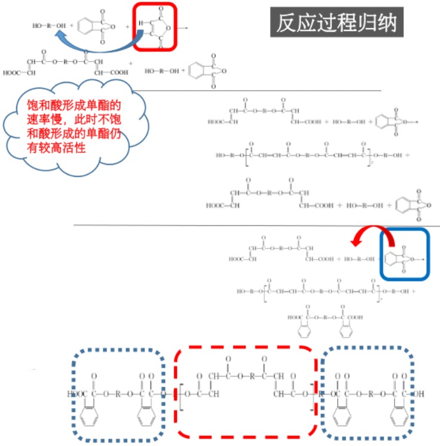

###### 实际操作合成过程

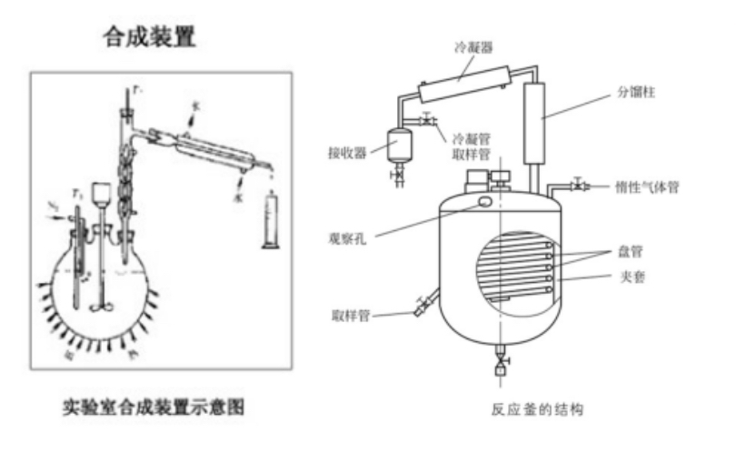

以线性不饱和聚酯的合成+苯乙烯稀释聚酯

**第一阶段**: 二元酸和二元醇酯化生成不饱和聚酯树脂低聚物
**第二阶段**: 不饱和聚酯树脂低聚物与含有不饱和双键的烯烃化合物混合, 并加入必要的阻聚剂, 即得到树脂产品

1. 先加入各种醇, 需要时加入稀释剂(加入量应为反应物总重的10%左右)
2. 将液体组分加热到100摄氏度左右
3. 开动搅拌机, 通入惰性气体至液面以下
4. 一次加入固体反应原料, 酸酐等, 在加入固体反应料时可加入0.01%的阻聚剂或者稳定剂, 防止反应物过早凝胶
5. 继续搅拌升温, 此时反应激烈进行, 快速生成水

###### 实际操作中实验仪器的注意事项

以线性不饱和聚酯的合成+苯乙烯稀释聚酯

**搅拌器**: 均匀混合物料, 各组分良好接触, 促进水分的生成和排除, 保证釜内的反应温度均匀, 加速反应进行. 防止釜内局部过热而使低聚物发生凝胶. 螺旋桨式搅拌器, 釜中心线上不约0.9m, 大功率且要控制转速, 转速过高的时候, 物料会飞溅, 粘在反应釜壁处发生凝胶甚至焦化, 焦化物落入反应体系中会使树脂变色, 进入分馏柱, 导致分馏柱堵塞, 造成反应无法控制
 **加热和冷却盘管**: 控制釜内反应温度, 缩聚反应开始前升温熔融反应物料, 反应进行中要保持规定的反应温度, 以确保反应的正常进行. 温度过高则会导致反应物大量挥发, 产物变色, 产生凝胶, 温度过低则会导致速率较慢导致效率降低; 盘管中的介质, 当反应升温较快的时候, 可以降低介质温度或者通入冷介质; 当温度下降较快的时候, 可增大盘管内热介质的流量, 提高介质的温度; 不锈钢, 呈螺旋状安装在反应釜的釜壁上, 高度达到反应釜高度的3/4以上. 有的加热盘管分为两部分(上部和底部)
 **夹套**: 侧壁和底部有双层夹套结构, 通有热交换介质起到加热反应体系的作用; 不锈钢, 外面包有保温材料; 可用热交换介质进行加热, 也可以用电热器直接安装在夹套内对加热介质进行加热
 **惰性气体输入管**: 插入反应物料中并且抑制延伸到接近釜底部处; 一般为氮气\二氧化碳, 排除反应釜内的氧气, 防止树脂的养护变色; 对反应物料有一定的搅拌作用, 通过对其流量的控制来调节反应生成的水的排除速率, 促进反应的进行
 **回流冷凝分馏柱**: 在缩聚反应过程中, 有相当数量的醇会夹杂在水蒸气中外溢, 为了保持反应釜内规定的醇酸比, 使得反应顺利进行, 必须要使醇回流; 分馏柱的温度要保持在醇的沸点和水的沸点之间, 分馏柱中可装填表面积大的多孔填充物, 以提高醇分离效率
 **冷凝器**: 有计量刻度, 指示液面高低, 容器的底部设有排放阀; 冷凝器接受器顶部的排气孔排出来未被冷凝的惰性气体, 底部排放阀门可以放冷凝水, 通过所收集的水量来判断反应程度; 一般在冷凝器和接收器的连接管的管道上装有一个取样管, 以便对冷凝水的折射率进行监测
 **冷凝器**: 水蒸气和惰性气体的混合蒸汽经过分馏柱馏出后, 要冷凝回收; 一般在分馏柱的柱顶加装冷凝器, 此时有少量的醇蒸汽也会和水一起冷凝; 通过测定冷凝液的折射率可以确定醇在水中的含量. 来控制温度. 若冷凝液中醇的含量较大, 可以降低分馏柱顶部的控制温度, 以减少醇的流失

###### 一步法合成和两步法合成

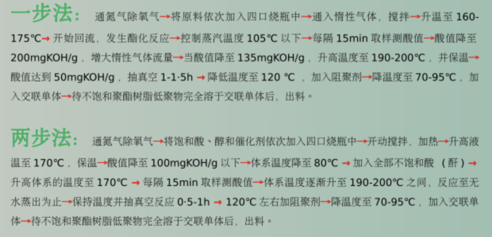

#### 固化

由液体状态转变为具有一定硬度的固态, 这个过程也可以叫做硬化. 液体树脂发生交联反应而转变为不溶\不熔的具有三维网状结构的固化物的全过程叫做树脂的固化(粘流态->交联->不溶不熔的体型网络)可以通过引发剂\光\高能辐射等引发分子链中的双键与可聚合的乙烯类单体进行自由基型共聚反应

共聚过程: 
- 链引发: 引发剂可以是有机过氧化物\氧化还原体系\紫外光\过氧化二苯甲酰\过氧化环己酮\环烷酸钴
- 链增长: 四个增长反应进行竞争, 重要参数是两种单体的竞聚率r1和r2
- 链终止: 主要是双基终止, 用苯乙烯单体的时候, 偶合终止是主要倾向

##### 固化原理

###### 初级自由基的形成

- 热分解引发: 利用热提供能量
- 光引发: 光敏剂咋吸收光能后, 能够分解产生自由基引发聚合, 这些光敏剂多是含羰基的化合物
- 氧化-还原体系引发: 活化能低, 能够在常温下引发
- 高能辐射引发: 不需要加引发剂, 不受温度限制

###### 单体自由基的形成

初级自由基进攻单体形成单体自由基->引发不饱和聚酯低聚物和交联剂的固化反应

###### 链增长反应

###### 链终止反应

#### 不饱和聚酯分子交联点键苯乙烯的重复单元数

- 苯乙烯(M1)和反丁烯二酸二乙酯(M2)共聚时的r1和r2分别为0.30和0.07, 两种单体有较强的共聚倾向, 交联点支架的苯乙烯重复单元数不会很多
- 苯乙烯(M1)与顺丁烯二酸二乙酯(M2)共聚时的r1和r2分别为6.25和0.05, 两种单体中的苯乙烯有较强的均聚倾向, 交联点间苯乙烯重复单元较多

#### 不饱和聚酯分子中双键的反应百分数(交联点数目)

- 不饱和聚酯分子中的反式双键较顺式双键活泼, 故此参数与线性不饱和聚酯中两种双键的比例有关, 反式双键的含量增高的时候, 固化树脂中双键的反应百分数相应提高.
- 影响不饱和聚酯分子中双键反应百分数的另一个因素是树脂中的苯乙烯含量, 随苯乙烯的含量提高, 固化时聚酯双键的反应百分数也相应提高

#### 其他类型的不饱和树脂聚酯

##### 乙烯基酯树脂(VER)

又名环氧丙烯酸酯树脂, 国内俗称乙烯基树脂, 又环氧树脂和一元不饱和羧酸通过开环加成反应制得, 再溶于不饱和聚合性单体中就得到了乙烯基酯树脂

##### 烯丙基酯树脂

##### 阻燃型不饱和聚酯树脂

#### 不饱和聚酯的性能

##### 物理性质

- 耐热性: 大多数变形温度为50摄氏度-60摄氏度
- 力学性能: 较好的拉伸\弯曲\压缩性能
- 耐化学腐蚀: 耐水\稀酸\稀碱\不耐有机溶剂, 随着化学结构和几何形状的不同, 耐化学腐蚀能力有很大差异
- 介电性能:好
- 优良的工艺性能

##### 化学性质

双键: 主链双键可以和乙烯基单体发生共聚交联反应
酯键: 可发生水解反应, 若与苯乙烯共聚交联, 则可以大大地降低水解反应的发生
酸碱环境: 酸性介质中, 水解可逆, 故聚酯具有耐酸性; 在碱性介质中, 共振稳定的羧酸根阴离子使水解成为不可逆, 故不耐碱
羧基: 链断末端的羧基可以和碱金属氧化物\氢氧化物反应. 使得分子链扩展, 树脂发生凝胶

##### 影响固化树脂性能的因素

- 相对分子质量: 随着相对分子质量的增加而显著提高, 耐水性和耐腐蚀性能也随之提高
- 顺式双键的异构化: 若使用同样配方的不饱和聚酯, 如果其中顺式双键异构化成反式双键的程度不同, 所得的不饱和聚酯树脂的性能就有很大差异
- 顺式双键异构化程度: 随着顺式双键想反式双键的转化程度提高, 树脂的固化时间和凝集时间缩短, 放热峰温度升高

###### 影响顺式双键异构化的因素

- 反应程度提高, 体系酸值下降, 则异构化的几率升高
- 异构化几率与所用的二元醇的类型有关:
  - 1, 2-二元醇比1, 3-或者1, 4二元醇的异构化几率要大, 1, 2-丁二醇>1, 3-丁二醇>1, 4-丁二醇
  - 含仲羟基的二元酸较伯羟基的二元醇异构化的几率要大. 2, 3-丁二醇>丙二醇>乙二醇
  - 含苯环的饱和二元酸比脂族二元酸有较大的促进作用. 苯酐比丁二酸\葵二酸对双键的异构化有较大的促进作用

###### 顺式双键的异构化反应机理理

- 一般认为, 顺式双键向反式双键的转化是在酸催化下进行的
- 除了酸催化外, 卤素\碱金属\硫磺以及硫化物等也能提高顺式双键的异构化程度. 为了提高顺式双键的异构化程度, 在多元羧酸存在的同时, 可以考虑再添加以下适当的催化剂

### 环氧树脂

#### 定义

由两个碳原子和一个氧原子形成的环称为环氧环或者环氧基, 含这种三元环的化合物统称为环氧化合物(环氧基团位于分子链的末端/中间或者形成环结构)

活泼的环氧基团, 使它们可与多种类型的固化剂发生交联反应而形成不溶不熔的三向网状结构的高聚物

#### 特点

- 形式多样: 可以适用各种应用对形式提出的要求
- 固化方便: 可以在5摄氏度-180摄氏度内固化
- 粘附力强: 有极性羟基和醚键
- 收缩率低: 固化是直接加成, 没有挥发性的副产物
- 力学性能: 优良的力学性能
- 电性能: 高介电性能/耐表面漏电/耐电弧的优良绝缘材料
- 耐化学性能: 取决于用的树脂和固化剂, 固化后具有优良的酸碱性/耐酸性和耐溶性
- 尺寸稳定性: 固化环氧有突出的尺寸稳定和耐久性
- 耐霉菌: 可以在苛刻的热带条件下使用

#### 分类

- 缩水甘油醚类: 简称双酚A型环氧树脂, 工业上使用量最大
- 缩水甘油酯类
- 缩水甘油胺类
- 脂环族环氧树脂
- 环氧化烯烃类
- 新型环氧树脂

#### 型号

以一个或者两个汉语拼音字母与两位数字作为型号, 表示环氧的类别和品种

- 字母: 主要组成物质名称拼音首字母, 如果相同取第二位, 若有改性, 用拼音字母表示, 未改性则标记"-"
- 数字: 环氧指标, 如E-51, 环氧指标在0.48~0.54mol/100g, 算术平均值: 0.51

环氧值: 100g树脂中包含的环氧基的摩尔数

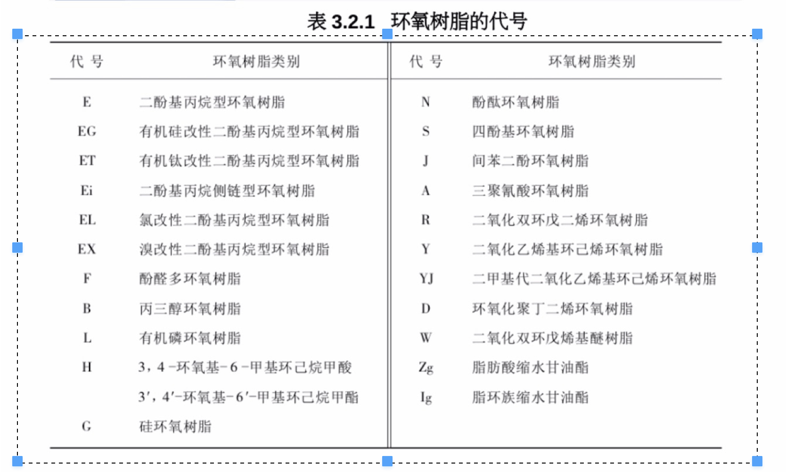

#### 技术指标

环氧树脂实际上是含有不同聚合度的分子的聚合物

大多数的分子含有两个环氧基端基的线性结构, 少数的分子可能支化, 极少数分子终止的基团是氯醇基团而不是环氧基

##### 环氧值

每100g树脂中含有环氧基的摩尔数

如相对分子质量为340, 每个分子含有2个环氧基的EP的环氧值为2/340*100=0.59

环氧当量: 1/环氧值*100

估算平均分子量: 数均分子量是环氧当量的1倍(未支化)

##### 无机氯含量

树脂中氯离子能和胺类固化剂起到络合作用, 影响树脂的固化和固化树脂的性能

##### 总氯含量

有机氯含量: 分子中未起到闭环反应的那部分的氯醇基团的含量. 有基氯也要影响树脂的固化和固化物的性能

有机氯含量 = 总氯含量 - 无机氯含量

##### 挥发物

树脂合成过程中, 容积或者水分的脱出青跨过, 容积脱除约干净, 挥发物越低

##### 相对分子质量

- 低相对分子质量(n=0~1), 粘性液体
- 中/高相对分子质量(n>1), 固体

#### 环氧树脂的逐步聚合反应固化

##### 固化剂

- 反应型: 环氧基环打开进行加成聚合, 固化剂本身参加到已形成的三位网络结构中
- 催化行: 以阳离子的方式/阴离子的方式, 使环氧基团开环进行加成聚合, 固化剂本身不参加到三维网状结构中

##### 多元硫醇

硫基基团(-SH)类似于羟基, 它可以和环氧基反应, 生成含仲羟基和硫醚键的产物

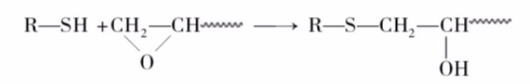

###### 特点

- 单独使用固化不充分
- 再适当的催化剂作用下环氧基同硫醇反应要比同胺类的反应快, 尤其是低温的时候
- 二乙烯三胺/2,4,6-三(二甲胺基甲基)酚/二甲胺基丙胺/哌啶和间苯二胺对固化反应都有较强的催化作用, 室温下即可反应

##### 多元酚

一阶或者二阶酚醛树脂是常用的多元酚固化剂

固化产物实际上是两种树脂经嵌段或者接枝聚合后形成的非常复杂的体型结构, 兼具酚醛和环氧两种树脂的性能, 相互改姓

1. 酚醛树脂分子中的酚羟基和环氧树脂中的环氧基反应

2. 一阶酚醛树脂分子中的醇羟基和环氧树脂中的环氧基及羟基反应

#### 环氧树脂的稀释剂

##### 作用

- 降低环氧树脂的粘度, 浇铸时较好渗透性, 粘合及层压时较好浸润性
- 控制环氧树脂和固化剂的反应热
- 延长树脂-固化剂体系的适用期
- 增加树脂-固化剂体系中填料的用量

##### 种类

- 非活性稀释剂: 不与环氧树脂及固化剂反应, 仅降低粘度
- 活性稀释剂: 含活性环氧基或者其他活性基团, 能反应

注意: 目的是改善操作工艺性能, 用量不宜过多, 否则影响固化物的性能

###### 非活性稀释剂

用量: 树脂质量的5%到15%

- 用量少时对物理性能的影响很小, 化学稳定性, 但影响耐溶剂性能
- 用量大时, 固化物的性能会变坏

种类: 多为高沸点溶剂和聚氯乙烯增塑剂

###### 活性稀释剂

能与固化剂翻译官, 参与环氧树脂的固化反应, 对固化物的性能没有影响, 有时还能增加固化体系的韧性. 

注意: 活性稀释剂一般有毒, 在使用过程中要注意, 长期接触网网会引发皮肤过敏, 严重甚至会溃烂

#### 环氧树脂的增韧剂

##### 作用

单纯的环氧树脂固化物的性能较脆, 抗冲击强度及耐热冲击性能较差. 增韧剂能够改善固化物的抗冲击强度和耐热冲击系能耐, 提高粘合剂的剥离强度, 减少固化时的反应热和收缩性

##### 缺点

对固化物的某些力学性能, 电性能, 化学稳定性, 特别是耐溶剂性和耐热性会产生不良影响

##### 分类

- 非活性增韧剂: 与环氧树脂的相容性好, 但是不参与固化反应. 主要是: 聚氯乙烯用的增塑剂和苯二甲酸酯类和磷酸/亚磷酸酯类
- 活性增韧剂: 在分子链上呦活性基团, 能参与固化反应的

###### 非活性增韧剂

- 不含有活性基团, 时间长会游离出来, 造成制品老化
- 粘度很小, 可兼作稀释剂, 增加树脂的流动性, 有利于浸润/扩散和吸附
- 一般用量为树脂质量的5%-20%

###### 活性增韧剂

主要是一些含有各种活性基团(环氧基/氨基)的高聚物, 直接参与环氧树脂的固化反应, 成为交联体系中的一个组成部分

1. 低相对分子质量聚酰胺

二聚或者三聚植物油酸或者不饱和脂肪酸与多元胺缩聚而成, 用量范围幅度大, 可按固化物的性能要求选择:

- 胺值(活泼氢当量)为200, 用量: 树脂质量的80%
- 胺值为300, 用量: 树脂质量的45%

2. 聚硫橡胶

两端有-SH的底线谷底分子质量聚硫橡胶, 反应很慢, 必须再加入其他的固化剂, 容易自动氧化起缩合或者加成作用, 由液态变成固态而失去增韧作用

3. 韧性环氧树脂

   1. 聚二元醇二缩水甘油醚

      低粘度液体, 改善液体二酚基丙烷型环氧树脂及酚醛多环氧树脂的韧性, 用量: 10~30wt%的环氧树脂

   2. 亚油酸二聚体二缩水甘油酯
   
      以不饱和脂肪酸二聚体为原料制备得到, 固化物耐碱性/耐汽油性差
   
4. 环氧化聚丁二烯树脂

具有较长的碳链, 树脂固化后具有优异的韧性

5. 不饱和聚酯

调节二元酸和二元醇的碳链的长短, 可以得到韧性很好的不饱和聚酯, 其增韧效果也很好

6. 丁腈橡胶

常用作增韧剂

- 含有能和环氧基团反应的基团的端羧基丁腈橡胶
- 一般用丁腈橡胶

7. 丙烯酸树脂

柔性丙烯酸树脂增韧效果好, 还能改善耐候性能

8. 热塑性树脂

增韧, 不降低耐热性能

热塑性树脂溶解于环氧树脂中, 固化过程中发生相分离

常用的热塑性树脂: 低相对分子质量的聚砜/聚醚砜/聚碳酸酯/聚醚酰亚胺等

#### 缩水甘油醚类环氧树脂

由含活泼氢的酚类和醇类与环氧氯丙烷缩聚而成

分类:

- 二酚基丙烷型环氧树脂
- 酚醛多环氧树脂
- 其他酚类环氧树脂
- 脂肪族多元醇环氧树脂

##### 二酚基丙烷型环氧树脂

###### 原料

- 二酚基丙烷: 简称双酚A, 熔点153~159摄氏度, 易溶于丙酮和甲醇, 可溶于乙醚, 微溶于水和苯

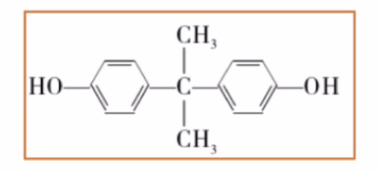

- 环氧氯丙烷: 无色透明液体, 沸点116.2摄氏度, 可溶于乙醚/酒精/四氯化碳和苯中, 微溶于水. 具有活泼的环氧基团, 可以和许多化合物反应, 如: 氨基/羟基/羧基

###### 合成原理

一般认为有四种反应:

1. 环氧氯丙烷在碱的催化作用下与二酚基丙烷进行加成反应, 并闭环生成环氧化合物(第一步加成氢氧化钠开环, 第二步取代氢氧化钠闭环, 先开环再闭环)

2. 生成的环氧化合物与二酚基丙烷反应

3. 含羟基的中间产物和环氧氯丙烷反应

4. 含环氧基中间产物与含酚基中间产物之间的反应

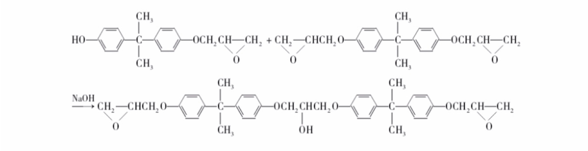

可能存在的副反应:

1. 单体环氧氯丙烷的水解

2. 树脂的环氧端基水解

3. 支化反应

仅在200摄氏度高温, 并且有碱存在的情况下才发生

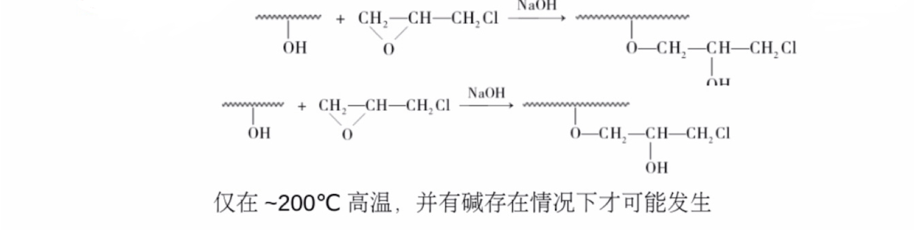

4. 环氧端基发生聚合

主要发生在大于180摄氏度的高温, 并有碱或者盐存在的情况下, 可以交联形成体型结构的高聚物

提醒:

为了合成预期相对分子质量的/分子链两端以环氧基终止的线性树脂, 必须控制合适的反应条件. 

其中: 两类单体的投料配比/氢氧化钠的用量/浓度与投料方式/反应温度等条件对控制反应起非常重要的作用

###### 合成影响因素

1. 二酚基丙烷与环氧氯丙烷的物质的量之比

- 合成低相对分子质量的树脂(n=0)

理论摩尔配比2:1, 实际5:1-10:1

原因: ECH(环氧氯丙烷)过量较少, 反应2和3容易发生, 生成高相对分子质量树脂. 按照2:1的投料比例, 最终得到约10%的n=0的树脂

- 合成较高相对分子质量的树脂(n=2-12)

理论上用(n+1)mol二酚基丙烷, (n+2)mol的ECH

由于系列副反应, 环氧氯丙烷的用量也往往相应提高

随着聚合度的增高, 两种单体物质的量之比渐趋于理论值

2. NaOH的用量和浓度的影响

NaOH的用途: 环氧基与酚羟基加成的催化剂, 氯醇闭环的催化剂

NaOH的过量程度随着环氧氯丙烷对双酚A用量的增多而减少

碱的浓度一般为10%-30%

浓碱介质中环氧丙烷的活性较大, 脱HCl作用迅速, 完全, 生产树脂的分子量相对较低, 但是副反应加速, 树脂的收率较低, 一般来说:   低分子量用30%的碱   高分子量用10%的碱

3. NaOH投料方式的影响

- 一步法

环氧丙烷过量较多, 水解的可能性增加, 回收率低, 反应后期, 氯醇基团的浓度降低, 环氧氯丙烷容易被水解破坏

- 两步法
    - 第一次加碱用于加成及部分闭环反应, 氯丙醇基团含量较高, 其水解反应的几率降低, 并且此时体系的黏度较低, 有利于环氧氯丙烷的回收
    - 第二次加碱主要用于氯丙烷的闭环反应

4. 温度的影响

起始温度<60摄氏度, 反应温度<90摄氏度, 有利于抑制副反应1, 2, 后期逐渐提高温度

5. 加料顺序的影响

- 低分子量的EP, 一般采用碱后加法, 即向两种单体的混合物中滴加碱液
- 高分子量的EP, 采用环氧氯丙烷后价法, 即向二酚基丙烷和碱液的混合物中低价环氧氯丙哇

6. 体系中水分的影响

制备低分子量EP时, 为了得到较高的产率, 体系中的水分必须维持在0.3%-2%内, 无水反应无法发生, 但是高于2%副反应较多

###### 合成方法

1. 一步法

在氢氧化钠作用下缩合(开环和聚合在同一反应条件下进行)

2. 二步法
  
在催化剂(如季铵盐)存在下

- 第一步, 加成生成二酚基丙烷氯醇醚 中间体
- 第二步, 在氢氧化钠存在下闭环, 环氧树脂

优点:

- 反应时间短, 操作稳定: 反应前阶段加入催化剂, 使双酚A与环氧氯丙烷先形成中间体, 因此在加碱过程中稳定波动小, 不会急剧上升, 易于控制, 加碱时间短, 可以避免环氧氯丙烷大量水解
- 质量好且稳定, 产率高

##### 酚醛多环氧树脂

由线型酚醛树脂和环氧氯丙烷缩聚形成, 包括: 苯酚甲醛型/邻甲酚甲醛型/三混甲酚甲醛型, 与二酚基丙烷型(双酚A型)环氧树脂相比, 含有两个以上的环氧基, 因此固化后产物交联密度大, 具有优良的热稳定性/力学强度/电绝缘性/耐水性和耐腐蚀性.

###### 合成

1. 一步法

生成线型酚醛树脂后立刻投入环氧氯丙烷环氧化反应

2. 二步法

先分离出生成的线型酚醛树脂后, 再与环氧氯丙烷环氧化反应

###### 合成的化学反应式

##### 其他酚类缩水甘油醚类环氧树脂

###### 间苯二酚型环氧树脂

黏度低, 工艺加工性好

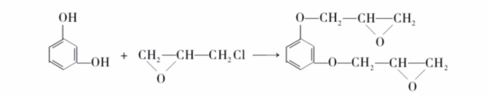

###### 间苯二酚-甲醛型环氧树脂

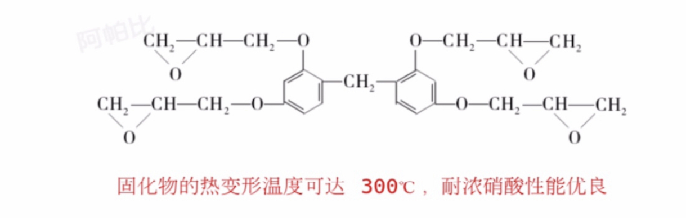

###### 四酚基乙烷型环氧树脂

###### 三羟苯基甲烷型

###### 四溴酚基丙烷型环氧树脂

##### 脂肪族多元醇缩水甘油醚型环氧树脂

特点: 黏度低; 多具有水溶性; 多是长链分子, 富有柔韧性

合成方法: 环氧氯丙烷与多元醇再催化剂的存在下反应

- 脂肪族氯醇比芳族氯醇对碱更加敏感, 容易水解
- 强碱容易促使脂族氧化物聚合

1. 第一步形成氯醇, 路易斯酸类催化剂
2. 第二部脱氯化氢, 碱的乙醇溶液

###### 丙三醇环氧树脂

制备工艺:

###### 季戊四醇环氧树脂

### 酚醛树脂

#### 概述

##### 性能

- 良好的机械强度
- 良好的耐热性能
- 瞬时耐高温和耐烧蚀突出

##### 用途

耐水耐热纸质层压制品/模压制品/摩擦材料/绝缘材料/黏合剂/耐候纤维板/空间飞行器/火箭, 导弹的瞬间耐高温和耐烧蚀结构材料

##### 存在的问题

- 合成化学反应复杂, 固化后分子结构难以测定
- 反应历程至今还未研究透彻

##### 分类

1. 热固性酚醛树脂: 一阶树脂

含有可以进一步反应的羟甲基, 如不加控制, 会形成不溶不熔的三维网格结构

2. 热塑性酚醛树脂: 二阶树脂

线性树脂, 要加入固化剂后才能形成三维网络

#### 合成原理

酚醛树脂是由酚类(苯酚/甲酚/二甲酚等)和醛类(甲醛/乙醛/糠醛等), 在酸性或者碱性催化剂下合成的结构, 主要是苯酚和甲醛的缩聚物

##### 原料结构特点

要得到体型结构的高聚物, 官能度的总数应该不小于5, 苯酚官能度:3, 甲醛官能度: 2

##### 反应特点

单体的官能度数目/摩尔比及催化剂的类型对生成的树脂性能有很大的影响

##### 热固性酚醛树脂的合成

缩聚反应在碱性催化剂存在下进行

常用催化剂: 氢氧化钠/氨水/氢氧化钡等

苯酚:甲醛(摩尔比)=1:1.1~1.5

###### NaOH催化下反应步骤

1. 甲醛和苯酚的加成反应, 形成多种羟甲基酚

2. 羟甲基酚的缩聚反应

不断缩聚, 树脂相对分子质量不断增大, 如果不加控制, 树脂就会形成凝胶, 相应的控制方法:

冷加法: 使反应在凝胶点前任何阶段上停止, 再加热又可使反应继续进行, 由此可合成适合各种用途的树脂

例如: 

- 在较低反应程度, 制得平均分子量很低, 在室温下可以溶于水的水溶性酚醛树脂
- 进一步缩聚, 至脱水形成半固体的树脂, 溶于醇类溶剂成为醇溶性酚醛树脂
- 若再进一步反应脱水后可以形成固体树脂

注意: 加成反应速率比缩聚反应速率快得多, 只要控制好反应条件, 可以得到低相对分子质量的多元酚醇的缩聚物

###### 强碱催化下的反应机理

1. 甲醛在水溶液中的平衡反应

2. 酚钠负离子的形成

3. 酚钠负离子与甲醛的加成反应

###### 氨催化的热固性酚醛树脂

反应机理更为复杂, 反应历程尚不清楚

现象:

- 生成的树脂几乎立即失去水溶性
- 产物中有二(羟苄)胺或者三(羟苄)胺; 不易溶于水
- 树脂中也存在羟甲基
- 可反应至较大相对分子质量而不会产生凝胶现象

##### 热塑性酚醛树脂的合成

###### 合成条件

- 强酸性催化剂存在下pH<3
- 甲醛: 苯酚(摩尔比)<1(如0.80~0.86). 可溶/可熔性, 分子内不含羟甲基的酚醛树脂
- 酸性条件下, 苯酚和甲醛的缩聚反应速度比加成速度快至少5倍以上, 主要产物是二酚基甲烷

###### 强酸催化下的反应机理

1. 甲醛在酸性水溶液中的存在形式

2. 酚环的亲电取代反应

3. 碳鎓离子和游离酚的反应

- H+在酚和醛反应的开始阶段是活泼的催化剂
- 缩聚反应的速度大体正比于氢质子的浓度

###### 中等pH值条件下的反应

高邻位热塑性酚醛树脂: 

用某些特殊的金属碱盐作为催化剂, pH: 4~7

催化剂: 

- 二价金属碱盐, 如: 锰/镉/锌和钴; 镁和铅(其中锰和钴的氢氧化物最有效)
- 过度金属, 如: 铜/铬和镍的氢氧化物

历程: 在中等pH条件下, 二价金属离子先在反应中形成

高邻位酚醛树脂的反应历程:

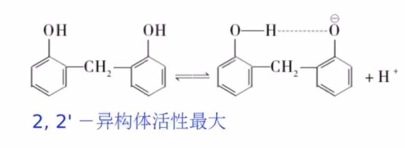

优点: 

- 固化速度约比一般热塑性酚醛树脂快2-3倍, 适用于注射成型
- 模压制品的热刚性较好

##### 影响因素

###### 单体官能度的影响

苯酚的酚羟基邻位/对位有三个活泼氢, 官能度为3;

- 当三个位置被其他的R基取代, 一般不会发生加成反应
- 两个位置被取代, 只能生成低分子量的缩合物
- 只有一个位点被取代, 可以生成线性聚合物, 无法固化

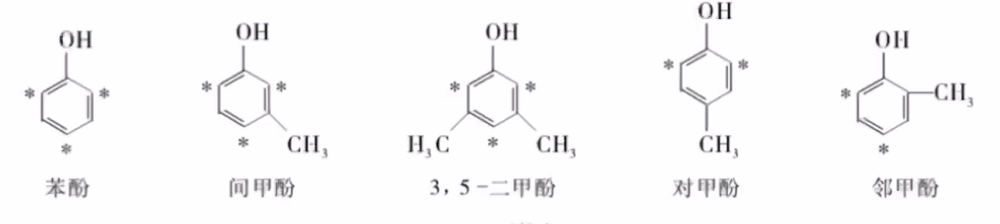

###### 酚环上取代基的影响

供电子基团: 间位增加邻对位的取代活性, 空间位阻效应的影响, 邻位或者对位取代酚降低邻对位的取代活性

###### 单体摩尔比的影响

- 甲醛:苯酚(摩尔比)>1时, 热固性酚醛. 工业上:(1.1~1.5):1
- 甲醛:苯酚(摩尔比)<1, 热塑性酚醛. 工业上:(0.8~0.86):1

###### 催化剂的影响

非常重要的影响因素, 常用的催化剂有一下三种:

1. 碱性催化剂

- 氢氧化钠: 催化效果好, 用量可小于1%; 反应结束后, 需要酸中和. 盐的存在, 使树脂电性能较差
- 氢氧化胺(25wt%的氨水): 催化性质温和, 用量一般为0.5~3%, 树脂的电性能较好
- 氢氧化钡: 用量一般为1-1.5%, 通入CO2生成BaCO3沉淀, 过滤除去, 树脂的电性能较好
- 有机胺: 如三乙胺, 树脂相对分子质量小, 电性能好

2. 碱土金属氧化物催化剂

常用的有BaO, MgO, CaO, 催化效果比碱性催化剂弱, 但是可形成高邻位的酚醛树脂

3. 酸性催化剂

- 盐酸: 催化效果好, 用量: 0.05%~0.3%
- 碳酸/有机酸: 用量较大, 1.5-2.5%, 优点, 缩聚过程较易控制, 树脂的颜色较浅, 有较好的耐光性.

注意: 

- 酸性催化剂的浓度对树脂固化速度非常灵敏, 反应速率随着氢离子浓度的增加而增大
- 碱性催化剂没有这种现象 超过一定值后, 催化剂浓度变化对反应速度基本无明显的影响

###### 反应介质pH值的影响

反应介质pH值对产品性质的影响比催化剂还大. 将37%甲醛水溶液与等量的苯酚混合反应

- 当介质pH=3.0-3.1时, 加热沸腾数日也无反应
- 若加入酸使得pH<3.0或者加入碱使得pH>3.1时, 则缩聚反应就会立刻发生

pH值的这个范围为酚醛树脂反应的中性点

- 醛酚比<1, 弱酸性催化剂(pH<3.0) --> 热塑性酚醛
- 醛酚比<1, 弱酸性或者中性碱土金属催化剂(pH=1-7) --> 高邻位线型酚醛
- 醛酚比>1, 碱性催化剂(pH=8-11) --> 热固性酚醛

缩聚反应初期最适当的pH值: 6.5-8.5

###### 其他因素的影响

酚醛树脂中有少量间位取代反应物, 当甲醛大大过量的时候, 也可以得到热固性树脂

甲醛过量, 在强酸性催化剂的存在下(pH=1-2)还能发生次甲基之间的交联反应

###### 制备工业上主要的酚醛树脂的条件一览

#### 合成方法

##### 热固性酚醛树脂的合成

###### 反应条件

- 催化剂: 碱性催化剂, 如: NaOH, 氨水, Ba(OH)2
- 投料比: 甲醛/苯酚投料物质的量之比为(1.1-1.5):1

###### 氨催化的合成工艺

反应釜中加入苯酚/甲醛和氨水, 搅拌加热..., 保温反应后, 取样测定凝胶化时间,... 再进行下一步的脱水操作. 真空脱水... 测定凝胶时间,... 加入乙醇稀释溶解, 然后过滤放料, 即制得产品

##### 热塑性酚醛树脂的合成

###### 反应条件

- 催化剂: 酸性催化剂: 如: 盐酸, 草酸, 甲酸等
- 投料比: 苯酚和甲醛的物质的量之比为1:(0.8-0.86)
- 合成设备和热固性树脂的设备相似

###### 合成工艺

在反应釜中, 按照苯酚:甲醛=1:0.85投料. 在搅拌下, 加入30%的盐酸调节pH为2.1-2.5. 加热反应..., 立即减压脱水, 到树脂的软化点达到规定指标为止, 乘热放料置于铁盘中, 冷却后粉碎备用

#### 固化

- 酚醛树脂一定要固化以后才有使用价值
- 固化速度, 对于复合材料的成型工艺具有重要的意义
- 热塑性酚醛和热固性酚醛树脂的固化反应截然不同

##### 总速度

- 凝胶速度: 树脂从A阶状态转变为B阶状态的速度
- 固化速度: 树脂从B阶状态转变为不溶不熔(C阶)状态的速度

##### 特点

- 一阶热固性酚醛树脂: 体型缩聚控制在一定程度的产物, 反应条件合适, 体型缩聚可以继续进行, 固化成体型
- 二阶热塑性酚醛树脂: 合成中甲醛的用量不足, 形成线性热塑性树脂, 分子内留有未反应的活性点. 加入能与活性点继续反应的固化剂, 补足甲醛的用量, 体型缩聚继续进行, 固化成体型高聚物

##### 热固性酚醛树脂的固化

加热条件下, 热固性酚醛树脂的固化历程非常复杂, 取决于: 温度条件/原料酚的结构/酚羟基邻对位的活性/合成树脂时碱性催化剂的类型

酚醛的反应和温度有关, 在低于170摄氏度时主要是分子链的增长, 此时反应主要有两类:

1. 酚核上的羟甲基和其他酚核上的邻位或者对位的活泼氢反应, 失去一分子水, 生成次甲基键

2. 两个酚核上的羟甲基相互反应, 失去一分子水, 生成二苄基醚

##### 热塑性酚醛树脂的固化

- 热塑性酚醛树脂也叫二阶树脂, 可溶可熔, 需要加入固化剂才能使树脂固化
- 酚核上有未反应的活化点, 补充甲醛或加入苯胺/多聚甲醛/六次甲基四胺等, 加热可以进一步反应, 形成三维网状结构而固化
- 最广泛用于酚醛模压料(80%用六次甲基四胺固化)

###### 使用六次甲基四胺固化

优点:

- 固化快速, 模压件在升高温度后有较好的刚度, 模压周期短, 顶出后翘曲最小
- 可以制备稳定的/硬的/可研磨的塑料
- 固化时不放出水, 制件的电性能好

原理:

1. 与只有一个邻位活性位置的酚反应

2. 与只有一个对位活性位置的酚反应

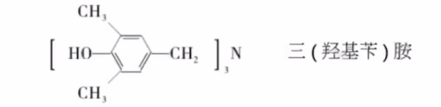

较高的固化温度(180摄氏度), 仲胺或叔胺不稳定

- 与游离酚反应释放出NH3, 形成次甲基
- 若无游离的酚存在, 则可能形成甲亚胺键, 如下图:

六次甲基四胺和包含活性点/游离酚(约5%)和少于1%水份的二阶树脂反应, 任何一个氮原子上链接的三个化学键依次打开, 与三个二阶树脂的分子链反应, 形成固化物

###### 影响热塑性酚醛树脂固化速率的因素

1. 六次甲基四胺的用量: 一般6~10%, 最适宜, 10%
2. 游离酚和水的含量: 含量增加, 凝胶的时间缩短
3. 温度: 温度升高, 凝胶的时间变短, 固化的速率增加

#### 特性和应用

##### 特性

- 原料易得, 价格便宜, 生产工艺简单
- 树脂既可以混入填料模压, 也可以浸渍层压, 还可以发泡
- 制品尺寸稳定
- 耐热/耐燃/可自灭/电绝缘性好, 但是耐电弧性差
- 化学稳定性好, 耐酸性强, 但是不耐碱

##### 三大热固性树脂性能比较

###### 优点

###### 缺点

##### 应用

- 膜材料
- 层压材料
- 结构复合材料
- 隔热/隔音/阻燃材料
- 胶黏剂/涂料/油墨
- 高技术领域

## 增强材料

增强材料 -- 复合材料主要组成部分

### 作用 

- 提高基体强度/模量/耐热和耐磨性
- 见效成型过程中的收缩率, 提高制品的硬度

### 分类

- 有机增强材料: 芳纶/PBO/超高分子量PE/聚酯纤维,棉,麻,纸
- 无机增强材料: 玻璃纤维/碳纤维/硼纤维/晶须/石棉/金属纤维

### 应具有的基本特征

- 提高树脂基体某种所需特性
- 良好的化学稳定性
- 与树脂具有良好的净润型和适当的界面反应
- 价廉

### 玻璃纤维

#### 分类

##### 按照化学组成分(碱金属氧化物含量)

- 无碱纤维: 碱金属氧化物的含量(K2O, Na2O)<1%, 强度高, 耐热性和电绝缘性好
- 低碱纤维: 碱金属氧化物的含量, 2%-6%, 耐酸性能好
- 有碱纤维: 碱金属氧化物含量, 10%-16%, 碱含量高, 强度低, 很少用于增强材料

注意: 碱性氧化物(助熔氧化物)越多, 玻璃纤维的熔点越低, 越容易制备, 但是纤维的强度和电绝缘性会降低, 纤维容易吸潮

##### 按照外观形状

- 长纤维
- 短纤维
- 空心纤维
- 卷曲纤维

##### 按照纤维特性

- 高强度纤维
- 高模量纤维
- 耐高温纤维
- 耐碱纤维
- 普通纤维

#### 结构及组成

玻璃: 熔融态过冷时因为粘度增加而具有某种固体物理机械性能的无定形物体, 属于各向同性的均质材料

玻璃纤维和块状玻璃: 外观不同, 但是结构相同, 拉伸强度比块状玻璃要高许多倍

##### 结构

###### 微晶结构假说

由硅酸盐或者二氧化硅的"微晶子"组成, 在"微晶子"之间无定形中间层隔离, 即由硅酸盐过冷溶液所填充

###### 网格结构假说

由二氧化硅的四面体/铝氧三面体或者硼氧三面体相互连成不规则的三维网络, 网络间的空隙由Na+/K+/Ca2+/Mg2+等阳离子所填充. 二氧化硅四面体的三维网状结构是决定玻璃性能的基础, 填充的Na+/Ca2+等阳离子为网络改性物

##### 组成

###### 化学组成

- 主体: 二氧化硅(SiO2)/三氟化二硼(B2O3), 对玻璃纤维的性质和生产工艺起到决定性的作用
  - 以二氧化硅为主的称为硅酸盐玻璃
  - 以三氧化二硼为主的称为硼酸盐玻璃
- 助熔氧化物(氧化钠/氧化钾等碱性氧化物): 降低玻璃的熔化温度和粘度, 使玻璃溶液中的气泡容易排除
- 氧化钙(CaO)/三氧化二铝(Al2O3): 在一定条件下构成玻璃网络的一部分, 改善玻璃某些性质和工艺性能

#### 物理和化学性能

##### 物理性能

###### 外观和密度

一般人造或者天然的有机纤维: 表面有较深的皱纹;

玻璃纤维: 表面呈光滑的圆柱, 横截面几乎是完整的圆形

用于复合材料的玻璃纤维, 直径5微米-20微米, 密度: 2.4-2.7g/cm^3; 一般有碱玻璃纤维: 2.4-2.6g/cm^3, 无碱玻璃纤维: 2.6-2.7g/cm^3

###### 力学性能

- 拉伸强度: 很高, 可达到2000MPa(一般的玻璃制品: 40~100MPa)
- 扭转强度, 剪切强度低

高强度的主要假说:

1. 微裂纹假说

- 微裂纹分布在玻璃的整个体积内, 以表面的微裂纹危害最大
- 受外力作用的时候, 微裂纹处易产生应力集中, 首先产生破坏
- 微裂纹, 大大降低了玻璃的强度
- 玻璃纤维由于经过了高温熔融, 均化减少了微裂纹产生的几率
- GF断面少, 微裂纹存在的几率少

2. "冻结"高温结构假说

玻璃纤维成型的过程中, 由于冷却速度快, 熔态的玻璃结构被冻结起来. 从而使玻璃纤维中的结晶/多晶转变及微观分层等较块状玻璃少很多, 因此强度高.

3. 分子取向假说

在玻璃纤维的成型过程中, 拉丝机的牵引作用, 使玻璃纤维分子产生定向排列, 强度提高

###### 影响玻璃纤维强度的因素

1. 纤维的直径和长度

直径越小, 拉伸的强度越高; 长度越长, 拉伸的强度越低

2. 化学组成

含有K2O和PbO成分多的玻璃纤维的强度较低

3. 存放时间

- 存放一段时间后强度会降低
- 主要原因: 空气中的水分会对纤维侵蚀

4. 负荷时间

- 随着施加负荷时间的增常而降低, 环境湿度较高的时候, 尤其明显
- 原因: 吸附在微裂纹中的水分, 在外力的作用下, 加快微裂纹扩展速度

###### 弹性

- 属于弹性材料, 没有明显塑性形变的阶段, 断裂延伸率为~3%
- 弹性模量比木材/有机纤维高, 比钢材低很多

主要的影响因素是化学组成, 加入BeO/MgO能提高玻璃纤维的弹性模量

###### 耐磨性和耐折性能

很差, 尤其是在潮湿的环境下, 表面吸附水分后能够加速微裂纹的扩展

表面处理可以提高玻璃纤维耐磨性和耐折性. 

###### 热/电性能

- 耐热性: 较高, 软化点5550摄氏度-580摄氏度, 200摄氏度~250摄氏度以下, 强度不变; 热膨胀系数, 4.8*10^-6/摄氏度. 耐热性是化学成分决定的, 石英和高硅氧玻璃纤维的耐热性>2000摄氏度
- 导电性: 主要取决于化学组成和温度和湿度. 玻璃纤维由于离子迁移而到店, 其电绝缘性差. 无碱纤维的电绝缘性能比有碱纤维优越很多

##### 化学性能

###### 玻璃纤维直径对化学性能的影响

由于制成玻璃纤维后, 比表面积大大增加, 所以其化学性能远远不如玻璃

###### 玻璃纤维化学组分对化学性能的影响

化学稳定性主要取决于组成中的: SiO2及碱金属氧化物的含量

- SiO2能够提高玻璃纤维的化学稳定性
- 碱金属氧化物降低化学稳定性(在水或者空气中水分的作用下发生分解)
- 能提高玻璃纤维耐酸性的物质: SiO2\Al2O3\ZrO2\TiO2
- 能提高玻璃纤维耐碱性的物质: SiO2\ZrO2\CaO\ZnO

一般规律:

- 耐水性: 耐酸玻璃纤维最优, 有碱比无碱差
- 耐酸性: 耐酸玻璃纤维最优, 有碱比无碱好
- 耐酸性: 无碱/有碱都不好, 但是无碱比有碱好

有碱玻璃纤维:

- 碱金属氧化物含量多, 在水或者空气中水分的作用下发生水解, 耐水性差. 一般碱金属氧化物的含量不超过13%
- 受酸作用后, 酸和硅酸盐作用生成硅酸. 硅酸迅速聚合并凝成胶体, 在玻璃表面上形成极薄的氧化硅保护膜. Na2O/K2O有利于保护膜的形成, 有碱纤维比无碱纤维的耐酸性好

石英/高硅氧玻璃纤维:

- 对水的化学稳定性最高, 对任何浓度的有机酸或者无机酸, 即使在高温状态下都很稳定
- 在碱性介质中, 稳定性较差, 但比普通玻璃纤维好
- 在室温下, 氢氟酸能破坏这种纤维, 而磷酸要在300摄氏度以上才能使其破坏

###### 水对玻璃纤维的作用

- 吸附作用
  - 玻璃纤维比表面积大, 吸附水的能力比玻璃大很多
  - 表面吸附的水既能降低纤维电绝缘性, 又使纤维与树脂黏结力减弱
- 溶解作用
  - 水使玻璃纤维中的碱金属氧化物溶解, 使其表面微裂纹扩展, 降低玻璃纤维的强度

#### 玻璃纤维及其制品的生产工艺

##### 坩埚法

生产工艺由制球和拉丝两部分组成

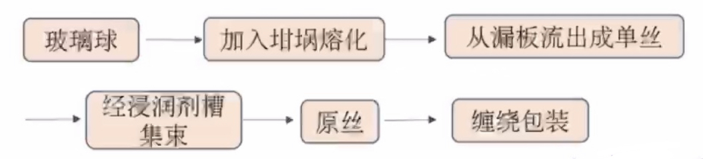

##### 池窑法

将玻璃原料直接加入窑内熔融/澄清/均化后, 经漏板孔流出, 单丝涂覆浸润剂并集束后, 由拉丝机缠到绕丝筒

###### 浸润剂

作用: 拉丝和纺织过程总使纤维粘合集束, 润滑耐磨, 消除静电

1. 纺织型浸润剂

主要成分: 石蜡/凡士林/脂肪酸/表面活性剂/水等, 满足纺织工业的要求. 不利于树脂和玻璃纤维的黏结, 因此使用的时候要进行脱蜡处理

2. 增强型浸润剂

主要成分: 偶联剂/成膜剂/润滑剂/润湿剂/抗静电剂等, 满足纺织工业加工需求以及玻璃纤维复合成型的多方面加工需求. 改善树脂对纤维的浸润性, 提高树脂与纤维的黏结力.

##### 生产示意图

主要生产设备: 纺纱机和织布机

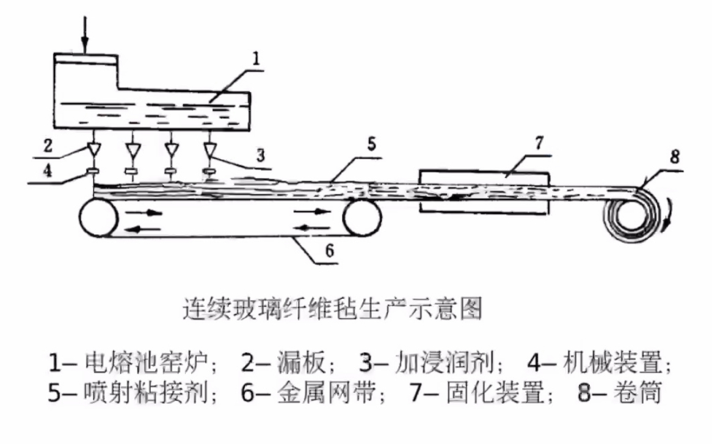

#### 玻璃纤维制品的性能

##### 玻璃纤维无捻粗纱

由于直径和股数不同有很多规格

无捻粗纱: 由平行原丝或平行单丝集束而成, 单丝直径13~23um

捻度: 单位长度内纤维与纤维之间所加的转速.

加捻可以提高纤维的饱和力, 改善纤维的受力状况, 有利于纺织工序进行. 捻度过大不易被树脂浸透.

多用于: 缠绕高压容器和管道
  也用于垃挤成型/喷射成形等工艺当中

为了适应不同复合材料的成型工艺/产品性能/基本类型, 采用不同的浸润剂, 产生不同用途的无捻粗纱:

###### 喷射用无捻粗纱

- 切割性能好
- 分散性好
- 贴模性好
- 浸润性好
- 丝束引出性好

###### SMC(片状模塑成型)用无捻粗纱

- 短切割性能好
- 抗静电性能好
- 易被树脂浸润
- 硬挺度适宜

###### 缠绕用无捻粗纱

- 成带性好
- 退解性好
- 张力均匀
- 浸润型好
- 线密度均匀

###### 织造用无捻粗纱

- 良好的耐磨性
- 良好的成带性
- 退解性好
- 张力均匀
- 浸润型好

##### 无捻粗纱方格布

方格布是无捻粗纱平纹织物, 主要用于手糊复合材料制品

质量要求:

- 织物均匀/布边平直/布面平整/无浸渍/无皱纹/不起毛等
- 单位面积/质量/布幅和卷长均符合标准
- 浸润性能好
- 力学性能好
- 潮湿环境下强度损失小

缺点: 层间剪切强度低, 耐压和疲劳前度差

##### 短切原丝毡

把玻璃纤维原丝或无捻粗纱短切成约50mm长, 将其均匀地铺在网带上, 随后撒上聚酯粉末黏结剂, 加热熔化然后冷却制成短切原丝毡. 根据黏结剂在树脂上的溶解速度, 短切毡分为:

- 高溶解度型: 适用于手糊工艺, 能够使树脂快速浸透毡片
- 低溶解度型: 是能够用于SMC等模压成型工艺, 防止模压时树脂将纤维冲掉

短切原丝毡的质量要求:

- 单位面积质量均匀, 无大孔眼形成, 黏结剂分布均匀
- 毡强度适中, 根据需求可以撕开
- 浸润型好, 能被树脂快速浸透

##### 连续原丝毡

将玻璃原丝成8字形铺设在连续移动的网带上, 经过聚酯粉末黏结剂粘合而成. 

单丝直径: 11-20微米, 原丝集束根数: 50或者100根, 单位面积质量: 150-650g/m^2

连续原丝毡的纤维是连续的, 制造的复合材料优于短切毡

可用于: 垃挤成型工艺/RTM成型工艺以及增强热塑性材料(GMT)

##### 表面毡

表面毡由于毡薄/玻璃纤维直径小, 可形成富树脂层, 树脂含量可以达到90%

复合材料具有较好的耐化学性能/耐候性能, 并遮盖了方格布等增强材料引起的布纹, 起到了好的表面修饰效果

单位面积质量: 30~150g/m^2

制造方法常用湿法造纸工艺

##### 缝合毡

用缝编机将短切玻璃或者长玻璃纤维缝合成毡, 短切玻璃纤维缝合毡可以代替短切毡使用, 而长玻璃纤维缝合毡可以代替连续原丝毡

优点:

- 不含有黏度剂
- 使树脂的浸透性好
- 价格低

##### 加捻玻璃布

分为: 平纹布/斜纹布/缎纹布/纱布和席纹布

- 平纹布: 结构稳定, 布面密实, 但是变形性差, 强度低
- 斜纹布: 较致密, 柔性好, 具有一定的变形性, 强度高于平纹布, 适合手糊成型
- 缎纹布: 纤维弯曲少, 制备的复合材料强度高
- 纱罗和席纹布: 纱罗特点四每一根纬纱处有两根经纬纱绞合的织物, 稳定性好. 席纹布指的是两根或者多根经纱在两根或者多根纬纱的上下进行交织的织物

##### 单向布

用粗经纱和细纬纱制成的四经破缎纹或长轴缎纹布

特点: 具有高强度

##### 三维织物

三维织物是由二维织物发展而来, 增强的复合材料具有良好整体性, 大大提高复合材料层间剪切强度和抗损伤的能力

三维织物的类型有: 机织/针织/编织/细编穿刺等

三位织物的形状有: 柱状/管状/块状/及变厚度异性截面等

###### 特点

三维织物技术是纱线平面相互交错实现立体交织的编织方法

三维编织技术在工艺上的特点:

- 具有编制异形整体织物的能力, 能够按照零件的形状和尺寸的大小编织出复合材料零件的预制品
- 能够有效控制复合材料内部的纤维体积含量

###### 性能

- 三维织物在Z轴方向有纤维增强, 不存在层间界面
- 有很高的抗损伤性, 抗撕裂性和抗剪切性, 并且不存在层间剥离问题
- 三维织物具有良好耐烧蚀性

### 芳纶纤维

#### 概述

芳香族聚酰胺树脂:

- 主链由芳香环和酰胺键构成
- 每个重复单元的酰胺基的氮原子和羰基直接与芳环上的碳原子相连

制成的纤维-芳香族聚酰胺纤维, 简称芳纶纤维

芳纶纤维的分类:

- 全芳族聚酰胺纤维
- 杂环芳族胺纤维

芳纶: 高科技特种纤维, 具有优良的力学性能, 稳定的化学性质和理想的机械性质

#### 制备

分为两个阶段

1. 对苯二胺和对苯二甲酸或者对苯二甲酰氯缩聚合成PPTA

2. 聚合体溶解, 纺丝, 制成纤维

采取干喷-湿纺法液晶纺丝工艺, 可以抑制纤维中产生卷曲或者折叠链, 使分子结构沿着纤维的轴向进一步高度取向, 形成几乎为100%的次晶结构

#### 结构和性能

PPTA结构主要由芳环和酰胺基组成, 大分子链具有线性刚性伸直链构型.

- 线性刚性直链构型 --> 分子间排列紧密 --> 化学稳定性好
- 氢键 --> 梯形聚合物 --> 良好规整性, 高结晶性
- 分子链方向为强共价键, 分子间以氢键相连 --> 各向异性(轴向强度高, 横向较低)

PPTA的晶体结构: 单斜晶系

- 纵向: 纤维中的分子具有近乎平行与纤维轴的取向
- 横向: 平行于氢键的片层的辐射状取向
- 航向条纹或氢键片层的打褶: 液晶纺丝中少量分子杂乱去向, 即PPTA的辐射状打褶结构

还有: 微纤结构/皮芯接哦股/空洞结构等不同形态的超分子结构, 高层低的有序微纤形态有利于承担更大的载荷

##### 优点

- 高强度和高模量
- 密度低
- 优良减震性/耐磨性
- 优良耐冲击性和抗疲劳性
- 尺寸稳定性很好
- 良好的耐化学腐蚀性
- 低膨胀, 低导热, 不燃, 不熔
- 优良的介电性能

##### 缺点

- 耐光性差, 暴露于可见光和紫外线时会产生光致讲解
- 溶解性差
- 抗压强度低
- 吸湿性强, 吸湿后性能变化大, 应该密封保存, 制备复合材料前需要烘干

#### 应用

##### 增强材料

###### 航空航天领域

对位芳纶具有密度低, 强度高, 耐烧蚀性好, 可用于: 

- 导弹, 固体火箭发动机的壳体
- 与碳纤维复合制造飞机/航天器机身/主翼/尾翼/控制线/防护管等
- 宇航服的隔热层/飞行服/飞机隔音层等

###### 船艇方面

利用芳纶低密度/高强度/耐疲劳等特性, 减轻质量, 降低燃料消耗

###### 汽车

利用芳纶低密度/高强度/耐疲劳等特性, 减轻质量, 降低燃料消耗, 同时提高耐冲击性, 震动衰减性和耐久性

###### 建筑材料方面

芳纶增强的混凝土具有强度高, 质量轻, 耐腐蚀的特点

- 可直接用于混凝土的增强
- 制成网格状的芳纶-环氧复合材料, 铺入混凝土内进行加强
- 芳纶环复合材料可用于桥梁/桥墩/大型建筑物的修复

##### 防弹制品

###### 防弹装甲板

###### 防弹背心

##### 其他

###### 缆绳

###### 传送带

###### 特种防护服装

###### 体育用品

### 碳纤维

#### 概述

碳纤维是由有机纤维在惰性气氛中, 加热至1500摄氏度所形成的纤维状碳材料, 其碳含量在90%以上

##### 结构

沿着纤维轴向排列的不完全石墨结晶, 各平行层原子堆积不规则, 缺乏三维有序, 呈乱层结构. 在2500摄氏度以上进一步碳化, 碳含量大于99%, 由乱层结构向三维有序的石墨结构转化, 称之为石墨纤维

##### 特点

- 重量轻/比强度大/模量高/耐热性高
- 化学稳定性好, 除了硝酸等少数的强酸之外, 几乎对所有的药品均稳定; 另外, 对碱也稳定
- 具有比钢强, 比铝轻的特性, 是一种目前最受重视的高性能材料之一
- 在航空航天/汽车工业/体育器材等许多方面有广泛用途

##### 分类

###### 按照性能分类

- 高性能: 高强度碳纤维/高模量碳纤维/中模量碳纤维
- 低性能: 耐火纤维/碳质纤维/石墨纤维

###### 按照原丝类型

- 聚丙烯腈基碳纤维
- 沥青基碳纤维
- 纤维素基碳纤维
- 酚醛基碳纤维
- 其他有机纤维基

###### 按照制造条件和方法

- 碳纤维: 碳化温度, 1000~1500摄氏度, 碳含量90%
- 石墨纤维: 石墨化温度, 2000摄氏度, 碳含量99%
- 气相生长碳纤维: 惰性气氛中将小分子有机物在高温下沉积成纤维--晶须或者短纤维

#### 制造方法

##### 热解法

主要步骤: 

1. 纤维化: 聚合物熔化或者溶解后制成纤维
2. 稳定(氧化或者固化): 200~450摄氏度下, 空气中, 防止聚合物纤维高温处理中熔融或者黏连
3. 碳化, 在1000~2000摄氏度的惰性气氛中进行, 碳含量85%~99%
4. 石墨化: 2000摄氏度, Ar保护下, 纤维石墨化, 碳含量99%, 纤维内分子排列具有很高的?

###### 聚丙烯腈基碳纤维的制备

1. 聚丙烯腈原丝的生产

以丙烯腈为原料, 自由基反应生成聚合物, 然后纺丝得到聚丙烯腈原丝

聚丙烯腈特性: PAN, 受热分解不熔融.

原丝制备工艺: 湿法/干法喷丝, 干湿法纺丝, 不能熔融喷丝

如何提高聚丙烯腈原丝质量是碳纤维制造的关键技术之一, 故影响原丝质量的因素:

- 杂质和灰尘: 杂志会在纤维表面和内部造成缺陷, 导致原丝强度降低
- 聚合物的相对分子质量: 分子量大, 特性黏度大, 分子间范德华力大, 分子间不易滑移, 力学性能提高. 分子量大, 黏度大, 纺丝困难, 纤维易变脆, 分子量应该控制在8*10^4左右
- 聚合物结晶度/分子取向度: 结晶度高, 分子间排列紧密有序, 孔隙率低, 分子间相互作用强, 链断不易运动, 提高聚合物强度; 通过纺丝中的牵伸, 使分子沿着轴向排雷, 使得轴向抗拉强度提高, 但过度牵伸纤维会产生裂纹和缺陷

故提高原丝质量的方法有:

- 纯度: 单体原料的纯度高, 含杂质要少; 纺丝液应该多次脱泡过滤, 除去气泡/粒子等杂质, 纺丝环境应该干净/清洁/灰尘少
- 控制分子量
- 原丝生产中应该注意提高结晶度和取向度

2. 聚丙烯腈原丝的预氧化

预氧化在200-300摄氏度下氧化气氛(空气)受张力的情况下进行

目的: 使链状聚丙烯腈分子发生环化/氧化/脱氢/交联等化学反应, 放出H2O, NH3, HCN, H2等分解产物, 形成耐热的梯形结构, 可以承受更高的碳化温度和提高碳化收率以改善其力学性能

需解决的问题: 缓和剧烈放热, 减少热裂异构等副反应

预氧化的程度对制备高性能碳纤维有重大的影响, 故要对预氧化程度进行控制:

- 氧含量: 预氧丝的氧含量: 8%-10%, 氧与纤维反应形成含氧结构, 碳化时大部分氧与氢反应溢出, 促使相邻链间交联, 提高纤维强度和模量; 氧过量, 碳原子以CO2和CO的形式溢出, 降低碳化收率, 使纤维存在缺陷, 力学性能变差
- 芳构化指数(AI): AI随着预氧程度的增加而增加, AI=50%的时候, 约50%的聚合物发生环化, 预氧程度合适, AI值在0.5-0.6内最佳
- 残存氰基浓度: 大, 氧化不充分, 预氧化中, 氰基大部分转化到梯形结构中, 小部分以挥发产物溢出, 也有极少部分残存
- 作为控制预氧化程度的依据(根据原丝种类和工艺条件, 确定残存氰基量和碳纤维性质的关系)
- 吸湿率: 纤维在标准温度和湿度的环境中, 达到平衡所吸附的水分的百分含量, PAN纤维吸湿性差, 随着预氧化程度的增加, 吸湿性逐渐增加, 预氧丝吸湿率: 6%-9%, 吸收水分的波动率<1%, 最高<0.5%, 波率越小, 原丝的质量越均匀, 预氧丝的质量也越好, 相应碳纤维质量的波动率越小

预氧化程度的主要决定因素: 热处理温度和时间, 同一纤维在不同温度下用最佳预氧化程度制得的碳纤维, 强度完全不一样, 故热处理温度和热处理时间:

- 热处理温度
  - 为了避免纤维剧烈放热以及热积累导致的局部过热/纤维间相互融结, 一般在低温下长时间预氧化(200-220摄氏度预氧化10h)
  - 适当提高预氧化温度能够显著提高生产力(氰基环化反应, T上升10摄氏度, 反应的速度约增加10倍; T上升50摄氏度, 增加50倍)
  - PAN纤维在240-260摄氏度分子运动剧烈, 分子链开始裂解, 提高温度必须提高纤维的热稳定性
  - 180-280摄氏度, 连续式或者阶段式梯度升温, 使裂解等副反应控制在最低温度, 缩短预氧化的时间
- 热处理时间
  - 恒温预氧化的时候, 根据原丝的tex数和热处理温度确定所需时间
  - 经验公式: lgt=5900/T-10.6+lg(d/a), t-时间, T-绝对温度, d-原丝的tex数
    - 空气中处理均聚聚丙烯腈原丝: a-1.85
    - 氧气中处理均聚聚丙烯腈原丝: a-4.63
    - 氧气中处理共聚原丝: a-9.4
    - tex数: 指1000m长纱线在公定回潮率下重量的克数, tex=g/L*1000, 其中g为纱的重量(g), L为纱的长度(m)
  - 预氧化处理的时候, 如果在5-20min内使纤维吸湿率达到4%, 纤维中的微孔变小, 断裂伸长率增大, 纤维界面呈扁平状, 强度更高
  
3. 聚丙烯腈原丝的碳化

碳化: 高纯度惰性气体保护, 一定张力下, 预氧丝加热至1000~1500摄氏度. 除去非碳原子(H/O/N等), 纤维进一步发生交联/环化/缩聚/芳构化等化学反应, 放出H2/H2O/NH3/HCN/CO/CO2/CH4和少量焦油类物质, 生成碳含量约为95%的碳纤维

惰性气体的作用: 防止氧化, 排除裂变产物, 传递能量介质

碳化的技术关键: 丝束入口严密密封, 炉内压力超过外压, 避免空气中氧气带入炉内并在高温下与碳起氧化反应, 烧断纤维或者造成缺陷

预处理以及反应气氛:

- 预氧丝吸水性强, 水分>300摄氏度时与碳纤维反应, 强度降低; 碳化前, 100~280摄氏度降纤维烘干, 提高碳纤维强度
- 碳化时保护气体多用高纯氮, 氧含量<1.0*10^-5, 高纯氩气

升温速率:

- 早期: 预氧丝在碳化时的速率不能过高, 会造成纤维内部形成空隙裂纹, 升温速率: 0.5摄氏度/min或者10摄氏度/min
- 目前: 快速碳化也能耐制备高质量碳纤维. 速率400~750摄氏度/min. 为了避免过大的热冲击, 开始时的升温速率较慢

4. 碳纤维的石墨化处理

碳纤维在2000摄氏度以上的氩气保护下进行热处理

碳纤维: 热处理到1000-1500摄氏度的纤维
石墨纤维: 加热到2000~3000摄氏度的纤维

一般将碳纤维和石墨纤维统称为碳纤维

石墨化的目的:

- 进一步脱出纤维中的氮/氢等非碳原子, 聚合物中芳构化碳增加, 转化成类似石墨层面的结构, 内部紊乱分布的乱层石墨转化为类似石墨的结晶状态
- 结晶增大, 结晶态碳的比例增加, 沿纤维轴的去向也增加
- 获得高模量的石墨纤维或者高强度高模量的高性能碳纤维

石墨化处理, T上升, 石墨化程度上升, 纤维模量上升, 裂纹和缺陷上升, 强度下降

- 在超高的温度下, 石墨和碳的蒸气压很高, 碳纤维表面的碳可能政法, 质量减小, 并使纤维表面产生缺陷, 强度降低. 在压力下进行石墨化, 可得到强度较高的石墨纤维
- 在压力下进行石墨化, 可得到强度较高的石墨纤维

##### 气相法

###### 基板法

预先将催化剂喷洒或者涂布在陶瓷或者石墨基板上, 将低碳烃或者芳烃与氢气混合通入反应管, 在1100摄氏度下通过基板, 在催化剂粒子上形成的碳丝以30-50mm/min的速率生长, 可以得到直径1-100微米, 长为300-500mm的碳纤维

常用的催化剂: 铁/镍粒子, 硝酸铁溶液

若以乙炔和氢气混合气问原料, 750摄氏度下通过镍板和镍粉催化剂, 得到螺圈状碳纤维

间歇式生产, 产率低, 约为10%

###### 气相流动法

将低碳烃/芳烃/脂环烃等原料和铁/钴/镍等超细粒子和氢气组合成三元混合体系, 在1100-1400摄氏度下, 铁或者镍等金属微粒被氢气还原为新生态熔融金属液滴

- 在铁微粒催化剂下液滴形成空心的直线形碳纤维
- 在镍微粒催化剂下液滴形成螺旋状碳纤维

碳纤维直径: 0.5-1.5微米, 长: 数毫米

拉伸强度可达5000MPa, 拉伸模量为650GPa

#### 性能

##### 物理性能

低密度/高强度/高模量/耐高温/耐化学腐蚀/低电阻/高热传导系数/低热膨胀系数/耐辐射

##### 化学性能

- 与碳相似: 除了能被强氧化剂氧化外, 对一般的酸碱惰性
- 在空气中, 当温度>400摄氏度时, 出现明显氧化, 生成CO和CO2
- 不能接触空气或者氧化气氛时, 碳纤维有突出的耐热性; 当T>1500摄氏度的时候, 强度才开始下降;(其他材料类型, 包括Al2O3在内, 性能已经大大下降)
- 良好的耐低温性能, 在液氮温度下也不能催化
- 耐油/抗辐射/抗放射/吸收有毒气体和减速中子

#### 表面处理

##### 为何要表面处理?

- 经过高温处理, 碳含量高, 表面惰性大, 与树脂接触不良, 黏结力差
- 碳纤维存在脆性和抗氧化性差等特点

##### 方法

- 表面氧化处理
- 涂层处理
- 点聚合和电沉积处理

#### 应用

##### 交通运输方面

汽车构架/传动轴/快艇/巡逻艇

##### 其他工业应用

- 耐腐蚀复合材料的应用
- 土木建筑上的应用
- 医疗器械上的应用

## 热固性复合材料成型工艺

### 手糊成型工艺

#### 概述

##### 定义

用手工或者在机械的辅助下将增强材料和热固性树脂铺覆在模具上, 树脂固化形成复合材料的一种成型方法

##### 特点

###### 优点

- 操作简便, 操作者容易培训
- 设备投资少, 生产费用低
- 能生产大型的和复杂结构的制品
- 制品的可设计性好, 且容易改变
- 模具材料来源广
- 可以制成夹层结构

###### 缺点

- 生产效率低
- 制品质量和操作者的生产技术水平相关
- 生产周期长
- 制品的力学性能较其他的方法低

##### 分类

按照成型时施加的压力的大小, 手糊成型工艺可以分成:

- 接触成型: 在不佳加压或者不加压的情况下制造增强塑料制品
- 低压成型: 接触成型后施加0.01-0.7MPa的压力, 最大不超过2.0MPa

#### 原料

- 玻璃纤维及其织物
  - 无捻粗纱
  - 无捻粗纱布
  - 短切原丝毡
  - 加捻布
  - 玻璃布带
- 热固性树脂
  - 不饱和聚酯树脂
  - 酚醛树脂
  - 环氧树脂
- 辅助材料
  - 脱模剂
  - 填料
  - 触变剂
  - 固化剂
  - ...

##### 玻璃纤维及其织物

###### 无捻粗纱布

时手糊成型工艺中最常用的玻璃纤维织物, 优点: 性变性好; 易被树脂浸润; 增厚的效率高, 能提高玻璃钢制品的抗冲击性能, 价格便宜

性能要求:

- 浸润性好, 质地均匀
- 剪裁/铺放的时候不滑移, 操作容易
- 成型时贴膜性好, 不产生回弹而引起的成型缺陷
- 织造时尽量减少纤维损伤和起毛

###### 短切原丝毡

简称短切毡, 手糊成型中常用的增强材料, 优点: 树脂浸透性好, 气泡容易排除, 形变性质好, 施工方便

性能要求:

- 浸润型好
- 毡强度和硬挺性要有良好的平衡
- 均匀性好, 避免厚度不均匀, 原丝件的黏结/分散不好等弊病
- 成型时对模具的贴服性好

###### 加捻布

由多股加捻纱织成的, 按照织法不同可以分为: 平纹布/斜纹布/缎纹布和单向布

手糊成型工艺常用斜纹布, 所得制品的强度比无捻粗纱不制成的制品高(除了冲击强度外), 制品表面平整, 气密性好, 但是价格比无捻粗纱布贵, 增厚效果差

###### 玻璃布带

可用来糊制加强型材料和特殊部位, 减少裁剪

##### 热固性树脂

###### 性能要求

- 能够配制成黏度适宜的胶液
- 能在室温或者较低温度下凝胶/固化, 要求在固化时无低分子物质产生
- 无毒或者低毒
- 价格便宜, 来源广泛

###### 不饱和聚酯树脂

工艺性能好, 价格便宜, 制品性能满足大部分应用需求, 应用最广泛

###### 酚醛树脂

优异的阻燃性能, 可用于对阻燃性能要求极高的场合, 如: 飞机, 火车, 船舶的内装饰材料和公共场所的装潢材料

###### 环氧树脂

主要用于力学性能要求较高的复合材料制品

##### 辅助材料

###### 脱模剂

一般由非极性或者极性很弱的物质制成, 这些物质与树脂的黏结力非常小, 具有极好的脱模效果

作用: 容易脱模, 制得表面平整光洁的制品, 并保证模具完好无损, 重复使用

条件: 使用方便, 成膜时间短, 成膜均匀, 光滑, 对树脂的黏附力小, 操作安全, 对人体无害, 不腐蚀模具, 不影响树脂的固化

需要考虑的因素: 模具材料/树脂的种类/固化温度/制造周期/脱模剂涂刷时间等

分类: 薄膜型/溶液型和油蜡型

1. 薄膜型脱模剂

2. 溶液型脱模剂

- 过氯乙烯溶液脱模剂: 渗透性好, 适用于木材/石膏等多孔性材料的封控, 不适宜于制品的直接接触, 常与其他脱模剂复合使用, 使用温度: 120摄氏度以下
- 聚乙烯醇脱模剂
- 聚苯乙烯脱模剂
- 醋酸纤维素脱模剂
- 硅橡胶脱模剂

3. 油膏/石蜡型脱模剂

脱模剂最好复合使用, 这样能达到良好的脱模效果, 原因: 手糊成型用的树脂都有较高的粘附性, 脱模剂与制品界面上仍有一定的粘附力, 脱模剂复合使用的时候, 分开部分是在粘附力最小的两层脱模剂之间; 对于大型制品和形状复杂的制品, 以及对于强度不高的模具, 在成型时应该采用复合脱模剂

###### 填料

使用目的:

- 降低固化收缩率和热膨胀系数, 减少固化时发热量和防止龟裂
- 改善制品的耐热性能, 电性能, 耐磨性能, 表面平滑性和遮盖力, 提高黏度或者赋予触变性
- 降低成本

性能要求:

- 在树脂中的分散性要好
- 吸油量少
- 不影响树脂的固化和贮存的稳定性

常用的填料:

- 碳酸钙: 使用最普遍, 表面处理后能够减少吸油量, 并赋予体系触变性
- 石棉/铝粉: 提高冲击强度
- 石英粉/三氧化二铝: 提高压缩强度
- 三氧化二铝/二氧化钛: 提高粘附力
- 三氧化二锑: 提高树脂的阻燃性
- 金属粉/石墨粉: 提高导热性和导电性
- 滑石粉/石膏粉: 降低成本

###### 颜料糊

使用目的:

防止复合材料制品染色不均, 把色料配成糊状, 提高着色效果

性能要求:

- 在树脂中易分散, 无色斑和分色现象, 着色力大
- 不影响树脂的黏度和固化
- 有机过氧化物的存在或成型时的加热不会产生变色或者褪色
- 贮存时不会引起树脂的凝胶, 色泽沉降或者分离等现象

颜料中有机颜料着色力强, 分散性好, 透明度高, 但是耐候性/耐氧化性/耐溶剂性不如无机颜料

###### 触变剂

赋予热固性树脂触变性

触变性: 在混合搅拌/涂刷等动作状态下, 树脂黏度变低, 而静止的时候黏度又变高的性质

触变度: $\eta_{6转/分钟}/\eta_{60转/分钟}$, 一般>1.2为宜

具有触变性的树脂在立面上成型复合材料的时候, 可以防止树脂的流挂/低落/麻面, 使成型操作容易进行

气相二氧化硅(SiO2): 常用的触变剂; 一般粒径: 10-20微米, 表面积: 50-400m^2/g, 表面带有Si-OH基团, 能行车工联结薄弱网状结构, 使树脂增稠, 用量: 1-3%(树脂)

其他常用的触变剂:

- 聚氯乙烯细粉
- 膨润土
- 超细碳酸钙

#### 手糊成型工艺

##### 流程

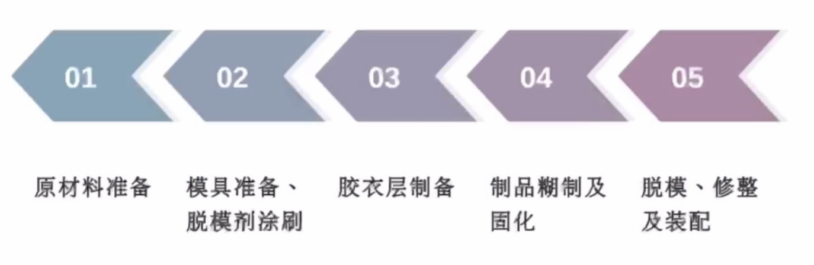

##### 原材料的制备

###### 增强材料的准备

- 小型和复杂的制品应该预先裁剪, 以提高工效和节约用布
- 简单形状可按照尺寸大小裁剪, 复杂形状则需要用纸板做成样板, 照样版裁剪

注意事项:

- 玻璃布的经纬向强度不同, 对要求正交各向同性的制品, 则将玻璃布经纬向交替铺放
- 应根据制品尺寸/性能要求和操作难易, 确定裁剪玻璃布的大小; 玻璃布越大, 制品的强度越高, 裁剪时应该尽可能大

###### 树脂胶液的配制

将树脂/固化剂或者引发剂/促进剂/填料和助剂等混合均匀, 常温固化的树脂具有很短的适用期, 必须在凝胶之前用完

这是手糊成型工艺的重要步骤之一, 直接关系制品的质量, 关键是对凝胶时间和固化程度的控制.

凝胶时间:

在一定温下树脂/引发剂/促进剂混合以后到凝胶缩哦那个的时间

- 凝胶的时间过短, 造成黏结不良, 影响制品的质量
- 凝胶的时间过长, 造成制品固化不完全, 强度降低

树脂的凝胶时间除了与配方有关以外, 还与环境温度/湿度/制品的厚度有关; 每次生产以前, 一定要做凝胶实验, 随时修改配方, 试验测得的凝胶时间一般要比制品的凝胶时间短

不饱和聚酯树脂: 通过调节促进剂的用量来调整凝胶时间, 凝胶时间随着促进剂用量的增加而缩短

环氧树脂: 采用活性低的固化剂如二甲基丙胺/二乙氨基丙胺/咪唑/聚酰胺等与伯胺共用来调整凝胶时间

##### 制品糊制和固化

##### 模具的结构形式

##### 模具材料的选择

模具质量最根本的问题: 制模材料的基本性能要和模具的制造要求与使用的条件相适应

根据模具的结构和使用情况, 合理选择用制模材料

模具材料的要求:

- 不受树脂和辅助材料的侵蚀
- 不影响树脂的固化
- 能经受住一定温度范围的变化
- 价格便宜, 来源方便, 制造容易

###### 常用的模具材料

- 木材: 易加工制造, 比较轻便. 不耐久/不耐高温, 适用于制造结构形状复杂的大尺寸的室温固化制品
- 石膏: 制造容易, 费用少. 经不起冲击, 易变形, 不耐用. 适用于形状简单的大型制品和几何形状较复杂的小型制品的成型
- 石蜡: 制造方便, 使用时不需涂脱模剂, 可回收利用, 成本较低, 熔点低, 易变形/制品的精度不高. 用来成型形状复杂和脱模苦难呢的小型异型制品
- 混凝土: 制造较方便, 成本低, 刚性好, 不易变形. 型面矫正较困难, 适用于线型光滑, 规则, 形状不复杂的大中型制品
- 玻璃钢: 质轻, 耐久, 制造简单. 适用于表面质量要求较高, 形状复杂的中小型玻璃钢品制
- 金属: 耐久, 不变形, 精度高, 加工复杂, 成本贵, 制造周期长. 适用于小型大批量生产的高精度定型产品

### 模压成型

#### 概述

##### 定义

指将模压料置于金属对象中, 在一定的温度和压力下, 压制成型复合材料制品的一种成型工艺

##### 特点

###### 优点

- 生产效率高
- 制品尺寸精确/表面光洁
- 价格低廉, 容易实现机械化和自动化
- 多数结构复杂的制品可以一次成型, 无需有损于制品性能的辅助加工, 制品的外观及尺寸的重复性好
  
###### 缺点

- 设计和制造较复杂, 初次投资较高
- 制品尺寸受设备限制, 一般只适用于中/小型复合材料制品

###### 分类

- 短纤维料模压法
- 毡料模压法
- 碎布料模压法
- 层压模压法
- 缠绕模压法
- 织物模压法
- 定向铺设模压法
- 预成型坯模压法
- 片装模塑料模压法
#### 组成/配方/工艺/质量控制

##### 组成

- 树脂: 酚醛/环氧/不饱和树脂/环氧酚醛/邻苯二甲酸二烯丙基酯/有机硅树脂/聚酰亚胺酯树脂等
- 增强材料: 纤维型增强材料(玻璃纤维/高硅氧纤维/碳纤维/芳纶纤维/尼龙纤维/丙烯腈纤维/晶须和石棉纤维等)
- 辅助材料: 稀释剂/偶联剂/增粘剂/脱模剂/颜料等

###### 对树脂的基本要求

- 满足模压制品特定的性能要求
- 良好的流动性: 室温常压下, 固体或者半固体状态, 压制条件下: 较好的流动性, 使模压材料能均匀地充满压模模腔
- 适宜的固化速度, 且固化过程中副产物少, 体积收缩率小

###### 辅助材料的作用

- 稀释剂: 降低树脂的黏度, 改进树脂的浸渍性能
- 偶联剂: 改进树脂与增强材料的黏结和界面状态
- 粉状填料: 提高模压料的流动性, 降低模压制品的收缩率/制品的表面粗糙度/质量的均匀性和赋予制品以某种特殊性能
- 增黏剂: 改善树脂压制时的高温黏度, 从而改善模压特性

##### 工艺

###### 预混法

###### 预浸法

###### 特点比较

- 预混法: 纤维较松散且无定向/流动性好, 制备过程中纤维强度损失较大
- 预浸法: 纤维成束状比较紧密, 备料过程中纤维强度损失较小, 模压料的流动性和料束之间的互溶性差
- 浸毡法: 短切纤维成硬毡状, 使用方便, 纤维强度损失稍小, 模压料中纤维的伸展性较好, 应用没有前两种广泛

##### 设备的原理和组成

浸胶机: 层压成型胶布主要设备: 由浸胶槽/烘干箱/牵引辊组成; 分为立式和卧式两种

##### 质量控制

三个指标: 树脂含量/挥发物含量和不溶性树脂含量

- 挥发物含量: $V=\frac{G_1-G_2}{G_1}\times 100%$
- 树脂含量: $R=\frac{G_1(1-V)-G_4}{G_1(1-V)}\times 100%$
- 不溶性树脂含量: $C=\frac{G_3-G_4}{G_1(1-V-G_4)}\times 100%$

###### 影响模压料质量的主要因素

- 溶剂: 调节树脂黏度. 黏度低有利于树脂对纤维渗透和附着; 黏度过小, 导致预混中纤维离析
- 纤维长度: 纤维太长容易缠结
- 浸渍时间: 确保纤维均匀浸透的情况下, 应尽量缩短
- 烘干条件(温度和时间): 控制挥发物和不溶性树脂的含量
- 其他: 树脂溶液的相对密度/烘箱温度/牵引速度和纤维张力等因素

###### 模压料的存放

1. 模压料的启用期

存放3-7天后才能启用

环氧酚醛型: 3天; 酚醛型: 7天;

作用: 挥发物有所降低, 质量的均匀性有所提高

###### 模压料的存放期

存放期和存放的条件有关

镁酚醛预混料: 6-12月; 镁酚醛预浸料: 3-6月, 环氧酚醛预混料: 0.5-1月

模压料要在密封/避光和避热条件下保存

##### 模压料的工艺性

###### 流动性

模压料在一定温度/压力下充满模腔的能力

影响因素: 树脂反应程度/挥发物的含量/增强材料的长度/含量/物料形态/成型加工条件

###### 收缩率

模具和制品在相应方向上尺寸差的百分数. (制品的热收缩和化学结构收缩)

影响因素: 树脂种类/增强材料和填料含量, 质量指标/制品结构, 成型加工踢哦啊金

###### 压缩比

压力方向上, 压制前后制品相应方向尺寸的比值

影响因素: 模压料的特性. 成型加工过程, 制品结构
#### 团状膜塑料/片状膜塑料

##### 团状模塑料(BMC)

将树脂/增稠剂/填料/引发剂/脱模剂/颜料和增强材料等组分加入捏合机中捏合均匀, 经过增稠后制得BMC

###### 特点

组成与SMC相似, 但是模压料形态和制备工艺不同, 纤维含量较少, 纤维长度较短, 填料含量比SMC大. BMC制品的强度低于SMC, 适合于压制小型的异型制品

##### 片状模塑料(SMC)

在不饱和聚酯树脂中加入增稠剂/无机填料/引发剂/脱模剂和颜料等组分配制成的树脂混合物, 浸渍短切纤维或毡片, 上下两岸覆盖聚乙烯薄膜, 经过增稠后制得的薄片状模塑料

###### 特点

- 工艺操作上简单方便效率高, 无尘土
- 对温度和压力的要求不高, 可变范围较大
- 制备过程及成型过程易实现自动化, 劳动条件改善
- 制品性能优良, 尺寸稳定性好, 适应结构复杂的制品或者大面积制品的成型

#### 增稠剂

增稠剂又叫增黏剂, 其作用是使不饱和聚酯树脂的黏度迅速增加, 黏度达到工艺要求后又相对稳定

##### 组成类型

- Ca/Mg的氧化物和氢氧化物系统: 应用最为普遍, 也最重要, 主要类型有: CaO/Ca(OH)2\CaO/MgO\Mg(OH)2等
- MgO和环状酸/酐的组合系统
- LiCl和MgO的组合系统

### 缠绕成型

#### 概述

##### 定义

将连续纤维或者带浸渍树脂胶液后, 按照一定的规律缠绕到芯模上, 然后在加热或者常温下固化, 制成一定形状样品的方法

##### 特点

###### 优点

- 比强度高, 可以超过钛合金
- 制品质量高而稳定, 容易自动化生产
- 成本较低, 生产效率高

###### 缺点

- 制品呈各向异性, 层间剪切强度低
- 制品的几何形状有局限性, 仅适用于圆柱体/球体和某些正曲率回转体制品, 对负曲率回转体样品难以缠绕
- 设备及辅助设备较多, 投资较大

###### 分类

1. 干法

将预浸纱带, 在缠绕机上经过加热至粘流状态并缠绕到芯模上的成型加工工艺过程

特点:

提高缠绕速度, 缠绕张力均匀, 设备易清洁, 劳动条件得到改善, 易实现自动化缠绕, 制品质量较稳定. 但是缠绕设备复杂, 投资较大

2. 湿法

将无捻粗纱经浸胶后直接缠绕到芯模上的成型加工工艺过程

特点:

设备较简单, 对原材料的要去不高, 对纱带质量不易控制/检验, 张力不易控制, 对缠绕设备如浸胶辊/张力控制辊等, 要经常维护/不断洗刷

3. 半干法

将无捻粗纱浸胶后, 随即预烘干, 然后缠绕到芯模上的成型工艺方法

特点:

与湿法相比增加了烘干的工序, 与干法相比缩短了烘干的时间, 降低了胶纱的烘干程度, 使缠绕过程可以在室温下进行, 这样既除去了溶剂, 又提高了缠绕速度和制品质量

#### 缠绕成型工艺的应用

##### 压力容器

有收到内压的容器和受到外压的容器两种, 宇航/火箭/飞机/舰艇等运载工具, 燃气汽车的液化气瓶及医疗方面都有应用

##### 管道

用于输送石油/水/天然气/化工流体介质等, 它可以部分替代不锈钢, 具有轻质/高强/防腐/耐久/方便的特点

##### 贮罐/槽车

各种用以运输或者贮存酸/碱/盐/油介质的贮罐/槽车, 具有耐腐蚀/重量亲/成型方便的特点

##### 军工制品

如火箭发动机的外壳/火箭发射管/雷达罩/鱼雷/鱼雷发射管等

#### 缠绕规律的分类

任意地将纤维缠绕到芯模上去, 制品的堆积厚度不均匀, 不嫩个满足制品的设计要求

缠绕规律的目的:

找出制品的结构尺寸和线型、芯模与绕丝头之间的定量/运动关系, 把纤维按照一定的规律均匀地布满在整个芯模的表面上, 关键问题是缠绕的定型

##### 环向缠绕

芯模绕自己轴线做匀速转动

绕丝头在平行于芯轴方向均匀缓慢地移动

芯模每转一周, 绕丝头向前移动一个纱片宽度, 如此循环至纱片均匀布满芯模筒身段表面为止

##### 纵向缠绕

又称为平面缠绕

绕丝头在固定平面内做圆周运动

芯模绕自己轴线做慢速间隙转动

绕丝头每转一周, 芯模转过一个微小角度, 芯模表面上是一个纱片宽度

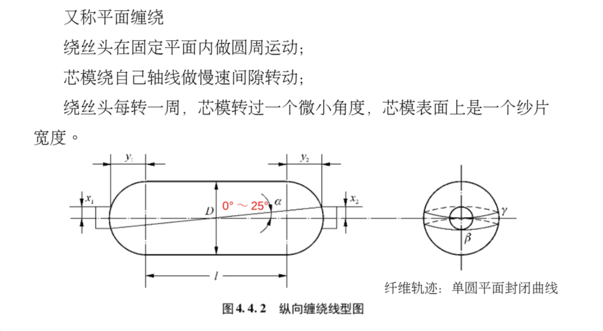

##### 螺旋缠绕

又称为测地线缠绕, 缠绕时, 芯模绕自己轴线匀速转动, 绕丝头特点速度沿着芯模轴线方向往复运动, 于是在芯模的筒身和封头上就实现了螺旋缠绕. 缠绕角: 12度-70度

###### 特点

每条纤维都对应极孔圆周上的一个切点, 相同方向邻近纱片之间相接而不相交, 不同方向的纤维则相交, 当纤维均匀缠满芯模表面的时候, 形成了双纤维层

#### 用切点分析法分析缠绕规律

螺旋缠绕是一种连续的纤维缠绕过程, 纤维的轨迹是由筒身部分的螺旋线和封头部分与极孔相切的空间曲线组成

纤维在芯模表面上的位置直接和纤维在极孔圆周上的切点位置有关. 因此, 可以通过切点在极孔圆周上的分布和出现的规律来研究纤维在芯模表面上的分布规律

### 垃挤成型

#### 概述

##### 定义

将浸渍了树脂胶液的连续纤维, 通过成型模具, 在模腔内加热固化成型, 在牵引机拉力的作用下, 连续拉拔出型材制品

##### 特点

###### 优点

设备造价低/生产效率高/可连续生产任意长的各种异型制品/原材料的有效利用率高, 基本上无边角废料

###### 缺点

只能加工不含邮凹凸结构的长条状制品和板状制品, 制品性能的方向性强, 剪切强度较低; 必须严格控制工艺参数

##### 工艺流程

##### 原材料

- 树脂: 主要是不饱和树脂, 以及环氧/酚醛等; 要求: 较高耐热性, 较快固化性能和较好的浸润性
- 增强材料: 玻璃纤维无捻粗纱/碳纤维/芳纶纤维等
- 辅助材料: 脱模剂/颜料等j

#### 垃挤成型的工艺参数

##### 拉挤成型工艺的影响因素

- 树脂的固化特性: 凝胶时间/固化时间/凝胶与固化时间差/固化放热峰温度
- 预热固化/增效固化
- 拉挤速度
- 内压力

##### 温度参数

拉挤成型工艺的加热固化由三部分组成: 进模具前的预热, 模内固化, 出模后的热固化

拉挤制品的凝胶和固化过程是在加热的成型模具内完成. 复合材料是通过复杂的热传导来接受来自模具的热量:

- 模具的瞬时温度随着物料在模具内的运动而变化
- 树脂固化放热, 且与模具热容量和时间有关, 模具热容量越大放热反应影响越小
- 拉挤成型复合材料呈各向异性, 沿着纤维长度方向和横向方向热传导系数差异很大, 材料内外传热能力也不同

材料横截面上存在着复杂的温度梯度, 沿着模具的长度方向上也存在着温度梯度

##### 预热固化影响

采用热传导方式加热, 很难实现制品的均匀固化, 尤其是对于比较厚的制品, 由于固化时的发热和收缩, 内部易发生开裂, 难以提高成型速度.

解决方法:

采用增效固化的方法. 又称预热固化或者高频介电加热. 浸渍了树脂的增强材料在进入模具前用高频发生器预热, 使整个受热截面的温度均匀提高, 促进树脂基体聚合反应

高频加热和热传导加热结合使用, 即可实现较厚制品的拉挤成型, 且能提高拉挤速度2-3倍, 在有预热的场合, 成型温度可以控制低一些, 而且内外温差缩小

- 当制品壁厚相当小时, 两种加热效果差别不大
- 壁厚15mm左右时, 高频加热效果最明显, 随着壁厚的增加, 热传导加热效果逐渐减少
- 壁厚超过30mm时, 单一的热传导加热已经无实用价值, 而增效固化的效果虽有下降, 但仍然有效

##### 拉挤速度

在挤拉成型过程中, 所有树脂系统都存在三个剪应力峰, 并且剪应力的峰的大小和形状随着拉挤速度的变化而变化

- 第一个峰: 模具入口处, 它与树脂的黏滞阻力相对应, 当树脂的温度升高, 黏度减小, 剪应力开始下降, 树脂中填料含量及模具入口温度高低对峰1有较大影响
- 第二个剪应力峰: 由于树脂发生交联反应, 黏度增加而引起, 其最大值与脱粘点相吻合
- 第三个峰: 由滑动摩擦和库伦摩擦引起

随着拉挤速度增加, 黏滞力峰1和摩擦力和库伦力峰3上升, 峰2下降

在适当温度下, 提高拉挤速度, 更利于降低凝胶区产品与模具界面间的剪切力, 有利于防止型材掉皮/掉末

##### 牵引力

牵引力的大小由制品和模具间界面上的摩擦力确定, 是保证制品顺利脱模的关键. 摩擦力随着拉挤速度的变化而变化. 内压力对牵引力的大小有较大的影响

内压力产生的原因:

- 在模具入口处树脂/纤维引入时产生内压
- 材料加热时的热膨胀产生内压
- 材料填充松实情况不同内压也不同
- 模具表面或形状不同内压也不同
 
 

༼ つ ◕_◕ ༽つ

